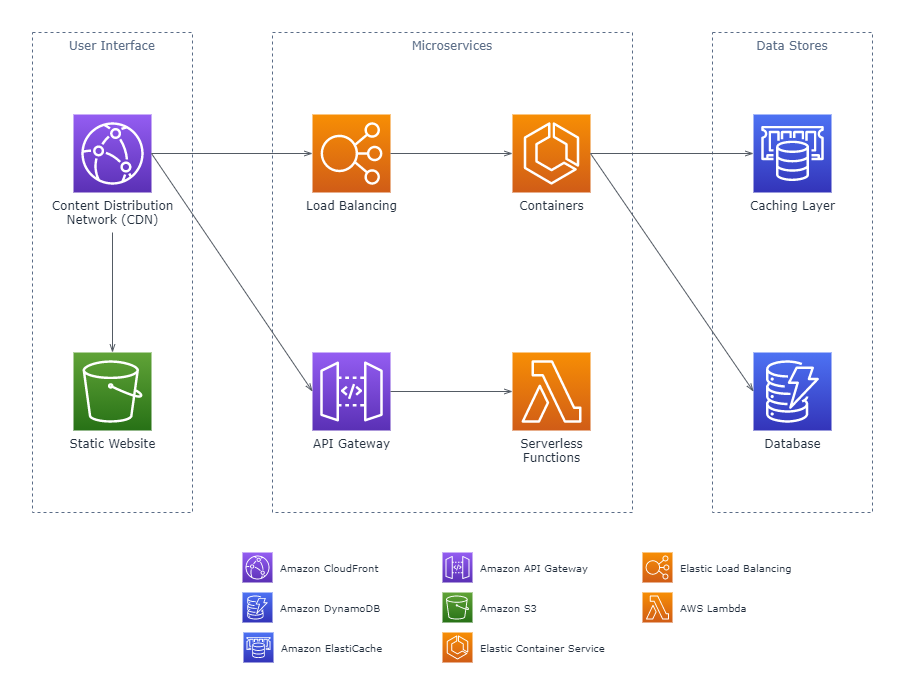
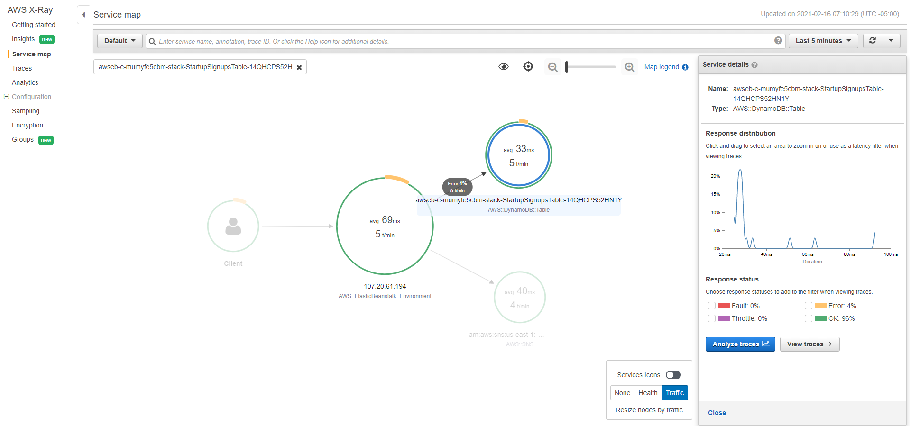
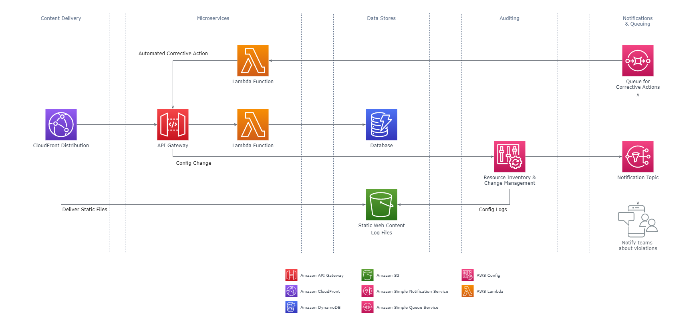

# **Implementing Microservices on AWS**

# Sections
- [**Implementing Microservices on AWS**](#implementing-microservices-on-aws)
- [Sections](#sections)
- [Overview](#overview)
- [Simple Microservices Architecture on AWS](#simple-microservices-architecture-on-aws)
  - [User Interface](#user-interface)
  - [Microservices](#microservices)
    - [Application Programming Interfaces (APIs)](#application-programming-interfaces-apis)
    - [Containers](#containers)
    - [Serverless Functions](#serverless-functions)
  - [Data Stores](#data-stores)
- [Reducing Operational Complexity](#reducing-operational-complexity)
  - [API Implementation](#api-implementation)
  - [Serverless Microservices](#serverless-microservices)
- [Distributed Systems Components](#distributed-systems-components)
  - [Service Discovery](#service-discovery)
    - [DNS-Based Service Discovery](#dns-based-service-discovery)
    - [Service Meshes](#service-meshes)
    - [Third-Party Software](#third-party-software)
  - [Distributed Data Management](#distributed-data-management)
  - [Asynchronous Communication and Lightweight Messaging](#asynchronous-communication-and-lightweight-messaging)
    - [REST-based Communication](#rest-based-communication)
    - [Asynchronous Messaging and Event Passing](#asynchronous-messaging-and-event-passing)
    - [Orchestration and State Management](#orchestration-and-state-management)
  - [Distributed Monitoring](#distributed-monitoring)
  - [Chattiness](#chattiness)
  - [Auditing](#auditing)
    - [Audit Trail](#audit-trail)
    - [Events and Real-Time Actions](#events-and-real-time-actions)
    - [Resource Inventory and Change Management](#resource-inventory-and-change-management)
- [Conclusion](#conclusion)
- [References](#references)

# Overview
- [Source](https://d1.awsstatic.com/whitepapers/microservices-on-aws.pdf)

This summary is based off of the August 2019 revision of the **Implementing Microservices on AWS** whitepaper.

In a [**microservices architecture**](https://aws.amazon.com/microservices/), software is composed of small, independent services that communicate over well-defined APIs. It allows for organizations to speed up development cycles, improve scalability of applications, and foster innovation. 

The focus of this whitepaper is to identify the features of a reliable, scalable, and easy-to-manage microservices architecture, and how to build it using AWS container and serverless technologies. Then the whitepaper discusses the cross-service aspects of microservices, such as service discovery, asynchronous communication, and distributed monitoring.

# Simple Microservices Architecture on AWS
A typical microservices architecture splits its functionalities by implementing a specific domain. The following example uses 3 domains: 
- User Interface (UI)
- Microservices
- Data Store

## User Interface
- Modern web applications often use JavaScript frameworks to implement single-page applications that communicate using RESTful APIs
  - Static web content can be served using [S3](https://aws.amazon.com/s3/) and [CloudFront](https://aws.amazon.com/cloudfront/)

## Microservices

### Application Programming Interfaces (APIs)
- **APIs** serve as the entry point for application logic, accepting requests from clients, processing the requests, and potentially sending responses back to the calling clients
  - [API Gateway](https://aws.amazon.com/api-gateway/) is a fully managed service that allows developers to publish, monitor, and secure APIs at scale

### Containers
- **Container** technologies like [Docker](https://www.docker.com/) provide benefits such as portability, productivity, and efficiency, but there are complexities when it comes to monitoring and securing the container management infrastructure at scale
  - [Elastic Container Service (ECS)](https://aws.amazon.com/ecs/) and [Elastic Kubernetes Service (EKS)](https://aws.amazon.com/eks/) are fully managed services that can handle the installation, operation, and scaling of container management infrastructure on the customer's behalf
  - [AWS Fargate](https://aws.amazon.com/fargate/) can be used with ECS or EKS so there is no need to worry about provisioning or scaling the virtual machines that host the containers
- Docker images used with ECS or EKS can be stored in [Elastic Container Registry (ECR)](https://aws.amazon.com/ecr/)

### Serverless Functions
- **Serverless** is defined as an operational model by the following tenets:
  - No infrastructure to provision or manage
  - Automatically scaling by unit of consumption
  - "Pay for value" billing model
  - Built-in availability and fault-tolerance
- [AWS Lambda](https://aws.amazon.com/lambda/) is a serverless compute service where the user uploads code (creating a Lambda function), and Lambda handles everything required to run and scale the function to meet demand
  - Supported programming languages include NodeJS, Python, Go, Java

## Data Stores
- Data stores are used to persist data needed by the microservices
- Popular in-memory data stores include Memcached and Redis, both of which can be used fully managed with [ElastiCache](https://aws.amazon.com/elasticache/)
- NoSQL databases are designed to favor the scalability required by microservices, a feature not inherent in relational databases
  - [DynamoDB](https://aws.amazon.com/dynamodb/) is a serverless NoSQL database service with high performance and autoscaling capabilities
  - When the feature [DynamoDB Accelerator (DAX)](https://aws.amazon.com/dynamodb/dax/) is enabled, the database is also provided with caching capabilities

# Reducing Operational Complexity

## API Implementation
- Designing, monitoring, and deploying APIs can be a time-consuming task, especially when taking into consideration the following challenges:
  - Keeping multiple versions to assure backward compatibility for all clients
  - Development, test, and production environments
  - Validating authorization to invoke the API
  - Transforming requests and responses
  - Throttling requests to avoid overloading application servers
  - Caching responses for performance
- [API Gateway](https://aws.amazon.com/api-gateway/) addresses those challenges, reducing the operational complexity of creating and maintaining APIs 

## Serverless Microservices
- As mentioned [earlier](#serverless-functions), serverless functions allow for executing application logic without the need to spend time and effort provisioning, managing, and scaling servers

# Distributed Systems Components

## Service Discovery
This section explores several techniques for allowing microservices to discover and interact with each other (perform service discovery) on AWS.

### DNS-Based Service Discovery
- ECS creates and manages a registry of service names using the [Route53](https://aws.amazon.com/route53/) Auto Naming API
  - Each name is mapped to a set of DNS records so that services can be referred to by name in the code and be resolved at runtime
- [AWS Cloud Map](https://aws.amazon.com/cloud-map/) is another option to provide a service registry for resources, such as for IPs, URLs, and ARNs

### Service Meshes
- **Service meshes** are an additional layer for handling inter-service communication, being responsible for monitoring and controlling traffic in complex architectures (hundreds or thousands of microservices)
- Service meshes don't require developers to make changes to existing application code
- [AWS App Mesh](https://aws.amazon.com/app-mesh/) is a service mesh that standardizes how microservices communicate, provides end-to-end visibility, and helps to ensure high-availability for applications

### Third-Party Software
- Distributed, reliable key-value stores such as [Consul](https://www.consul.io/), [etcd](https://github.com/coreos/etcd), or [Eureka](https://github.com/Netflix/eureka) may be used for service discovery

## Distributed Data Management
- Each microservice component should have its own data persistence layer, rather than using one data model for all application components
- As a result of using distributed data stores, microservices are limited by the [CAP Theorem](https://en.wikipedia.org/wiki/CAP_theorem) to trade off consistency for performance, resulting sometimes in partial executions
  - The distributed [Saga Pattern](https://theburningmonk.com/2017/07/applying-the-saga-pattern-with-aws-lambda-and-step-functions/) can be used to remedy partial transactions by undoing partial changes
  - [AWS Step Functions](https://aws.amazon.com/step-functions/) makes it easy to implement a Saga execution coordinator
- **Event sourcing** is a technique used to store data as a stream of events, such as database transaction logging or version control systems
  - This allows for state to be determined and reconstructed at any point in time by replaying the events
  - [Kinesis Data Streams](https://aws.amazon.com/kinesis/data-streams/) is a durable, real-time data streaming service and can be used to capture events from microservices
  - Kinesis-streamed events can then be persisted in S3 to implement event sourcing

## Asynchronous Communication and Lightweight Messaging

### REST-based Communication
- HTTP/S is the most popular way to implement synchronous communication between microservices, and most RESTful APIs use HTTP as the transport layer
- API Gateway as [mentioned earlier](#api-implementation) can be used to implement RESTful APIs, and can configure services to respond to one or more HTTP methods
  
### Asynchronous Messaging and Event Passing
- This method involves services communicating via exchanging messages in a queue
- The major benefit this allows is not requiring a service discovery technique, and services become loosely coupled
  - [Simple Queue Service (SQS)](https://aws.amazon.com/sqs/) is a fully managed message queueing service for this purpose
  - [Simple Notification Service (SNS)](https://aws.amazon.com/sns/) can be used to allow applications to send messages to multiple subscribers via a pub-sub system
  - By using both together, it is possible to publish one message to multiple subscribed queues

### Orchestration and State Management
- Step Functions can be used to build applications from individual components that each perform a discrete function
- It also avoids having to add coordination code inside services, which would result in tight coupling of services
- Step Functions supports orchestration of Lambda functions, applications on [EC2](https://aws.amazon.com/ec2) or ECS, and additional AWS services such as [SageMaker](https://aws.amazon.com/sagemaker/) and [Glue](https://aws.amazon.com/glue/)

## Distributed Monitoring
- [CloudWatch](https://aws.amazon.com/cloudwatch/) can be used to aggregate and visualize metrics, centralize log files, and set alarms for the AWS environment and its running applications and services
- Most AWS resources centralize their log files by default, with the primary locations being S3 or CloudWatch Logs
  - CloudWatch Logs Insights can be used to query and visualize logs instantly, allowing for troubleshooting operational problems
  - [Elasticsearch Service (ES)](https://aws.amazon.com/elasticsearch-service/) can be used for full-text search, structured search, and analytics
    - [Kibana](https://www.elastic.co/kibana) is a plugin for ES that can be used to provide data visualization
  - [Athena](https://aws.amazon.com/athena/) can likewise be used to run SQL queries against log files in S3
- [AWS X-Ray](https://aws.amazon.com/xray/) can be used to trace requests that traverse through multiple microservices, helping to debug and analyze the application's architecture
  - Example X-Ray Service Map:
    

## Chattiness
- The communication overhead increases in a microservices architecture because the services have to talk to each other, and high message volumes can cause issues such as latency
- For **protocols**, it is common to use simple protocols like HTTP
  - Messages can be encoded in diffrent ways, such as:
    - Human-readable formats: JSON or YAML
    - Efficient binary formats: Avro or Protocol Buffers
- **Caches** are a great way to reduce chattiness of microservices, and multiple caching layers are possible:
  - ElastiCache can reduce the volume of calls to other services by caching results locally
  - API Gateway provides a built-in layer of caching responses
  - DynamoDB DAX provides caching and microsecond latency for DynamoDB tables

## Auditing
- To help enforce security policies, it is important to audit both resource access as well as activities that lead to system changes
- Changes must be tracked at the individual service level as well across services running on the wider system

### Audit Trail
- [CloudTrail](https://aws.amazon.com/cloudtrail/) enables API calls made in the AWS cloud to be logged to either CloudWatch in real-time, or S3 within minutes
- All user and automated system actions becomes searchable and can be analyzed for unexpected behaviour, policy violations, or debugging
- Information recorded includes but is not limited to: 
  - timestamps
  - invoking user/role/account
  - service and action called
  - caller's IP address
  - request parameters

### Events and Real-Time Actions
- [EventBridge](https://aws.amazon.com/eventbridge/) can be used to deliver a stream of real-time data events from the user's own applications, third-party SaaS applications, and AWS services
- Once an event pattern is matched by the rule, the event is routed to the rule's targets that are defined by the user
- Targets include, but are not limited to:
  - API Gateway endpoints (ex. invoking an API call to a service)
  - Kinesis Data Streams
  - Lambda Functions (ex. taking corrective action)
  - SNS Topics (ex. sending a notification email)
  - SQS Queues
- A full list of EventBridge targets is [listed in the official documentation](https://docs.aws.amazon.com/eventbridge/latest/userguide/eventbridge-targets.html)

### Resource Inventory and Change Management
- [AWS Config](https://aws.amazon.com/config/) allows an organization to define policies with specific rules to automatically detect, track, and alert users to policy violations
- Config can be used in combination with other AWS services to automatically take corrective action once a violation occurs, as the example below illustrates:
  - In this application, the organization has decided that API Gateway must only accept HTTPS requests, and set up a Config rule to track it
  - If a developer changes the API Gateway to allow non-compliant HTTP traffic, the following events will occur: 
  - the team will be notified of it
  - the configuration change will be logged to S3
  - the system will take automatic corrective action to revert API Gateway using Lambda
    

# Conclusion
Microservices architecture is a distributed design approach intended to overcome the limitations of traditional monolithic architectures, yet they also come with a unique set of challenges of their own. This whitepaper highlights the managed services provided by AWS that can help teams implement microservices with reduced architectural complexity and operational burden.

# References
- [Whitepaper](https://d1.awsstatic.com/whitepapers/microservices-on-aws.pdf)
- [What are Microservices? (AWS)](https://aws.amazon.com/microservices/)