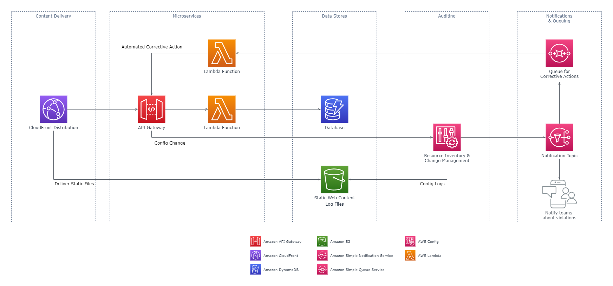

# **Infrastructure as Code**

# Sections
- [**Infrastructure as Code**](#infrastructure-as-code)
- [Sections](#sections)
- [Overview](#overview)
- [The Infrastructure Resource Lifecycle](#the-infrastructure-resource-lifecycle)
- [Resource Provisioning](#resource-provisioning)
  - [AWS CloudFormation](#aws-cloudformation)
    - [Template Anatomy](#template-anatomy)
    - [Change Sets](#change-sets)
    - [Reusable Templates](#reusable-templates)
    - [Template Linting](#template-linting)
    - [Best Practices](#best-practices)
  - [Summary](#summary)
- [Configuration Management](#configuration-management)
  - [AWS Systems Manager](#aws-systems-manager)
    - [Document Structure](#document-structure)
    - [Best Practices](#best-practices-1)
  - [AWS OpsWorks](#aws-opsworks)
    - [Best Practices](#best-practices-2)
  - [Summary](#summary-1)
- [Monitoring & Performance](#monitoring--performance)
  - [Amazon CloudWatch](#amazon-cloudwatch)
    - [Amazon CloudWatch](#amazon-cloudwatch-1)
    - [Amazon CloudWatch Logs](#amazon-cloudwatch-logs)
    - [Amazon CloudWatch Events / Amazon EventBridge](#amazon-cloudwatch-events--amazon-eventbridge)
    - [Best Practices](#best-practices-3)
  - [Summary](#summary-2)
- [Compliance & Governance](#compliance--governance)
  - [AWS Config](#aws-config)
    - [AWS Config Rules](#aws-config-rules)
    - [Rule Structure](#rule-structure)
    - [Best Practices](#best-practices-4)
  - [Summary](#summary-3)
- [Resource Optimization](#resource-optimization)
  - [AWS Trusted Advisor](#aws-trusted-advisor)
    - [Checks](#checks)
    - [Best Practices](#best-practices-5)
  - [Summary](#summary-4)
- [Next Steps](#next-steps)
- [Conclusion](#conclusion)
- [References](#references)

# Overview
- [Source](https://d1.awsstatic.com/whitepapers/DevOps/infrastructure-as-code.pdf)

This summary is based off of the July 2017 revision of the **Infrastructure as Code** whitepaper. **Infrastructure as Code (IaC)** is the practice of defining and automating the provisioning of IT infrastructure (compute, network, storage, etc.) through configuration files, in a similar manner to how a software application is constructed by its application code. Rather than relying on manually performed steps, which are prone to human error, lack of agility, and excessive time spent, IaC uses automation to set up infrastructure more quickly and consistently each time.

IaC falls under the larger umbrella of [DevOps](./introduction-to-devops.md) practices, which are used to foster increased velocity in the software development lifecycle (SDLC). This whitepaper focuses on best practices for IaC, the benefits of IaC, and the various AWS services that can leverage IaC for managing cloud infrastructure.

# The Infrastructure Resource Lifecycle
IaC does not only apply to provisioning IT infrastructure resources, but can be used throughout the resource's lifecycle. There are five key, cyclic stages for IT resources, and each stage can leverage IaC: 

1. **Resource Provisioning**
2. **Configuration Management**
3. **Monitoring & Performance**
4. **Compliance & Governance**
5. **Resource Optimization**

The table below summarizes each stage and provides AWS services that can support each stage. Each stage and how the services are used will be explained in the following sections of this document.

<html>
<table>
  <tr>
    <td width="200"><b>Stage</td>
    <td width="400"><b>Description</td>
    <td width="200"><b>AWS Services</td>
  </tr>
  <tr>
    <td><b>Resource Provisioning</td>
    <td>Administrators provision resources according to the specifications they want.</td>
    <td>AWS CloudFormation</td>
  </tr>
  <tr>
    <td><b>Configuration Management</td>
    <td>The resources become components of a management system that supports activities such as patching and tuning.</td>
    <td>AWS Systems Manager<br>AWS OpsWorks</td>
  </tr>
  <tr>
    <td><b>Monitoring & Performance</td>
    <td>Monitoring tools validate the operational status of the resources by examining items such as metrics, log files, etc.</td>
    <td>Amazon CloudWatch<br>Amazon EventBridge</td>
  </tr>
  <tr>
    <td><b>Compliance & Governance</td>
    <td>Compliance frameworks drive additional validation to ensure alignment with corporate and industry standards, as well as regulatory requirements.</td>
    <td>AWS Config</td>
  </tr>
  <tr>
    <td><b>Resource Optimization</td>
    <td>Administrators review performance data and identify changes needed to optimize the environment around criteria such as performance and cost management.</td>
    <td>AWS Trusted Advisor</td>
  </tr>
</table>
</html>

# Resource Provisioning
Administrators can use IaC to for a streamlined, repeatable process for instantiating resources consistently. The following sitauations are an example for where this would be useful:
- A release manager needs to build a replica of a cloud-based production environment for disaster recovery purposes.
- A service has to meet certain industry protection standards, and so requires that its infrastructure is configured with a set of security controls each time the service is installed.
- The students in a university class each need an environment that contains the appropriate tools for their studies in the course.

 To address these situations and needs, AWS offers [AWS CloudFormation](https://aws.amazon.com/cloudformation/).

## AWS CloudFormation
AWS CloudFormation gives developers and administrators an easy way to create, manage, provision, and update a collection of related AWS resources in an orderly and predicatble way. AWS CloudFormation uses template files to describe *stacks*, a term used for a collection of AWS resources as a single unit. Template files can be used to create identical copies of the stack within and across regions. Once created, stacks can be modified and updated in a controlled and predictable way just by updating their underlying templates. If a stack is deleted, all of its AWS resources are deleted (by default) as well, facilitating easy management. 

In the diagram below, a template file is used to build a stack consisting of a VPC, subnets, security groups, EC2 instances, RDS databases, and a load balancer.


### Template Anatomy
CloudFormation templates can be written in JSON or YAML format, and contain parameters, resource declarations, outputs, among other configurations. Templates can also reference other templates, enabling modularization.

The example template below is YAML-formatted. It creates a VPC and an internet gateway, and attaches the internet gateway to the VPC.
```
Resources:
  VPC:
    Type: AWS::EC2::VPC
    Properties:
      CidrBlock: 10.0.0.0/16
      InstanceTenancy: default

  IGW:
    Type: AWS::EC2::InternetGateway

  IGWAttachment:
    Type: AWS::EC2::VPCGatewayAttachment
    Properties:
      InternetGatewayId: !Ref IGW
      VpcId: !Ref VPC
```

The `Resources` section is the only required section in a CloudFormation template, but to learn about all of the optional sections, read the [*Template Anatomy* section in the *AWS CloudFormation User Guide*](https://docs.aws.amazon.com/AWSCloudFormation/latest/UserGuide/template-anatomy.html#template-anatomy-sections).

### Change Sets
CloudFormation stacks can be modified by updating their templates, to add, modify, or delete resources. The [change sets feature](https://docs.aws.amazon.com/AWSCloudFormation/latest/UserGuide/using-cfn-updating-stacks-changesets.html) enables you to preview proposed changes to a stack without actually performing them to see their impact. There are 3 phases to applying a change set to a stack:
1. Create the change set.
   - Submit the changes to the template or parameters of a stack. 
2. Preview the change set.
   - CloudFormation will provide a summary and detailed list of the changes that will occur. Changes may have downstream changes on other resources in the stack, and those will be displayed here.
3. Execute the change set.
   - Once satisfied, you can execute the change set to modify the stack. 

### Reusable Templates
CloudFormation allows for the grouping of stacks logically by function. Instead of grouping all resources in a single template, it is possible to use [nested stacks](https://docs.aws.amazon.com/AWSCloudFormation/latest/UserGuide/aws-properties-stack.html) and [cross-stack references](https://docs.aws.amazon.com/AWSCloudFormation/latest/UserGuide/walkthrough-crossstackref.html) to reuse and share templates across multiple stacks.

The nested stacks feature allows for creating a child stack as a *resource* within the template of another stack. This means that whenever the parent stack is created, the child stack is created. This can be useful in, for example, sharing infrastructure code across projects, while still maintaining independent stacks for each project.

Cross-stack references allow for stacks to export values that other stacks can then import and use. This can allow for sharing a single resource across multiple projects (for example, a VPC).

### Template Linting
As with application code, CloudFormation templates also should go through some form of static analysis (*linting*) to ensure that the template is syntactically correct and adheres to style guidelines. CloudFormation provides the [ValidateTemplate](https://docs.aws.amazon.com/AWSCloudFormation/latest/APIReference/API_ValidateTemplate.html) API for this purpose. If the validation check fails, CloudFormation will return a template validation error.

### Best Practices
The following are some best practices to apply when using CloudFormation:

#### Planning and Organizing
- Use IAM to control access
- Organize your stacks by lifecycle and ownership
- Reuse templates to replicate stacks in multiple environments

#### Creating Templates
- Do not embed credentials in your templates
- Use parameter constraints
- Validate templates before using them

#### Managing Stacks
- Use stack policies to protect stack resources from accidental modification or deletion
- Use code reviews and revision controls to manage your templates
- Create change sets before updating your stacks

## Summary
The resource lifecycle starts with resource provisioning, and CloudFormation provides a template-based way to achieve this with IaC, just like with application code.

# Configuration Management
Once the infrastructure is provisioned and running, you need to manage the ongoing configuration needs of its environment. These are some examples where this would be useful:
- A release manager wants to deploy an application across a group of servers and perform a rollback if any problems occur.
- A system administrator is tasked with installing a new operating system package in all developer environments, but the other environments must remain untouched.
- An application administrator needs to periodically update a configuration file across all application servers.

One approach to address this need is with *infrastructure immutability*, where the existing resources are taken down, and a new infrastructure with new configuration is provisioned in its place.

If environments have high levels of durability however, it's much faster to make incremental changes instead of reprovisioning. AWS offers [AWS Systems Manager](https://aws.amazon.com/systems-manager/) and [AWS OpsWorks](https://aws.amazon.com/opsworks/) for these purposes.

## AWS Systems Manager
AWS Systems Manager (SSM) is a collection of tools and services that allow for the visibility and control of your AWS infrastructure, all under a unified interface. For configuration management, it helps you understand and control your AWS environment, EC2 instances, and even on-premises servers. You can track and remotely manage systems, OS patch levels, application configurations, and other functionalities across fleets of servers. These capabilities help with automating complex and repetitive tasks, preventing drift, and maintaining software compliance across all your systems.

The table below lists some of the configuration management capabilities of SSM, and examples for each.

<html>
<table>
  <tr>
    <th width="160">Task</th>
    <th width="300">Description</th>
    <th width="300">Example</th>
  </tr>
  <tr>
    <th>Run Command</th>
    <td>Run commands on EC2 instances without SSH or RDP.</td>
    <td>Run a shell script on 50 instances at one time.</td>
  </tr>
  <tr>
    <th>Automation</th>
    <td>Automate routine maintenance tasks and scripts.</td>
    <td>Stop developer instances on Friday evenings, and start them up again on Monday morning.</td>
  </tr>
  <tr>
    <th>Patch Manager</th>
    <td>Automates the process of patching instances for updates.</td>
    <td>Keep a fleet of servers at the same patch level for security.</td>
  </tr>
  <tr>
    <th>State Manager</th>
    <td>Creates states that represent a certain configuration applied to instances.</td>
    <td>Keep track of which instances have been updated to the current, stable version of Apache HTTP.</td>
  </tr>
  <tr>
    <th>Maintenance Windows</th>
    <td>Define schedules to apply patches, updates, scripts, and other tasks to instances.</td>
    <td>Run security patches every Sunday between 0:00 AM - 2:00 AM.</td>
  </tr>
  <tr>
    <th>Inventory</th>
    <td>Collect OS, application, and instance metadata.</td>
    <td>Determine what versions of Apache HTTP the servers currently have.</td>
  </tr>
</table>
</html>

To read about all the SSM features, read the [*Systems Manager Capabilities* section in the AWS Systems Manager User Guide](https://docs.aws.amazon.com/systems-manager/latest/userguide/features.html).

### Document Structure
An SSM document defines the actions that SSM performs on its managed instances. There are already numerous pre-configured SSM documents provided by AWS, and you can create custom documents as well. Documents can also be version-controlled and shared across AWS accounts.

Documents can be written in JSON or YAML format, and include steps and parameters that you specify. The following is an example of a document for a Windows-based host with two steps, and no parameters. It uses PowerShell to run the `ipconfig` command to gather network configuration of the instance, and then installs MySQL.

```
{
 "schemaVersion": "2.0",
 "description": "Sample version 2.0 document v2",
 "parameters": {},
 "mainSteps": [
    {
      "action": "aws:runPowerShellScript",
      "name": "runShellScript",
      "inputs": {
        "runCommand": ["ipconfig"]
      }
    },
    {
      "action": "aws:applications",
      "name": "installapp",
      "inputs": {
        "action": "Install",
        "source":
        "http://dev.mysql.com/get/Downloads/MySQLInstaller/mysqlinstaller-community-5.6.22.0.msi"
      }
    }
  ]
}
```

### Best Practices
Below are some best practices for some of SSM's capabilities:

#### Run Command
- Improve your security posture by leveraging Run Command to access your EC2 instances, instead of SSH/RDP.
- Audit all API calls made by or on behalf of Run Command using AWS CloudTrail.
- Use the rate control feature in Run Command to perform a [staged command execution](https://docs.aws.amazon.com/systems-manager/latest/userguide/send-commands-multiple.html#send-commands-rate).

#### Automation
- Use Automation to simplify creating AMIs from the AWS Marketplace or custom AMIs, using public documents or by creating your own.
- Use the documents `AWS-UpdateLinuxAmi` or `AWS-UpdateWindowsAmi` or create a custom Automation document to build and maintain images.

#### State Manager
- Update the SSM agent periodically using the preconfigured `AWS-UpdateSSMAgent` document
- Use tags to create application groups. Then target instances using the `Targets` parameter, instead of specifying individual instance IDs.
- Use a centralized configuration repository for all your SSM documents, and share documents across the organization.

#### Inventory
- Use Inventory in combination with AWS Config to audit your application configuration overtime.

## AWS OpsWorks
AWS OpsWorks is a configuration management service that provides fully managed instances of [Chef Automate](https://www.chef.io/products/chef-automate) and [Puppet Enterprise](https://puppet.com/products/puppet-enterprise/). OpsWorks is also offered as [AWS OpsWorks Stacks](https://aws.amazon.com/opsworks/stacks/), which lets you manage application stacks using Chef recipes.

Known as recipes in Chef, and modules in puppet, these tools use configuration files that are analagous to CloudFormation templates. They are a form of source code that can be version-controlled, extending the principle of IaC to the configuration management stage of the resource lifecycle.

Below is a sample Chef recipe used in OpsWorks Stacks. It checks the EC2 instance's operating system, and runs the appropriate command to install the `tree` package if applicable.

```
instance = search("aws_opsworks_instance").first
os = instance["os"]

if os == "Red Hat Enterprise Linux 7"
    Chef::Log.info("********** Operating system is Red Hat Enterprise Linux. **********")
elsif os == "Ubuntu 12.04 LTS" || os == "Ubuntu 14.04 LTS" || os == "Ubuntu 16.04 LTS" || os == "Ubuntu 18.04 LTS"
    Chef::Log.info("********** Operating system is Ubuntu. **********") 
elsif os == "Microsoft Windows Server 2012 R2 Base"
    Chef::Log.info("********** Operating system is Windows. **********")
elsif os == "Amazon Linux 2018.03" || os == "Amazon Linux 2"
    Chef::Log.info("********** Operating system is Amazon Linux. **********")
elsif os == "CentOS Linux 7"
    Chef::Log.info("********** Operating system is CentOS 7. **********")
else
    Chef::Log.info("********** Cannot determine operating system. **********")
end

case os
when "Ubuntu 12.04 LTS", "Ubuntu 14.04 LTS", "Ubuntu 16.04 LTS", "Ubuntu 18.04 LTS"
  apt_package "Install a package with apt-get" do
    package_name "tree"
  end
when "Amazon Linux 2018.03", "Amazon Linux 2", "Red Hat Enterprise Linux 7", "CentOS Linux 7"
  yum_package "Install a package with yum" do
    package_name "tree"
  end
else
  Chef::Log.info("********** Cannot determine operating system type, or operating system is not Linux. Package not installed. **********")
end
```

To experiment with OpsWorks Stacks in particular, try out the tutorial [*Getting Started with Cookbooks in AWS OpsWorks Stacks*](https://docs.aws.amazon.com/opsworks/latest/userguide/gettingstarted-cookbooks.html).

This document will not go into the details of using Chef or Puppet, as they are widely used and heavily documented, but know that these configuration management tools exist and that AWS provides managed instances of each, so that you don't have to configure a Chef or Puppet server from scratch.

### Best Practices
- Consider storing your Chef recipes and Puppet modules in a source control repository, just as you would with application code.
- Use IAM to limit access to OpsWorks API calls.

## Summary
AWS Systems Manager lets you deploy, customize, enforce, and audit an expected state configuration for your servers. AWS OpsWorks enables you to use Chef or Puppet to support the configuration of an environment after it's been provisioned. SSM documents, Chef recipes, and Puppet modules can become part of the infrastructure code base and be version-controlled, just like application source code.

# Monitoring & Performance
It's important to capture key metrics to assess the health of the environment and take corrective action when problems arise. Metrics provide visibility into the environment's state, and can allow your organization to automatically respond to events. To address the need to collect and analyze metrics and log files, AWS offers the [Amazon CloudWatch](https://aws.amazon.com/cloudwatch/) service.

## Amazon CloudWatch
CloudWatch is a set of services that ingests, interprets, and responds to runtime metrics, logs, and events. It automatically aggregates metrics from resources across AWS services, and can be configured to respond with built-in actions such as notifications, or with custom actions such as invoking an [AWS Lambda](https://aws.amazon.com/lambda/) function. The code for the Lamdba functions become part of the infrastructure code base, extending IaC to the monitoring level. CloudWatch is composed of three main services: the main CloudWatch service, CloudWatch Logs, and CloudWatch Events. These will now be explored in more detail.

### Amazon CloudWatch
The main CloudWatch service collects and tracks metrics for many AWS services, including EC2, DynamoDB, RDS, API Gateway, etc. Custom metrics can also be created and pushed from your applications to be monitored by CloudWatch. In CloudWatch, you can implement metric-based alarms that can invoke notifications or custom actions such as Lambda functions.

### Amazon CloudWatch Logs
CloudWatch Logs monitors and stores logs from EC2, CloudTrail, Lambda, and other sources. Ingested log data can be the basis for new CloudWatch metrics, that can in turn, trigger your CloudWatch alarms. You can use this capability to monitor and alert on any resource that generates logs, without needing to write additional application code.

### Amazon CloudWatch Events / Amazon EventBridge
CloudWatch Events produces a stream of changes from AWS environments, applies a rules engine, and delivers matching events to specified targets. Example events that can be streamed include changing an EC2 instance's state, taking an EBS snapshot, AWS API calls, AWS Trusted Advisor optimization notifications, and much more. Targets include built-in actions such as SNS notifications, or custom responses such as Lambda functions.

[Amazon EventBridge](https://aws.amazon.com/eventbridge/) is the new implementation of CloudWatch, with more robust functionality. It can use sources from third-party Software-as-a-Service (SaaS) applications, and your own applications. It uses the same API as CloudWatch Events, so all of your existing API usage can remain the same. A full list of EventBridge targets is listed in the [*Amazon EventBridge User Guide*](https://docs.aws.amazon.com/eventbridge/latest/userguide/eventbridge-targets.html).

The ability of an infrastructure to respond to selected events offers benefits in both operations and security. For operations, events automate maintenance activities without having to manage a separate scheduling system, and for information security, events can can provide notifications of console logins, authentication failures, and risky API calls discovered by CloudTrail.

[Linked here](https://github.com/AJ2O/aws-free-tier) is a solution using Terraform (a third-party IaC tool), Lambda, and EventBridge to keep your AWS account from exceeding free tier. Once deployed, it uses its many rules to detect events and API calls made in your account and respond accordingly. Here are some things it can do automatically at the time of this writing:
- If you launch an EC2 instance with a type outside of free tier (example: `m5.large`), the instance will be terminated.
- If you take an EBS snapshot and your snapshot storage will exceed free tier, the snapshot is deleted.
- If you try to create a DynamoDB table, and the aggregate RCUs and WCUs across all your DynamoDB tables will exceed free tier, the new table will be terminated.

### Best Practices
- Ensure that all AWS resources are emitting metrics.
- Send logs from AWS resources, including S3 and EC2 to CloudWatch Logs for analysis using log stream triggers and Lambda functions.
- Use CloudWatch Events / EventBridge to respond to application-level issues.

## Summary
Monitoring is essential to understand systems behaviour and to automate data-driven reactions. CloudWatch can collect the relevant metrics, EventBridge can alert on environment changes, and Lambda functions can respond to events triggered by the former two services, thereby extending IaC into operations-related activities.

# Compliance & Governance
Many organizations require visibility into their infrastructure to address industry or regulatory requirements. Consider the following situations:
- A user is added to a privileged administrators group, and nobody can explain when or how this occurred.
- The RAM and CPU configurations for several servers has unexpectedly doubled, resulting in a much larger bill than in previous months.
- The security groups for your backend servers; previously locked down and secure; are now open publicly to the whole Internet.

To understand how resources have changed over time, and to set compliance standards for your cloud environment, AWS offers [AWS Config](https://aws.amazon.com/config/) as a solution.

## AWS Config
Config enables you to assess, audit, and evaluate the configurations of your AWS resoruces. It provides a view of all your AWS resources, and resource change timeline for each of them. The image below displays a timeline for an Amazon Aurora cluster, and the highlighted configuration change was a modification to enable Multi-AZ:


### AWS Config Rules
With Config rules, every change triggers an evaluation by the rules associated with the resources. There are preconfigured rules by AWS that can be used for common cases, such as requiring IAM users to have strong passwords, or restricting SSH access to EC2 instances. Once a rule is enabled, and a resource is non-compliant according to the rule, Config can send notifications via SNS, which can also in-turn trigger a Lambda function to remediate the issue.

The example illustrated below shows how Lambda and Config can be used in tandem:
- In this application, the organization has decided that API Gateway must only accept HTTPS requests, and set up a Config rule to track it.
- If a user changes the API Gateway to allow non-compliant HTTP traffic, the following events will occur: 
- The team will be notified of it via SNS.
- The configuration change will be logged to S3.
- The system will take automatic corrective action to revert API Gateway using Lambda.



Config also supports the creation of custom rules using Lambda, and these rules become part of the infrastructure code base, extending IaC to the compliance and governance stages of the resource lifecycle.

### Rule Structure
When a custom rule is invoked through Config rules, the associated Lambda function receives the configuration events, processes them, and returns results. The following Lambda function (in python) determines if VPC Flow Logs are enabled on a given VPC:

```
import boto3
import json

def evaluate_compliance(config_item, vpc_id):
    if (config_item['resourceType'] != 'AWS::EC2::VPC'):
        return 'NOT_APPLICABLE'
    elif is_flow_logs_enabled(vpc_id):
        return 'COMPLIANT'
    else:
        return 'NON_COMPLIANT'

def is_flow_logs_enabled(vpc_id):
    ec2 = boto3.client('ec2')
    response = ec2.describe_flow_logs(
        Filter=[{'Name': 'resource-id','Values': [vpc_id]},],
    )
    if len(response[u'FlowLogs']) != 0: return True

def lambda_handler(event, context):
    invoking_event = json.loads(event['invokingEvent'])
    compliance_value = 'NOT_APPLICABLE'
    vpc_id = invoking_event['configurationItem']['resourceId']
    compliance_value = evaluate_compliance(invoking_event['configurationItem'], vpc_id)

    config = boto3.client('config')
    response = config.put_evaluations(
        Evaluations=[
            {
                'ComplianceResourceType': invoking_event['configurationItem']['resourceType'],
                'ComplianceResourceId': vpc_id,
                'ComplianceType': compliance_value,
                'OrderingTimestamp': invoking_event['configurationItem']['configurationItemCaptureTime']
            },
        ],
        ResultToken=event['resultToken'])
```

### Best Practices
- Enable AWS Config for all regions to record configuration item history.
- Implement a process to respond to changes detected by AWS Config, such as in the [API Gateway example above](#aws-config-rules).

## Summary
AWS Config extends the concept of IaC into compliance and governance. This service's capabilities can assist your organization with the monitoring of compliance controls.

# Resource Optimization
The final stage is resource optimization, where administrators review performance data and identify changes need to optimize the environment around areas such as security, performance, and cost management. Consider the following questions surrounding optimization:
- Are there provisioned resources that are underutilized?
- Are there ways to reduce the charges associated with the operating environment?
- Are there any service limits that apply to the resources, and if there are, how close are we to exceeding those limits?

To answer questions like these, AWS offers [AWS Trusted Advisor](https://aws.amazon.com/premiumsupport/technology/trusted-advisor/), to help analyze the environment and retrieve data relating to optimization.

## AWS Trusted Advisor
Trusted Advisor helps you observe best practices by scanning your AWS resources and comparing their usage against AWS best practices in four categories:
- Cost Optimization
- Fault Tolerance
- Performance
- Security

It also displays your service limits and how close they are to being reached. The image below is a snippet from the Trusted Advisor Dashboard:


### Checks
Trusted Advisor provides a variety of checks to determine if infrastructure is following best practices. Checks include detailed descriptions of recommendations, alert criteria, and a list of useful resources on the topic. Trusted Advisor returns the results of the checks and can provide weekly notifications for status updates and cost savings. It also integrates with CloudWatch Events, so it's now possible to tie Lambda functions to the state change of a check. This example shows how IaC can be extended to the resource optimization stage of an infrastructure resource's lifecycle.

It is also important to note that all AWS customers have access to a core set of Trusted Advisor checks, but the full suite of Trusted Advisor Checks is only available to customers with a Business- or Enterprise-level Support Plan.

### Best Practices
- Subscribe to Trusted Advisor notifications through email or an alternative delivery system.
- If you have a Business- or Enterprise-level Support Plan, use the [AWS Support API](https://docs.aws.amazon.com/awssupport/latest/user/Welcome.html) in conjunction with Trusted Advisor notifications to create cases with AWS Support to perform remediation.

## Summary
You must continually monitor your infrastructure to optimize the infrastructure resources with regard to performance, security, and cost, and AWS Trusted Advisor can be used to satisfy this need. You can use the APIs and Lambda in conjunction with Trusted Advisor, extending the principles of IaC to resource optimization.

# Next Steps
To begin with your adoption of IaC, here are some key actions that you can take within your organization:
- Use a source control repository to store and manage infrastructure code.
  - Examples: [GitHub](https://github.com/), [AWS CodeCommit](https://aws.amazon.com/codecommit/)
- Incorporate a QA process via unit tests and linting before deployments.
- Embrace end-to-end automation, by removing manual steps.
- Roll out every new update to your infrastructure via code by updating your stacks. Avoid making one-off changes manually.
- Make your changes auditable, and make logging mandatory.

# Conclusion
IaC enables you to manage your infrastructure just like application code, and it can be applied to all stages of an infrastructure resource's lifecycle. Using IaC will increase the velocity of your SDLC, and in turn, increase the rate at which business value is delivered.

# References
- [Whitepaper](https://d1.awsstatic.com/whitepapers/DevOps/infrastructure-as-code.pdf)
- [What is DevOps? (AWS)](https://aws.amazon.com/devops/what-is-devops/)
- [AWS CloudFormation User Guide](https://docs.aws.amazon.com/AWSCloudFormation/latest/UserGuide/Welcome.html)
- [Systems Manager Capabilities (AWS User Guide)](https://docs.aws.amazon.com/systems-manager/latest/userguide/features.html)
- [Getting Started with Cookbooks in AWS OpsWorks Stacks (AWS User Guide)](https://docs.aws.amazon.com/opsworks/latest/userguide/gettingstarted-cookbooks.html)
- [Amazon EventBridge Targets (AWS User Guide)](https://docs.aws.amazon.com/eventbridge/latest/userguide/eventbridge-targets.html)
- [About the AWS Support API (AWS User Guide)](https://docs.aws.amazon.com/awssupport/latest/user/Welcome.html)
