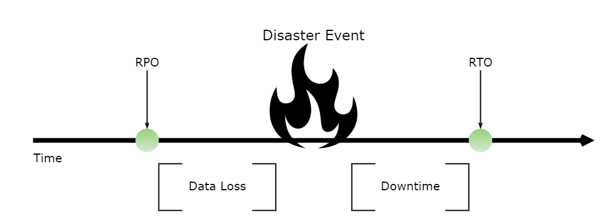

# **Reliability Pillar - AWS Well-Architected Framework**

# Sections
- [**Reliability Pillar - AWS Well-Architected Framework**](#reliability-pillar---aws-well-architected-framework)
- [Sections](#sections)
- [Overview](#overview)
  - [Prerequisites](#prerequisites)
- [Definitions](#definitions)
  - [Resiliency](#resiliency)
  - [Availability](#availability)
  - [Disaster Recovery (DR) Objectives](#disaster-recovery-dr-objectives)
- [Foundations](#foundations)
- [Workload Architecture](#workload-architecture)
- [Change Management](#change-management)
- [Failure Management](#failure-management)
- [Conclusion](#conclusion)

# Overview
- [Source](https://docs.aws.amazon.com/wellarchitected/latest/reliability-pillar/welcome.html)

This summary is based off of the July 2020 revision of the **Reliability Pillar - AWS Well-Architected Framework** whitepaper.

The AWS Well-Architected Framework (W-AF) helps customers learn the best architectural practices for designing and operating systems on the cloud. For a customer, it provides a way to measure their current cloud architecture decisions against best practices to identify areas for improvement, which will likely lead to increased business success. The W-AF consists of five pillars, and they are summarized in [its own whitepaper](./well-architected-framework.md).

This whitepaper in particular focuses on the **reliability** pillar of the W-AF, and how to apply it to cloud solutions. It encompasses the ability of a workload to perform its intended function correctly and consistently when it's expected to. This includes the ability to operate and test the workload through its total lifecycle. This paper provides in-depth, best practice guidance for implementing reliable workloads on AWS.

## Prerequisites
- There is a shortened version of this document in the larger context of the W-AF, which contains the main points of reliability. Read [the reliability section](./well-architected-framework.md#the-five-pillars-reliability) first before reading this document. Many of the broader points already outlined there will not be repeated here.

# Definitions

## Resiliency
Reliability of a workload in the cloud depends on several factors, the primary of which is *Resiliency:*
- **Resiliency** is the ability of a workload to:
  - Recover from infrastructure or service disruptions
  - Dynamically acquire computing resources to meet demand
  - Mitigate disruptions

The other four pillars of the AWS W-AF can also have impacts on reliability:
- **Operational Excellence:** Using runbooks and playbooks to investigate and quickly respond to failure scenarios can confirm that applications are ready for production.
- **Security:** Workloads must be protected from malicious actors who could impact availability.
- **Performance Efficiency:** Designing for maximum request rates and minimizing latencies can stabilize load induced on applications.
- **Cost Optimization:** Tradeoffs could be made to spend more on EC2 instances to achieve more application stability.

While the other four aspects are important to reliability, they are already covered in the [AWS WA-F](./well-architected-framework.md), so resiliency will be the primary focus of this document.

## Availability
*Availability* is both a commonly used metric to quantitatively measure resiliency, as well as a target resiliency objective:
- **Availability** is the percentage of time that a workload is available for use, also known as a *percentage uptime*.
- The availability of a workload can be represented by this formula:
  - `Availability = (Time the workload is available for use) / (Total Time)`

The table below translates availability in terms of raw units of time per year, and gives some applications which commonly fall under each availability tier:

<html>
<table>
  <tr>
    <th width="80">Availability</th>
    <th width="300">Maximum Unavailability (per year)</th>
    <th width="460">Application Categories</th>
  </tr>
  <tr>
    <td>99%</td>
    <td>3 days, 15 hours</td>
    <td>Batch processing, ETL jobs</td>
  </tr>
  <tr>
    <td>99.9%</td>
    <td>8 hours, 15 minutes</td>
    <td>Internal tools like knowledge management, project tracking</td>
  </tr>
  <tr>
    <td>99.95%</td>
    <td>4 hours, 22 minutes</td>
    <td>Online commerce, point of sale</td>
  </tr>
  <tr>
    <td>99.99%</td>
    <td>52 minutes</td>
    <td>Video delivery, broadcast workloads</td>
  </tr>
  <tr>
    <td>99.999%</td>
    <td>5 minutes</td>
    <td>ATM transactions, telecommunication workloads</td>
  </tr>
</table>
</html>

Here are some other ways and factors by which availability (AVA) can be measured:
- **Based on requests:**
  - `AVA = (Successful Responses) / (Valid Requests)`
  - Example:
    - `Valid Requests = 1,000,000`
    - `Successful Responses = 998,770`
    - `=> AVA = 99.877%`
- **Workloads with Hard Dependencies:**
  - `Total Workload AVA = (AVA of Invoker) x (AVA of Dep. 1) x (AVA of Dep. 2) x ...`
  - Example:
    - `AVA of Invoker = 99.99%`
    - `AVA of Dep. 1 = 99.99%`
    - `AVA of Dep. 2 = 99.99%`
    - `=> Total Workload AVA = (99.99% x 99.99% x 99.99%)`
    - `= 99.97%`
- **Workloads with Redundant Components:**
  - `Effective AVA = Max AVA - ((100% - AVA of Comp. 1) x (100% - AVA of Comp. 2) x ...)`
  - Example: 
    - `Max AVA = 100%`
    - `AVA of Comp. 1 = 99.9%`
    - `AVA of Comp. 2 = 99.9%`
    - `=> Effective AVA = 100% - (0.1% x 0.1%)`
    - `= 99.9999%`

Designing applications for high availability typically results in increase cost, so it's appropriate to identify the true availability needs before starting the application's design. High availability also imposes stricter requirements for testing and validation under many different failure scenarios.

## Disaster Recovery (DR) Objectives
In addition to availability, a resiliency strategy should also take into account strategies to recover the workload in case of a disaster event, such as natural disasters, large-scale technical failures, or human threats such as attack or error. Two metrics used to construct and evaluate DR plans are *recovery time objective*, and *recovery point objective*.
- **Recovery Time Objective (RTO)**
  - Defined by the organization. RTO is the maximum acceptable amount of time after a service disruption to restore business processes to their regular service levels.
  - RTO should answer: *How quickly must you recover? What is the cost of downtime?*
- **Recovery Point Objective (RPO)**
  - Defined by the organization. RPO is the maximum acceptable loss of data between the last recovery point and the service disruption.
  - RPO should answer: *How much data can you afford to recreate or lose?*

The availability needs that are required for a workload must be aligned to the business need and criticality. By first defining business criticality framework with defined RTO, RPO, and availability, you can then assess each workload. This approach requires that the people involved with the workload's implementation are knowledgabe of the of the framework, and the impact that their workload has on business needs.

# Foundations
 
# Workload Architecture

# Change Management

# Failure Management

# Conclusion