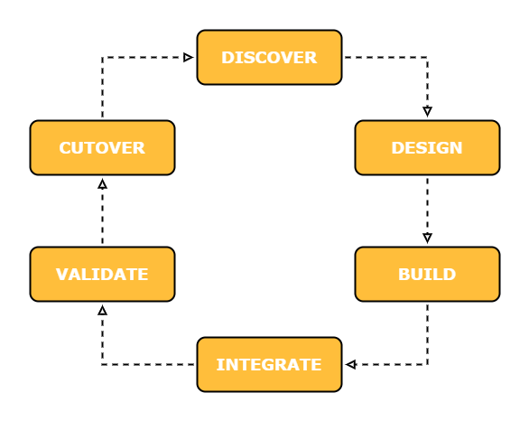

# **AWS Migrations**

# Sections
- [**AWS Migrations**](#aws-migrations)
- [Sections](#sections)
- [Overview](#overview)
- [The Cloud Adoption Framework (AWS CAF)](#the-cloud-adoption-framework-aws-caf)
- [Motivating Change](#motivating-change)
- [Business Drivers](#business-drivers)
- [Migration Strategies](#migration-strategies)
  - ["The 6 R's": 6 Application Migration Strategies](#the-6-rs-6-application-migration-strategies)
    - [1. Re-Host ("Lift and Shift")](#1-re-host-lift-and-shift)
    - [2. Re-Platform ("Lift, Tinker, and Shift")](#2-re-platform-lift-tinker-and-shift)
    - [3. Re-Factor / Re-Architect](#3-re-factor--re-architect)
    - [4. Re-Purchase](#4-re-purchase)
    - [5. Retire](#5-retire)
    - [6. Retain ("Re-visit")](#6-retain-re-visit)
  - [Which Migration Strategy is Right for Me?](#which-migration-strategy-is-right-for-me)
- [Building a Business Case for Migration](#building-a-business-case-for-migration)
- [Migration Readiness and Planning](#migration-readiness-and-planning)
- [Migrating](#migrating)
  - [First Migrations - Build Experience](#first-migrations---build-experience)
  - [Migration Execution](#migration-execution)
  - [Application Migration Process](#application-migration-process)
  - [Team Models](#team-models)
- [Conclusion](#conclusion)
- [References](#references)

# Overview
- [Source](https://d1.awsstatic.com/whitepapers/Migration/aws-migration-whitepaper.pdf)

This summary is based off of the March 2018 revision of the **AWS Migration Whitepaper**. It covers migration strategies and considerations that organizations should be aware of in their partial integration or full migration to the cloud.

# The Cloud Adoption Framework (AWS CAF)
Assessing cloud migration readiness across key business and technical areas helps determine the most effective approach to an enterprise cloud migration effort. The [AWS Cloud Adoption Framework (AWS CAF)](./caf.md) provides a mental model to establish six key areas, known by the CAF as Perspectives:

- **Business**
- **People**
- **Governance**
- **Platform**
- **Security**
- **Operations**

Addressing each Perspective is critical to synchronizing business and technical goals across the organization, and resulting in a successful cloud migration. To read about each Perspective in detail, including each Perspective's associated job roles, responsibilities, and capabilities, read the [AWS Cloud Adoption Framework (AWS CAF) summary](./caf.md).

# Motivating Change
Cloud adoption can fail to reach maximum potential if companies do not consider the impact to culture, people, and processes, in addition to the technology. On-premises infrastructure has historically been managed by people, but with cloud platforms, developers can easily automate the provisioning of resources using service APIs. As a result, roles and responsibilities will change as application teams take more control of their infrastructure and application services. 

# Business Drivers

### Business Agility
The number one reason customers choose to move to the cloud is for the **agility** they gain. They can move from idea to implementation in minutes rather than the months it can take to provision services on-premises.

### Operational Costs
Operational costs are the costs of running the organization's infrastructure. It includes the unit price of infrastructure, employing an elastic cost base, and investment risk for new applications and markets.

### Workforce Productivity
Workforce productivity addresses how efficiently the organization can get its services to market. Cloud  services can be quickly provisioned, which increases productivity because it lets teams focus on the things that make their business different, rather than on things that don't, such as maintaining data centers.

### Cost Avoidance
Cost avoidance is setting up an environment that does not create unnecessary costs. Eliminating the need for hardware refresh and maintenance programs is a key contributor to this driver.

### Operational Resilience
Operational resilience involves reducing the risk profile and the cost of risk mitigation. Using multiple regions and availability zones, an application's uptime is improved and its risk-related costs are reduced.

# Migration Strategies
The complexity of migrating existing business applications varies, depending on considerations such as architecture, existing licensing agreements, and business requirements. Typically, it's better to start with an application on the low-complexity end of the spectrum to allow for quick win to build team confidence and to provide a learning experience.

## "The 6 R's": 6 Application Migration Strategies
There are 6 common migration strategies, and they are each shown below with a rating for their complexities and opportunities to optimize. Following the table is a description of each strategy:

<html>
<table align="center">
    <tr>
        <th align="center" width="240">Strategy</th>
        <th align="center" width="240">Complexity (Time & Cost)</th>
        <th align="center" width="240">Opportunity to Optimize</th>
    </tr>
    <tr>
        <th align="center">Re-Host</th>
        <td align="center">**</td>
        <td align="center">*</td>
    </tr>
    <tr>
        <th align="center">Re-Platform</th>
        <td align="center">****</td>
        <td align="center">***</td>
    </tr>
    <tr>
        <th align="center">Re-Factor / Re-Architect</th>
        <td align="center">*****</td>
        <td align="center">*****</td>
    </tr>
    <tr>
        <th align="center">Re-Purchase</th>
        <td align="center">***</td>
        <td align="center">*</td>
    </tr>
    <tr>
        <th align="center">Retire</th>
        <td align="center">N/A</td>
        <td align="center">N/A</td>
    </tr>
    <tr>
        <th align="center">Retain</th>
        <td align="center">*</td>
        <td align="center">N/A</td>
    </tr>
</table>
<html>

### 1. Re-Host ("Lift and Shift")
- **Complexity:** Low
- **Opportunity to Optimize:** Low
- **Description:**
  - Move application without changes
  - Most re-hosting can be automated with tools, but some users prefer to do this manually to learn how to apply legacy systems to the cloud
  - Applications are easier to optimize/re-architect once they're already running on the cloud
- **Example:** Migrating a [MySQL](https://www.mysql.com/) hosted on premises to a MySQL database hosted on [Amazon EC2](https://aws.amazon.com/ec2/)

### 2. Re-Platform ("Lift, Tinker, and Shift")
- **Complexity:** High
- **Opportunity to Optimize:** Moderate
- **Description:**
  - Make a few cloud optimizations to achieve a tangible benefit, without changing the core architecture of the application
  - Reduces the amount of time spent on maintaining an application's underlying virtual machine host
- **Example:** Migrating a [MySQL](https://www.mysql.com/) hosted on premises to an [Amazon RDS MySQL](https://aws.amazon.com/rds/mysql/) database

### 3. Re-Factor / Re-Architect
- **Complexity:** Highest
- **Opportunity to Optimize:** Highest
- **Description:**
  - Re-imagine the application's architecture and its development using cloud-native features
  - Addresses business needs to add features, scale, or meet performance that is otherwise difficult to achieve in the application's current environment 
- **Example:** Remodelling a monolothic application to a [microservices-oriented](https://aws.amazon.com/microservices/) one, using container orchestration and/or serverless functions such as [Kubernetes](https://kubernetes.io/) and [AWS Lambda](https://aws.amazon.com/lambda/) respectively

### 4. Re-Purchase
- **Complexity:** Moderate
- **Opportunity to Optimize:** Low
- **Description:**
  - Move from perpetual licenses to a software-as-a-service (SaaS) model
- **Example:** Moving from an HR system to [Workday](https://www.workday.com/)

### 5. Retire
- **Complexity:** N/A
- **Opportunity to Optimize:** N/A
- **Description:**
  - Remove applications that are no longer needed
  - As much as 10%-20% of an enterprise IT portfolio is no longer useful and can be turned off
  - Needs a thorough discovery process of the environment, and recognizing who owns what application

### 6. Retain ("Re-visit")
- **Complexity:** Lowest
- **Opportunity to Optimize:** N/A
- **Description:**
  - Keep applications critical for the business, but that require major refactoring before they can be migrated
  - They can be revisited at a later time

## Which Migration Strategy is Right for Me?
In order of increasing complexity and opportunity to optimize, the 6 strategies are: 
**Retire** < **Retain** < **Re-Host** < **Re-Purchase** << **Re-Platform** <<< **Re-Factor/Re-Architect**

Consider a phased approach when migrating applications, rather than doing it all in one step:
- Prioritize business functionality in the first phase
- In subsequent phases, optimize business applications by gradually remodelling them where AWS can make a noticeable difference in cost, performance, productivity or compliance

The strategies chosen should address the following questions:
- Is there a *time sensitivity* to the business case or driver?
  - Example: Data center shutdown or contract expiration
- *Who* will operate the AWS environment and applications?
- *What standards are critical to impose* on all applications that are to be migrated?
- What *automation requirements* will be imposed on applications as a starting point for cloud operations, flexibility, and speed?

Understanding the organization's application portfolio is an important step for determining the migration strategy and subsequent migration plan and business case. The answers to the questions don't need to be elaborate, but addressing them helps align the organization and test its operational norms.

# Building a Business Case for Migration
A clear and compelling migration business case provides the organization's leadership with a data-driven rationale to support the initiative.

A migration business case has four categories, **Run Cost Analysis**, **Cost of Change**, **Labor Productivity**, and **Business Value.** The table below outlines each category:

<html>
<table align="center">
    <tr>
        <th width="160">Category</th>
        <th width="400">Inputs for Consideration</th>
    </tr>
    <tr>
        <th>Run Cost Analysis</th>
        <td>
            <ul>
            <li>Total Cost of Ownership (TCO) comparison of run costs on AWS migration vs. current model</li>
            <li>Impact of AWS purchasing options and discounts</li>
            </ul>
        </td>
    </tr>
    <tr>
        <th>Cost of Change</th>
        <td>
            <ul>
            <li>Migration planning/consulting costs</li>
            <li>Change management</li>
            <li>Application migration cost estimate, parallel environments cost</li>
            </ul>
        </td>
    </tr>
    <tr>
        <th>Labor Productivity</th>
        <td>
            <ul>
            <li>Estimate of reduction of hours spent on legacy operational activities (requisitioning, racking, patching, etc.)</li>
            <li>Productivity gains from automation</li>
            <li>Developer productivity</li>
            </ul>
        </td>
    </tr>
    <tr>
        <th>Business Value</th>
        <td>
            <ul>
            <li>Agility (faster time-to-market (TTM), elasticity, global expansion, etc.)</li>
            <li>Cost avoidance (server refresh, maintenance contracts, etc.)</li>
            <li>Risk mitigation (resilience for DR scenarios, etc.)</li>
            <li>Decommissioned asset reductions</li>
            </ul>
        </td>
    </tr>
</table>
<html>

## Drafting the Business Case
The migration business case will go through several phases of evolution:
- **Directional** - estimate the number of servers and the rough order of magnitude (ROM) assumptions around server utilization
  - Allows for assigning budgets and resources
- **Refined** - refine the scope of the case when additional data is gained about the scope of the migration and workloads
- **Detailed** - engage in a deep discovery of the on-premises environment and server utilization
  - It is recommended to use automated tools for this purpose, discussed more in the [Application Discovery section](#application-discovery)

The [AWS Pricing Calculator](https://calculator.aws/#/) can be helpful for the directional and refined phases.

# Migration Readiness and Planning
**Migration and Readiness Planning (MRP)** is a method that consists of tools, processes, and best practices to prepare an enterprise for cloud migration, and aligns with the CAF.

## Assessing Migration Readiness
The CAF is a framework to be used for analyzing an organization's IT environment. This framework helps determine cloud migration readiness, as it addresses preparation across several key areas. Some items to consider for readiness are shown below:
- Have you clearly defined the scope and the business case for migration?
- Have you evaluated the envrionment and applications in scope through the lenses of the CAF?
- Have your operations and employee skills been reviewed and updated to accomodate the change?

## Application Discovery
**Application discovery** is the process of understanding the on-premises IT environment, determining what physical and virtual servers exist, and what applications are running on those servers. Manually performing discovery can take weeks or months to perform, so it's recommended to use automated discovery tools.

Items to consider:
- Using an automated discovery tool, such as [AWS Application Discovery Service](https://aws.amazon.com/application-discovery/)
  - There are third-party discovery tools in the AWS Marketplace as well
- The IT environment will change over time, so there must be a plan to keep data current by continuously running the discovery tool
- It may be useful to do an initial application discovery during business case development to accurately reflect the scope

## Application Portfolio Analysis
**Application portfolio analysis** takes the application discovery data and then begins grouping applications based on patterns in the portfolio. It identifies:
- Order of migration
- Appropriate [migration strategy](#migration-strategies) to use for migrating a given pattern

The result of the analysis is a broad categorization of resources aligned by common traits. Special cases may also be identified that need special handling.

**Examples:**
- Grouping of applications and servers by business unit: 
  - 30% marketing
  - 20% HR
  - 40% internal productivity
  - 10% infrastructure management
- Grouping based on the 6 R's:
  - 30% of the portfolio could use a re-host
  - 30% require re-platforming
  - 30% require re-factoring
  - 10% can be retired

## Migration Planning
The primary objective of the **migration plan** is to lead the overall migration effort. Recommended migration plan activities include:
- Review of project management methods, tools, and capabilities to assess any gaps
- Define project management methods and tools to be used during the migration
- Develop a project plan, risk/mitigation log, and roles and responsibilities matrix to manage the risks that occur during the project and identify ownership for each resource involved
- Identify key resources and leads for each of the migration work streams defined in this section
- Outline resources, timelines, and cost to migrate the targeted envrionment to AWS

## Technical Planning
**Technical planning** involves building an initial backlog of prioritized applications by using the [application portfolio analyis](#application-portfolio-analysis) data. A small team can lead this process, often from the enterprise architecture team. They analyze and gather information about the current architecture for each application, then develop the future architecture and capture the workload details to execute a streamlined migration. Iteration helps migrations continue as the detailed plan evolves with new learnings.

# Migrating
## First Migrations - Build Experience
It is important to develop migration skills and experience early to help an organization's teams make informed choices about their workload patterns. AWS recommends migrating three to five applications that are representative of common migration patterns in the portfolio. This will determine the process for moving that pattern in the mass migration to follow.

## Migration Execution
After gaining experience, the organization can scale teams to support the initial wave of migrations. The core teams expand to form migration sprint teams that operate in parallel. This is useful for re-hosting and re-platforming patterns that can use automation and tooling to accelerate application migration.

## Application Migration Process
Every application in the execution phase of a migration follows the same six-step process: Discover, Design, Build, Integrate, Validate, and Cutover.

### Discover
- The application portfolio analysis and planning backlog are used to understand current and future architectures
- For each application, the data is analyzed and migration plan for it is confirmed

### Design
- The target state is developed and documented:
  - The AWS architecture
  - The application architecture
  - Supporting operational components and processes
- The data used for this step is derived from the Discover stage

### Build
- The migration design created during the Design stage is executed
- The required people, tools, and reusable templates are identified and given to the migration teams
  - Migration teams are selected based on the migration strategy chosen for the application

### Integrate
- The migration team works with external service providers and consumers of the application to make connections or service calls to the application
- The team then runs the application to demonstrate functionality and operation before it is ready for the Validate stage

### Validate
- Each application goes through a series of specific tests before being finalized, such as:
  - Build verification
  - Functional
  - Performance
  - Business continuity
- Business acceptance criteria is completed by parallel testing of pre-migrated and post-migrated applications

### Cutover
- The cutover plan agreed upon by the migration team and application owners is executed
- Perform a user acceptance test at this point to verify a successful cutover
  - If it fails, use the rollback procedure in the cutover plan

## Team Models

### Core Cloud Teams
These teams work across the migration teams. They act as a central hub for managing projects, sharing lessons learned, coordinating resources, and building common solutions. These teams include:
- **Cloud Business Office (Program Control)**
  - Drives the program
  - Manages resources and budgets
  - Manages and reports risk
  - Drives communication and change management
- **Cloud Engineering & Operations**
  - Builds and validates the fundamental components that ensure development, test, and production environments are:
    - Scalable
    - Automated
    - Maintained
    - Monitored
- **Innovation**
  - Develops repeatable solitions that will expedite migrations in coordination with the platform engineering, migration, and transition teams
  - They work on larger or more complex technical issues for the migration teams
- **Portfolio Discovery & Planning**
  - Accelerates downstream activities by executing application discovery and optimizing application backlogs
  - Minimizes wasted efforts

### Migration Factory Teams
During the scale-out phase of a migration project, multiple teams operate concurrently and support large volumes of migrations in the re-host and minor re-platform patterns. These teams are referred to as migration factory teams. Between 20% - 50% of an enterprise application portfolio consists of repeated patterns that can be optimized by a factory approach. The following teams are examples that are focused on specific migration patterns:
- **Re-Host Migration Team**
  - Migrates high-volume, low-complexity applications that don't require core changes
- **Re-Platform Migration Team**
  - Migrates applications that require a change of platform or a repeatable change in application architecture
- **Re-Factor/Re-Architect Migration Team**
  - Designs and migrates complex or core business applications with many dependencies
  - The migration becomes a release cycle or a few release cycles within the plan for the team

# Conclusion
This document introduced both the preparation and execution steps required for large migrations to the cloud. Build a business case and refine the ROI as the project progresses. Use the CAF to analyze the environment through the different Perspectives. Use a migration factory construct and iterate the migration patterns to create an optimal move to the cloud.

# References
- [Whitepaper](https://d1.awsstatic.com/whitepapers/Migration/aws-migration-whitepaper.pdf)
- [AWS Cloud Adoption Framework (AWS CAF)](./caf.md)
