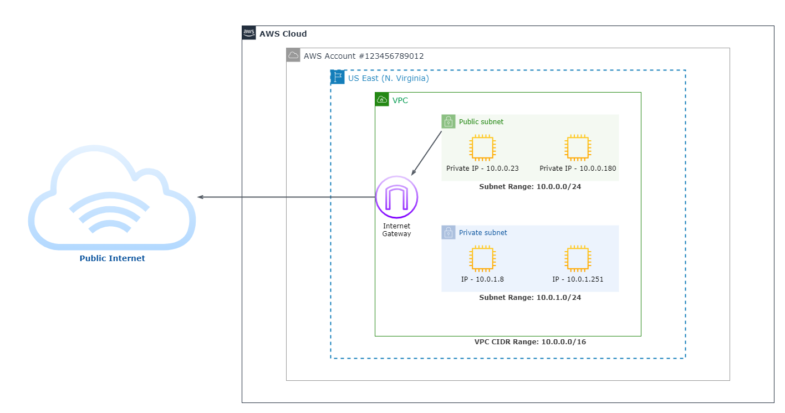

# **Integrating AWS with Multiprotocol Label Switching**

# Sections
- [**Integrating AWS with Multiprotocol Label Switching**](#integrating-aws-with-multiprotocol-label-switching)
- [Sections](#sections)
- [Overview](#overview)
  - [Prerequisites](#prerequisites)
- [Introduction](#introduction)
- [Overview of AWS Networking Services and Core Technologies](#overview-of-aws-networking-services-and-core-technologies)
  - [Amazon Virtual Private Cloud](#amazon-virtual-private-cloud)
  - [AWS Direct Connect and VPN](#aws-direct-connect-and-vpn)
  - [Internet Gateway](#internet-gateway)
  - [Customer Gateway](#customer-gateway)
  - [Virtual Private Gateway and Virtual Routing and Forwarding](#virtual-private-gateway-and-virtual-routing-and-forwarding)
- [BGP Protocol Overview](#bgp-protocol-overview)
  - [Autonomous Systems](#autonomous-systems)
    - [AWS Path Selection Algorithm](#aws-path-selection-algorithm)
- [Colocation with AWS Direct Connect](#colocation-with-aws-direct-connect)
- [References](#references)

# Overview
- [Source](https://d1.awsstatic.com/whitepapers/Networking/integrating-aws-with-multiprotocol-label-switching.pdf)

This summary is based off of the December 2016 revision of the **Integrating AWS with Multiprotocol Label Switching** whitepaper. This whitepaper provides best practices for integrating a customer's existing [Multiprotocol Label Switching (MPLS)](https://www.cloudflare.com/en-gb/learning/network-layer/what-is-mpls/) provider with AWS in single or multi-regional configurations.

## Prerequisites
Before progressing, it's necessary to be familiar with the networking concepts and terms that will appear frequently throughout this summary. Listed below are the concepts and links to brief explanations of them:
- [Multiprotocol Label Switching (MPLS)](https://www.cloudflare.com/en-gb/learning/network-layer/what-is-mpls/)
- [OSI Model](https://www.cloudflare.com/en-gb/learning/ddos/glossary/open-systems-interconnection-model-osi/)
- [Wide Area Network (WAN)](https://www.cloudflare.com/en-gb/learning/network-layer/what-is-a-wan/)
- [Autonomous Systems (AS)](https://www.cloudflare.com/en-gb/learning/network-layer/what-is-an-autonomous-system/)
- [Border Gateway Protocol (BGP)](https://www.cloudflare.com/en-gb/learning/security/glossary/what-is-bgp/)

# Introduction
Many service providers offer a managed MPLS solution that is either Layer 3 or Layer 2-based (according to OSI model), and the solution provides a logical extension of a customer's network. In this whitepaper, MPLS refers to the service provider's managed MPLS/[WAN](https://www.cloudflare.com/en-gb/learning/network-layer/what-is-a-wan/) solution. While AWS does not natively integrate with MPLS as a protocol, AWS provides mechanims by which to connect an existing MPLS/WAN solution via [AWS Direct Connect](https://aws.amazon.com/directconnect/) and VPN.

# Overview of AWS Networking Services and Core Technologies
This section briefly describes the key AWS services and technologies discussed in this whitepaper.

## Amazon Virtual Private Cloud
An [Amazon Virtual Private Cloud (VPC)](https://aws.amazon.com/vpc/) is a logically isolated virtual network in which a customer can launch AWS resources (such as virtual machines) and define its IP addressing scheme. Routing tables, network gateways, subnet ranges, and network firewalls are configured along with the VPC. A simplified VPC architecture is shown below.

## AWS Direct Connect and VPN
VPCs can be connected to from on-premises networks via AWS Direct Connect and/or VPN connections using any IPsec/IKE-compliant platform (routers and firewalls). These connectivity options are discussed in great detail in the [*VPC Connectivity Options*](./1vpc-connectivity-options.md) summary.

## Internet Gateway
The [Internet Gateway (IGW)](https://docs.aws.amazon.com/vpc/latest/userguide/VPC_Internet_Gateway.html) is a VPC component that allows communication between instances in the VPC and the Internet. It must be explicitly routed to by a routing table to be used.

## Customer Gateway
The [Customer Gateway (CGW)](http://docs.aws.amazon.com/AmazonVPC/latest/NetworkAdminGuide/Introduction.html) is a VPC component that represents the customer's side of the connection between their network and the VPC. In an MPLS scenario, the CGW can be either: 
- a customer edge (CE) device located at a Direct Connect location, or 
- a provider edge (PE) device in an existing MPLS VPN network

## Virtual Private Gateway and Virtual Routing and Forwarding
The [Virtual Private Gateway (VGW)](https://docs.aws.amazon.com/vpn/latest/s2svpn/VPC_VPN.html#VPN) is the AWS Managed VPN endpoint of the connection between a customer's network and a VPC. The customer enables an IPsec VPN connection from their CGW to the VGW. 

It's also possible to connect from an on-premises network to VPCs using a [virtual routing and forwarding (VRF)](https://en.wikipedia.org/wiki/Virtual_routing_and_forwarding) approach. AWS recommends implementing a VRF if a customer has concerns about IP overlap with multiple VPCs.

# BGP Protocol Overview

## Autonomous Systems
An AS is a group of networks that has a unified routing policy. Examples include VPCs, an on-premises data center, or a vendor's MPLS network. Each AS also has an Autonomous System Number (ASN) assigned to it by an Internet Registry or a provider.

AWS recommends using BGP routing when establishing Direct Connect connections with VPCs. A VPC is assigned an ASN, and the customer assigns an ASN to their CGW. After connection has been established between the CGW and VGW, the two sides become BGP peers and exchange their routing information (known as IP prefixes). 

Based on the shared routing information, BGPs create a vector graph of the network topology, with each node being an ASN. The link between two ASNs forms a path, and the collection of these paths forms a route used to reach a specific destination.

### AWS Path Selection Algorithm
To determine the set of preferred paths, the VGW using the BGP best path selection algorithm. The rules of that algorithm as applied to VPCs is the following:

**1. IP Prefix** 
- The most specific IP prefix is preferred
- Example: 10.0.0.0/24 is more preferable than 10.0.0.0/16

**2. VPN Connection** 
- If the prefixes are equal, statically configured VPN connections are preferred

**3. AS PATH Length** 
- If both connections use BGP, their "AS PATH" prefixes are compared, and the prefix with the shortest "AS PATH" prefix is preferred

**4. Origin** 
- If the AS PATHs are the same length, the prefixes' origins are compared
- IGP > EGP > Unknown
  - Interior Gateway Protocol (IGP) origins are more preferable than Exterior Gateway Protocol (EGP) origins
  - EGP origins are more preferable than unknown origins

**5. Router** 
- If the origins are the same, the router IDs of the advertising routes are compared
- The lowest router ID is preferred

**6. Peer IP Address**
- If the router IDs are the same, the BGP peer addresses are compared
- The lowest peer IP address is preferred

To learn more about the BGP Best Path Selection Algorithm in general, [read this Cisco guide on the topic](https://www.cisco.com/c/en/us/support/docs/ip/border-gateway-protocol-bgp/13753-25.html#anc2).

# Colocation with AWS Direct Connect

# References
- [Whitepaper](https://d1.awsstatic.com/whitepapers/Networking/integrating-aws-with-multiprotocol-label-switching.pdf)
- [What is Amazon VPC? (AWS User Guide)](https://docs.aws.amazon.com/vpc/latest/userguide/what-is-amazon-vpc.html)
- [What is MPLS? (Cloudflare)](https://www.cloudflare.com/en-gb/learning/network-layer/what-is-mpls/)
- [What is the OSI Model? (Cloudflare)](https://www.cloudflare.com/en-gb/learning/ddos/glossary/open-systems-interconnection-model-osi/)
- [What is a WAN? (Cloudflare)](https://www.cloudflare.com/en-gb/learning/network-layer/what-is-a-wan/)