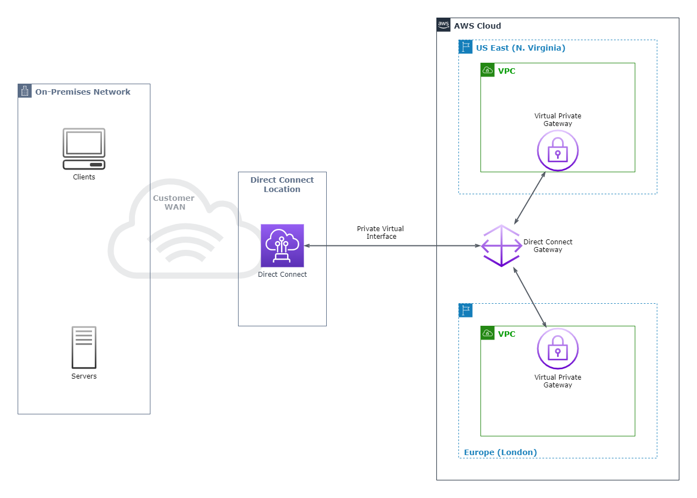
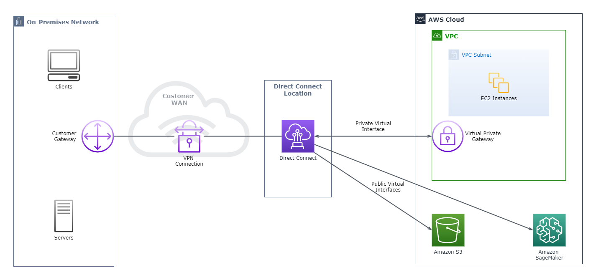
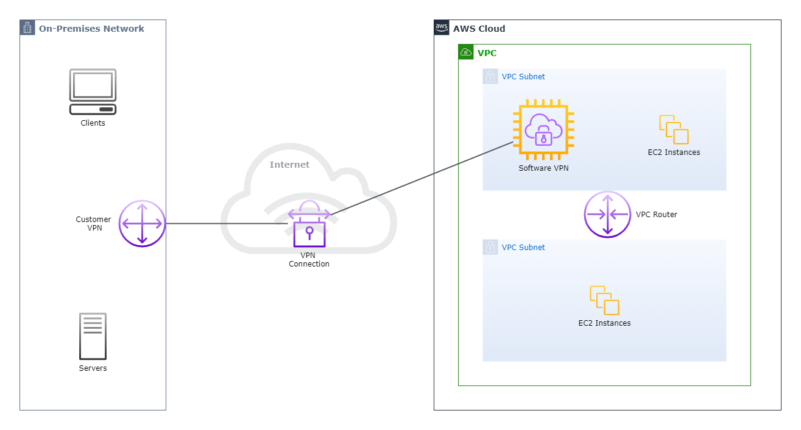
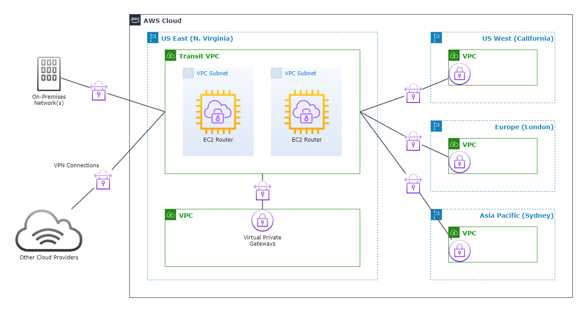
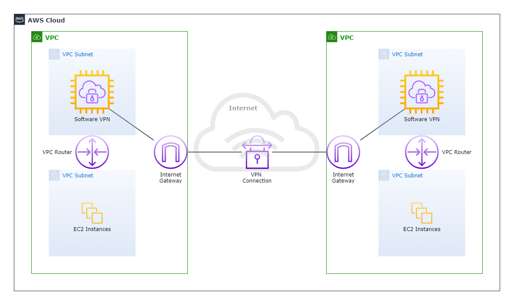
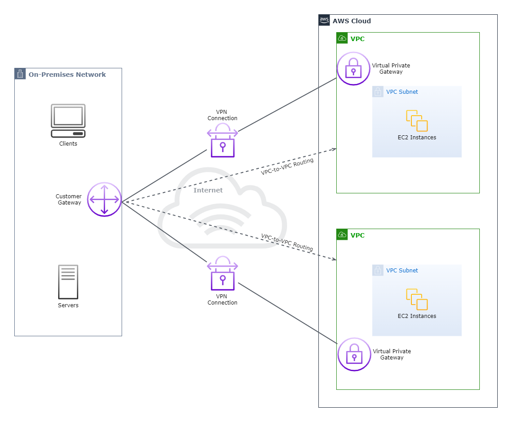

# **Amazon Virtual Private Cloud Connectivity Options**

# Sections
- [**Amazon Virtual Private Cloud Connectivity Options**](#amazon-virtual-private-cloud-connectivity-options)
- [Sections](#sections)
- [Overview](#overview)
- [Network-to-Amazon VPC Connectivity Options](#network-to-amazon-vpc-connectivity-options)
  - [Option Comparison](#option-comparison)
  - [AWS Managed VPN](#aws-managed-vpn)
    - [How It Works](#how-it-works)
  - [AWS Direct Connect](#aws-direct-connect)
    - [How It Works](#how-it-works-1)
  - [AWS Direct Connect + VPN](#aws-direct-connect--vpn)
  - [AWS VPN CloudHub](#aws-vpn-cloudhub)
  - [Software VPN](#software-vpn)
  - [Transit VPC](#transit-vpc)
- [Amazon VPC-to-Amazon VPC Connectivity Options](#amazon-vpc-to-amazon-vpc-connectivity-options)
  - [Option Comparison](#option-comparison-1)
  - [VPC Peering](#vpc-peering)
  - [Software VPN](#software-vpn-1)
  - [Software-to-AWS Managed VPN](#software-to-aws-managed-vpn)
  - [AWS Managed VPN](#aws-managed-vpn-1)
  - [AWS Direct Connect](#aws-direct-connect-1)
- [Internal User-to-Amazon VPC Connectivity Options](#internal-user-to-amazon-vpc-connectivity-options)
- [Conclusion](#conclusion)
- [References](#references)

# Overview
- [Source](https://d1.awsstatic.com/whitepapers/aws-amazon-vpc-connectivity-options.pdf)

This summary is based off of the January 2018 revision of the **Amazon Virtual Private Cloud Connectivity Options** whitepaper. This whitepaper describes network connectivity options for [Amazon Virtual Private Cloud (VPC)](https://aws.amazon.com/vpc/) available on AWS. These options include integrating remote customer networks with VPCs and joining multiple VPCs into a connected virtual network.

An important theme to remember for all of the options mentioned in this whitepaper is that for either remote-to-remote, remote-to-VPC, or VPC-to-VPC connections, they should not have overlapping IP ranges. Some of the options will outright fail if the two networks being connected have overlapping IP ranges.

# Network-to-Amazon VPC Connectivity Options
These options are useful for integrating AWS resources with existing on-premises services, applications and servers. It also allows internal users to interact and connect with the AWS-hosted resources just like any other on-premises resource.

## Option Comparison
Below is a comparison chart summarizing each option, including their advantages and disadvantages. Each option is explained in greater detail in subsequent sections.
<html>
    <table>
        <tr>
            <th align="center" width="40">Option</th>
            <th align="center" width="80">Description</th>
            <th align="center" width="240">Advantages</th>
            <th align="center" width="240">Disadvantages</th>
        </tr>
        <tr>
            <td align="center"><b>AWS Managed VPN</td>
            <td>AWS Managed IPsec VPN connection over the Internet</td>
            <td>Easy to set up; Reuse existing VPN equipment  
            Multi-site redundancy and failover (AWS side)</td>
            <td>Latency and availability depends on Internet conditions</td>
        </tr>
        <tr>
            <td align="center"><b>Direct Connect</td>
            <td>Dedicated, private connection to AWS</td>
            <td>Consistent network experience of up to 10 Gbps</td>
            <td>Complicated, lengthy process to set up</td>
        </tr>
        <tr>
            <td align="center"><b>Direct Connect + VPN</td>
            <td>Dedicated, private, IPSec VPN connection to AWS</td>
            <td>Same as above + secure IPsec VPN connection</td>
            <td>Same as above + VPN setup complexity</td>
        </tr>
        <tr>
            <td align="center"><b>VPN CloudHub</td>
            <td>Connect remote networks in hub-and-spoke model</td>
            <td>Same as AWS Managed VPN</td>
            <td>Same as AWS Managed VPN</td>
        </tr>
        <tr>
            <td align="center"><b>Software VPN</td>
            <td>Software appliance-based VPN connection over the Internet</td>
            <td>Customer has full control of managing both sides of the VPN connection  
            Wide selection of VPN vendors, products, and protocols</td>
            <td>Customer has full responsibility of managing VPN connection: 
            - Implement high availability 
            - Appliance setup and configuration 
            - EC2 instance patches and security</td>
        </tr>
        <tr>
            <td align="center"><b>Transit VPC</td>
            <td>Software appliance-based VPN connection with hub VPC</td>
            <td>Same as above  
            Simplified network management of multiple VPCs and remote networks</td>
            <td>Same as above</td>
        </tr>
    </table>
</html>

## AWS Managed VPN
This option is used to establish an IPsec VPN connection between on-premises networks and a VPC over the Internet. The diagram below shows what this architecture looks like.

### How It Works
**1. Virtual Private Gateway**
- The virtual private gateway is the VPN concentrator on the AWS side of the VPN connection and is created by the customer
- It is attached to the VPC that is to be connected to by on-premises networks
  
**2. Customer Gateway**
- The customer gateway is an AWS resource representing the VPN device on the on-premises side of the VPN connection
- When being created, the customer provides information about their device to AWS

**3. Start Connection**
- To bring up the tunnel for the VPN connection, the customer needs to generate some traffic and initiate the Internet Key Exchange (IKE) negotiation process
  - By default, the customer starts the IKE negotiation process, but this setting can be changed to allow AWS to initiate it instead

There is built-in multi-data center redundancy and failover for the virtual private gateway to ensure availability of the VPN connection. It is recommended that the customer creates multiple customer gateway connections to ensure availability on their side of the VPN connection.

Both dynamic (BGP peering), and static routing options are provided to give the customer flexibility on their routing configuration.

- To read more about configuring a VPN connection to VPCs from on-premises networks, read [*How AWS Site-to-Site VPN works*](https://docs.aws.amazon.com/vpn/latest/s2svpn/how_it_works.html) in the AWS VPN user guide
- To read about the customer gateway device minimum requirements to work with VPCs and some examples, read the [*Your customer gateway device*](https://docs.aws.amazon.com/vpn/latest/s2svpn/your-cgw.html#example-configuration-files) section
- To read more about tunnel initiation options, read the [*Site-to-Site VPN tunnel initiation options*](https://docs.aws.amazon.com/vpn/latest/s2svpn/initiate-vpn-tunnels.html) section

## AWS Direct Connect
Direct Connect establishes a dedicated, private connection from an on-premises network to a VPC (and other AWS services) with speeds of up to 10 Gbps. This connection can reduce network costs, increase bandwidth throughput, and provide an overall more consistent network experience than Internet-based connections. The diagram below shows what this architecture can look like.

The customer chooses from a selection of [Direct Connect locations](https://aws.amazon.com/directconnect/features/?nc=sn&loc=2#AWS_Direct_Connect_Locations) that  will integrate the Direct Connect endpoint to the customer's on-premises network. This process can either be done by the customer directly at a Direct Connect location, or they can partner with a WAN service provider to help route the connection from on-premises to the Direct Connect location.

### How It Works
**1. Connections**
- A connection is created at a Direct Connect location to establish a network connection from on-premises to an AWS region

**2. Virtual Interfaces**
- Virtual interfaces are created between Direct Connect and AWS services to enable access from on-premises networks

**3 Private Virtual Interfaces**
- Access an Amazon VPC using private IP addresses

**4. Public Virtual Interfaces**
- Access AWS services from on-premises networks, without traversing the public Internet

A Direct Connect Gateway can be used to enable an on-premises network to connect to multiple VPCs across different regions through Direct Connect. The image below displays an example of what that looks like.

## AWS Direct Connect + VPN
This option is the combination of the former two options, wherein Direct Connect dedicated connections can be encrypted end-to-end from the on-premises network to AWS.

## AWS VPN CloudHub
VPN CloudHub is used for secure, VPN connections between different on-premises sites in a hub-and-spoke model. It leverages a virtual private gateway with multiple customer gateways, with at least one gateway per site. The diagram below displays a CloudHub architecture.

Each gateway uses unique BGP ASNs, and they advertise their BGP prefixes over their VPN connections to allow each site to send and receive data from other sites. This option can be combined with Direct Connect and other VPN options (such as multiple gateways per site for redundancy).

## Software VPN
This option allows the customer to fully manage both sides of VPC connectivity by creating a VPN connection between the on-premises network and a software VPN appliance running in the customer's VPC network. The image below shows this architecture.

There are AWS partners, the AWS Marketplace, and open source communities that have produced software VPN appliances that run on EC2. Note that along with this choice comes the most responsibility of all the options, including configuring, patching, and upgrading the EC2 instance. There is also a single point of failure for the network design, which is the EC2 instance.

## Transit VPC
A transit VPC is a global network transit center on AWS, allowing the customer to connect multiple, geographically disperse VPCs and remote networks together. It builds off of the [Software VPN](#software-vpn)  The image below shows an example of this architecture.

This option greatly simplifies network management and minimizes the number of connections required to connect multiple VPCs and remote networks.

# Amazon VPC-to-Amazon VPC Connectivity Options
These options are for integrating multiple VPCs into a larger network. This is useful for connecting AWS resources between VPCs or consolidating a global network of VPCs. These can be combined with the [Network-to-Amazon VPC Connectivity Options](#network-to-amazon-vpc-connectivity-options) to integrate remote networks with multiple VPCs.

## Option Comparison
Below is a comparison chart summarizing each option, including their advantages and disadvantages. Each option is explained in greater detail in subsequent sections.
<html>
    <table>
        <tr>
            <th align="center" width="40">Option</th>
            <th align="center" width="80">Description</th>
            <th align="center" width="240">Advantages</th>
            <th align="center" width="240">Disadvantages</th>
        </tr>
        <tr>
            <td align="center"><b>AWS Managed VPN</td>
            <td>AWS Managed IPsec VPN connection over the Internet</td>
            <td>Easy to set up; Reuse existing VPN equipment  
            Multi-site redundancy and failover (AWS side)</td>
            <td>Latency and availability depends on Internet conditions</td>
        </tr>
        <tr>
            <td align="center"><b>Direct Connect</td>
            <td>Dedicated, private connection to AWS</td>
            <td>Consistent network experience of up to 10 Gbps</td>
            <td>Complicated, lengthy process to set up</td>
        </tr>
        <tr>
            <td align="center"><b>Direct Connect + VPN</td>
            <td>Dedicated, private, IPSec VPN connection to AWS</td>
            <td>Same as above + secure IPsec VPN connection</td>
            <td>Same as above + VPN setup complexity</td>
        </tr>
        <tr>
            <td align="center"><b>VPN CloudHub</td>
            <td>Connect remote networks in hub-and-spoke model</td>
            <td>Same as AWS Managed VPN</td>
            <td>Same as AWS Managed VPN</td>
        </tr>
        <tr>
            <td align="center"><b>Software VPN</td>
            <td>Software appliance-based VPN connection over the Internet</td>
            <td>Customer has full control of managing both sides of the VPN connection  
            Wide selection of VPN vendors, products, and protocols</td>
            <td>Customer has full responsibility of managing VPN connection: 
            - Implement high availability 
            - Appliance setup and configuration 
            - EC2 instance patches and security</td>
        </tr>
        <tr>
            <td align="center"><b>Transit VPC</td>
            <td>Software appliance-based VPN connection with hub VPC</td>
            <td>Same as above  
            Simplified network management of multiple VPCs and remote networks</td>
            <td>Same as above</td>
        </tr>
    </table>
</html>

## VPC Peering
A VPC Peering connection is between two VPCs and routes between each other as if they were in the same network. It is AWS' recommended method to connect VPCs.

AWS uses its existing VPC infrastructure to create connections, meaning it doesn't introduce any new points of failure. Also, routing tables, security groups, and network access control lists can all be leveraged to control which subnets are able to utilize the peering connection.

## Software VPN
Similar to its [network-to-VPC counterpart mentioned earlier](#software-vpn), the customer can fully manage the VPN endpoints between VPCs using a software appliance. The only new addition is an Internet Gateway attached to each VPC to facilitate communication between them.

## Software-to-AWS Managed VPN
This option is recommended when a customer wants to connect VPCs across multiple regions and take advantage of the benefits of the AWS managed VPN endpoint. These include multi-data center redundancy and failover into the virtual private gateway side of the connection.

Note that while the virtual private gateway side is highly available, there is still a single point of failure on the software appliance.

## AWS Managed VPN
It's possible to take advantage of multiple VPN connections to route traffic between multiple VPCs, as the diagram below displays.

This approach is suboptimal as traffic between VPCs must traverse the Internet, but the customer gets to claim the benefits of the AWS Managed VPN on both sides, and they get flexibility in managing routing for their remote networks.

## AWS Direct Connect

# Internal User-to-Amazon VPC Connectivity Options

# Conclusion

# References
- [Whitepaper](https://d1.awsstatic.com/whitepapers/aws-amazon-vpc-connectivity-options.pdf)