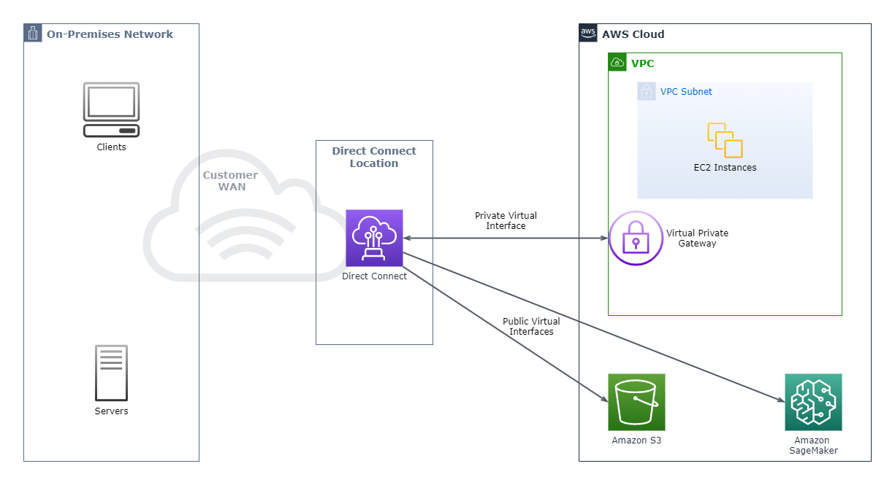

# **Amazon Virtual Private Cloud Connectivity Options**

# Sections
- [**Amazon Virtual Private Cloud Connectivity Options**](#amazon-virtual-private-cloud-connectivity-options)
- [Sections](#sections)
- [Overview](#overview)
- [Network-to-Amazon VPC Connectivity Options](#network-to-amazon-vpc-connectivity-options)
  - [Option Comparison](#option-comparison)
  - [AWS Managed VPN](#aws-managed-vpn)
    - [How It Works](#how-it-works)
  - [AWS Direct Connect](#aws-direct-connect)
    - [How It Works](#how-it-works-1)
  - [AWS Direct Connect + VPN](#aws-direct-connect--vpn)
  - [AWS VPN CloudHub](#aws-vpn-cloudhub)
  - [Software VPN](#software-vpn)
  - [Transit VPC](#transit-vpc)
- [Amazon VPC-to-Amazon VPC Connectivity Options](#amazon-vpc-to-amazon-vpc-connectivity-options)
  - [Option Comparison](#option-comparison-1)
- [Internal User-to-Amazon VPC Connectivity Options](#internal-user-to-amazon-vpc-connectivity-options)
- [Conclusion](#conclusion)
- [References](#references)

# Overview
- [Source](https://d1.awsstatic.com/whitepapers/aws-amazon-vpc-connectivity-options.pdf)

This summary is based off of the January 2018 revision of the **Amazon Virtual Private Cloud Connectivity Options** whitepaper. This whitepaper describes network connectivity options for [Amazon Virtual Private Cloud (VPC)](https://aws.amazon.com/vpc/) available on AWS. These options include integrating remote customer networks with VPCs and joining multiple VPCs into a connected virtual network.

# Network-to-Amazon VPC Connectivity Options
These options are useful for integrating AWS resources with existing on-premises services, applications and servers. It also allows internal users to interact and connect with the AWS-hosted resources just like any other on-premises resource.

Below is a comparison chart summarizing each option, including their advantages and disadvantages. Each option is explained in greater detail in subsequent sections.

## Option Comparison
<html>
    <table>
        <tr>
            <th align="center" width="160">Option</th>
            <th align="center" width="160">Use Case</th>
            <th align="center" width="300">Advantages</th>
            <th align="center" width="300">Disadvantages</th>
        </tr>
    </table>
</html>

## AWS Managed VPN
This option is used to establish an IPsec VPN connection between on-premises networks and a VPC over the Internet. The diagram below shows what this architecture looks like.

### How It Works
**1. Virtual Private Gateway**
- The virtual private gateway is the VPN concentrator on the AWS side of the VPN connection and is created by the customer
- It is attached to the VPC that is to be connected to by on-premises networks
  
**2. Customer Gateway**
- The customer gateway is an AWS resource representing the VPN device on the on-premises side of the VPN connection
- When being created, the customer provides information about their device to AWS

**3. Start Connection**
- To bring up the tunnel for the VPN connection, the customer needs to generate some traffic and initiate the Internet Key Exchange (IKE) negotiation process
  - By default, the customer starts the IKE negotiation process, but this setting can be changed to allow AWS to initiate it instead

There is built-in multi-data center redundancy and failover for the virtual private gateway to ensure availability of the VPN connection. It is recommended that the customer creates multiple customer gateway connections to ensure availability on their side of the VPN connection.

Both dynamic (BGP peering), and static routing options are provided to give the customer flexibility on their routing configuration.

- To read more about configuring a VPN connection to VPCs from on-premises networks, read [*How AWS Site-to-Site VPN works*](https://docs.aws.amazon.com/vpn/latest/s2svpn/how_it_works.html) in the AWS VPN user guide
- To read about the customer gateway device minimum requirements to work with VPCs and some examples, read the [*Your customer gateway device*](https://docs.aws.amazon.com/vpn/latest/s2svpn/your-cgw.html#example-configuration-files) section
- To read more about tunnel initiation options, read the [*Site-to-Site VPN tunnel initiation options*](https://docs.aws.amazon.com/vpn/latest/s2svpn/initiate-vpn-tunnels.html) section

## AWS Direct Connect
Direct Connect establishes a dedicated, private connection from an on-premises network to a VPC (and other AWS services) with speeds of up to 10 Gbps. This connection can reduce network costs, increase bandwidth throughput, and provide an overall more consistent network experience than Internet-based connections. The diagram below shows what this architecture can look like.

The customer chooses from a selection of [Direct Connect locations](https://aws.amazon.com/directconnect/features/?nc=sn&loc=2#AWS_Direct_Connect_Locations) that  will integrate the Direct Connect endpoint to the customer's on-premises network. This process can either be done by the customer directly at a Direct Connect location, or they can partner with a WAN service provider to help route the connection from on-premises to the Direct Connect location.

### How It Works
**1. Connections**
- A connection is created at a Direct Connect location to establish a network connection from on-premises to an AWS region

**2. Virtual Interfaces**
- Virtual interfaces are created between Direct Connect and AWS services to enable access from on-premises networks

**3 Private Virtual Interfaces**
- Access an Amazon VPC using private IP addresses

**4. Public Virtual Interfaces**
- Access AWS services from on-premises networks, without traversing the public Internet

A Direct Connect Gateway can be used to enable an on-premises network to connect to multiple VPCs across different regions through Direct Connect. The image below displays an example of what that looks like.

## AWS Direct Connect + VPN
This option is the combination of the former two options, wherein Direct Connect dedicated connections can be encrypted end-to-end from the on-premises network to AWS.

## AWS VPN CloudHub

## Software VPN

## Transit VPC

# Amazon VPC-to-Amazon VPC Connectivity Options

Below is a comparison table summarizing each option, including their advantages and disadvantages. Each option is explained in greater detail in subsequent sections.

## Option Comparison
<html>
    <table>
        <tr>
            <th align="center" width="160">Option</th>
            <th align="center" width="160">Use Case</th>
            <th align="center" width="300">Advantages</th>
            <th align="center" width="300">Disadvantages</th>
        </tr>
    </table>
</html>

# Internal User-to-Amazon VPC Connectivity Options

# Conclusion

# References
- [Whitepaper](https://d1.awsstatic.com/whitepapers/aws-amazon-vpc-connectivity-options.pdf)