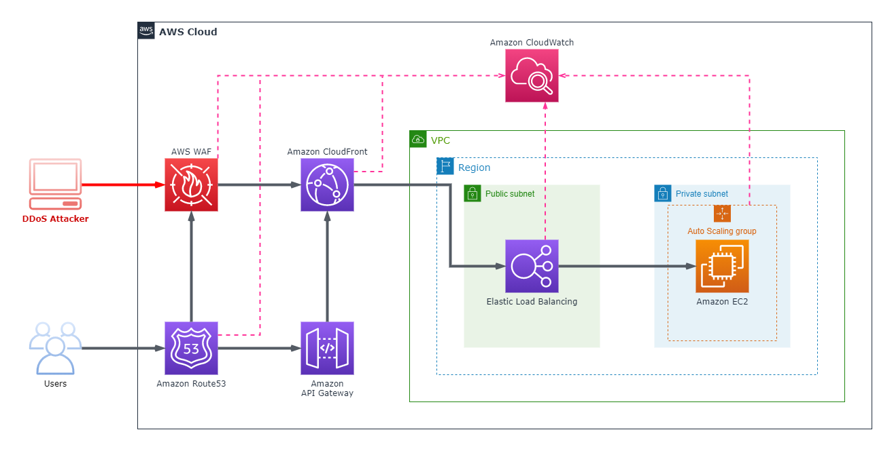

# **AWS Best Practices for DDoS Resiliency**

# Sections
- [**AWS Best Practices for DDoS Resiliency**](#aws-best-practices-for-ddos-resiliency)
- [Sections](#sections)
- [Overview](#overview)
  - [Prerequisites](#prerequisites)
- [Introduction: Denial of Service Attacks](#introduction-denial-of-service-attacks)
  - [Definition](#definition)
  - [Infrastructure Layer Attacks](#infrastructure-layer-attacks)
    - [UDP Reflection Attacks](#udp-reflection-attacks)
    - [SYN Flood Attacks](#syn-flood-attacks)
  - [Application Layer Attacks](#application-layer-attacks)
    - [HTTP Flood Attack](#http-flood-attack)
    - [Cache-Bursting Attack](#cache-bursting-attack)
    - [Other Attacks](#other-attacks)
- [Mitigation Techniques](#mitigation-techniques)
  - [DDoS-Resilient Reference Architecture](#ddos-resilient-reference-architecture)
  - [Infrastructure Layer Defense](#infrastructure-layer-defense)
    - [Services Used](#services-used)
    - [Amazon EC2 with Auto Scaling](#amazon-ec2-with-auto-scaling)
    - [Elastic Load Balancing](#elastic-load-balancing)
    - [Leverage AWS Edge Locations for Scale](#leverage-aws-edge-locations-for-scale)
      - [Web Application Delivery at the Edge (Amazon CloudFront)](#web-application-delivery-at-the-edge-amazon-cloudfront)
      - [Domain Name Resolution at the Edge (Amazon Route53)](#domain-name-resolution-at-the-edge-amazon-route53)
  - [Application Layer Defense](#application-layer-defense)
    - [Services Used](#services-used-1)
    - [Detect and Filter Malicious Web Requests (AWS WAF + Amazon CloudFront)](#detect-and-filter-malicious-web-requests-aws-waf--amazon-cloudfront)
- [Attack Surface Reduction](#attack-surface-reduction)
  - [Obfuscating AWS Resources](#obfuscating-aws-resources)
    - [Services Used](#services-used-2)
      - [VPC Design (NACLs and Security Groups)](#vpc-design-nacls-and-security-groups)
      - [Protecting the Origin (Amazon CloudFront + Security Groups)](#protecting-the-origin-amazon-cloudfront--security-groups)
      - [Protecting API Endpoints (Amazon API Gateway)](#protecting-api-endpoints-amazon-api-gateway)
- [Operational Techniques](#operational-techniques)
  - [Visibility](#visibility)
  - [Support](#support)
    - [AWS Support Plans](#aws-support-plans)
    - [DDoS Response Team (DRT)](#ddos-response-team-drt)
- [References](#references)

# Overview
- [Source](https://d1.awsstatic.com/whitepapers/Security/DDoS_White_Paper.pdf)

This summary is based off of the December 2019 revision of the **AWS Best Practices for DDoS Resiliency** whitepaper. It provides the reader with guidance to improve the DDoS resiliency of their apps running on AWS. This is done through outlining the practices that fit into a DDoS mitigation strategy, and the corresponding AWS services and features that can help a customer replicate those practices to protect their apps.

## Prerequisites
- Basic knowledge of the [OSI Model](https://www.cloudflare.com/en-gb/learning/ddos/glossary/open-systems-interconnection-model-osi/)

# Introduction: Denial of Service Attacks

## Definition
A **Denial of Service (DoS)** attack is a deliberate attempt to make an application or website unavailable to its users, such as flooding and overwhelming it with network traffic. A **Distributed Denial of Service (DDoS)** attack uses multiple sources (infected computers, routers, IoT devices, etc.) to orchestrate a DoS attack against a target. The diagram below illustrates a simple DDoS attack.

DDoS attacks are most common at the layers 3, 4, 6, and 7 of the [OSI Model](https://www.cloudflare.com/en-gb/learning/ddos/glossary/open-systems-interconnection-model-osi/), and the chart below displays examples of attacks in each layer. These attack types will be discussed in detail in the following sections.

<html>
<table align="center">
  <tr>
    <th align="center">Layer</th>
    <th align="center">Data Unit</th>
    <th align="center">Description</th>
    <th align="center">Attack Vector Examples</th>
  </tr>
  <tr>
    <th align="center">7 - Application</th>
    <td align="center">Data</td>
    <td align="center">Network access to application</td>
    <td align="center">HTTP floods, DNS query floods</td>
  </tr>
  <tr>
    <th align="center">6 - Presentation</th>
    <td align="center">Data</td>
    <td align="center">Data representation and encryption</td>
    <td align="center">TLS Abuse</td>
  </tr>
  <tr>
    <th align="center">4 - Transport</th>
    <td align="center">Segments</td>
    <td align="center">End-to-end connections and reliability</td>
    <td align="center">SYN floods</td>
  </tr>
  <tr>
    <th align="center">3 - Network</th>
    <td align="center">Packets</td>
    <td align="center">Path determination and logical addressing</td>
    <td align="center">UDP reflection attacks</td>
  </tr>
</table>
</html>

## Infrastructure Layer Attacks
This document will collectively refer to Layers 3 and 4 as the *infrastructure layer*, and it is the most commonly attacked layer. Large volumes of network traffic can overwhelm the network capacity, tie up firewall and server systems.

### UDP Reflection Attacks
A **UDP Reflection Attack** exploits the fact that UDP is a stateless protocol, meaning that the source server does not need to wait to get the target's permission to begin communication.

It involves the attacker creating a valid UDP request packet using the target's IP address as the source. When the attacker sends the UDP packet to an intermediate "reflector" server, it is tricked into sending the response packets to the target. The reflector server is used because it generates a response many times larger than the original request packet, depending on the amplification factor.

The amplification factor is dependent upon the protocol used. In the case of DNS for example, it can be 28 to 54 times the original amount of bytes. This attack may also more specifically referred to as a [DNS Amplification](https://www.cloudflare.com/en-gb/learning/ddos/dns-amplification-ddos-attack/) or [NTP Amplification](https://www.cloudflare.com/en-gb/learning/ddos/ntp-amplification-ddos-attack/) attack, depending on the protocol used.

### SYN Flood Attacks
A **SYN Flood Attack** exploits the SYN/ACK handshake process of a TCP connection. Under normal circumstances, the handshake proceeds as follows:
1. A SYN (synchronization) packet is sent from the client to the target to initiate communication
2. The target responds with a SYN-ACK packet in acknowledgement
3. The client responds with an ACK packet to acknowledge the target's response. At this point the TCP connection is open and able to transmit data.

In a SYN flood attack, the attacker sends a high volume of SYN packets to the target, often with spoofed IP addresses. The target responds to each request and opens a port ready to receive the ACK response. The response never comes back, and the target is left waiting with open ports for some time. Once all the available ports are used, the target is unable to function normally.

## Application Layer Attacks
Attacks agains Layers 6 and 7 are referred to as *application layer attacks*, and they work with a similar principle to [SYN Flood Attacks](#syn-flood-attacks). They attempt to overload specific functions of an application to make it unavailable or unresponsive to legitimate users.

### HTTP Flood Attack
In an **HTTP Flood Attack**, the attacker sends a high volume of HTTP requests to the target. The target becomes saturated with requests and is unable to respond to requests from legitimate users.

### Cache-Bursting Attack
The **Cache-Bursting Attack** is a specialized HTTP Flood that uses variations in the query string to circumvent [content delivery network (CDN)](https://www.cloudflare.com/en-gb/learning/cdn/what-is-a-cdn/) caching. It forces the CDN to contact the origin server for every page request, causing additional strain on the application.

### Other Attacks
TLS is computationally expensive, so if an app is delivered over TLS, an attacker can send unintelligible data to the app to reduce its performance. The attacker may also exhaust server resources by opening and closing many TLS sessions.

Brute force and credential stuffing attacks attempt to gain unauthorized access to areas of an application. Scraper bots attempt to steal content or record competitive information such as pricing. While these and other attacks are not strictly DDoS attacks, their automated nature makes them similar, and can be mitigated with some of the same practices outlined in this document.

# Mitigation Techniques
Some forms of DDoS mitigation are included automatically with AWS services. Further resiliency can be improved by using specific services and implementing additional best practices.

All AWS customers benefit from the automatic protections of [AWS Shield](https://aws.amazon.com/shield/) Standard for free, and protects against many common infrastructure layer attacks. AWS Shield Advanced provides additional DDoS mitigation and response capabilities at an additional charge. Some of these benefits include: 
- 24x7 access to the AWS DDoS Response Team (DRT) for assistance in mitigating DDoS attacks
- Cost protection to request a limited refund of scaling-related costs that can result from a DDoS attack
- Free access to [AWS WAF](https://aws.amazon.com/waf/) for the mitigation of application layer DDoS attacks when used with [Amazon CloudFront](https://aws.amazon.com/cloudfront/) or [Application Load Balancers (ALB)](https://aws.amazon.com/elasticloadbalancing/application-load-balancer/)
- Automatic baselining of web traffic attributes when used with AWS WAF
- Free access to [AWS Firewall Manager](https://aws.amazon.com/firewall-manager/) for automated policy enforcement

## DDoS-Resilient Reference Architecture
This reference architecture includes several AWS services that can help improve an application's resiliency against DDoS attacks. Each service's purpose in mitigation will be explained in later sections of this document. The architecture referenced in this document is shown in the diagram below.

<html>
<table align="center">
  <tr>
    <th align="center">Best Practice</th>
    <th align="center">AWS Service</th>
  </tr>
  <tr>
    <th align="center">Minimize Attack Surface</th>
    <td align="center">AWS WAF, VPC Design</td>
  </tr>
  <tr>
    <th align="center">Scale to Absorb</th>
    <td align="center">Amazon CloudFront, Auto Scaling Groups</td>
  </tr>
  <tr>
    <th align="center">Safeguard Exposed Resources</th>
    <td align="center">AWS Shield, AWS WAF</td>
  </tr>
  <tr>
    <th align="center">Learn Normal Behaviour</th>
    <td align="center">Amazon CloudWatch, AWS GuardDuty</td>
  </tr>
  <tr>
    <th align="center">Have A Plan</th>
    <td align="center">The Customer</td>
  </tr>
</table>
</html>

## Infrastructure Layer Defense

### Services Used
- [**Auto Scaling Groups**](#amazon-ec2-with-auto-scaling)
- [**Elastic Load Balancing**](#elastic-load-balancing)
- [**Amazon CloudFront**](#web-application-delivery-at-the-edge-amazon-cloudfront)
- [**Amazon Route53**](#domain-name-resolution-at-the-edge-amazon-route53)

**Key considerations:**
- Ensure that enough transit capacity and diversity is available, yet also protect resources such as EC2 instances from attack traffic
- Some instance types can easily handle large volumes of traffic by using network interfaces of up to 25 Gbps
- Some instance types can enable [**enhanced networking**](https://aws.amazon.com/ec2/features/#enhanced-networking) to handle higher packets per second (PPS) and lower latencies

### Amazon EC2 with Auto Scaling
A method to mitigate both infrastructure and application layer attacks is to scale to absorb attacks. Web applications on EC2 instances can be set behind a load balancer and automatically scale to meet suddent traffic spikes. Scaling events can be triggered by alarms on thresholds defined in [Amazon CloudWatch](https://aws.amazon.com/cloudwatch/). The metrics used for the thresholds can be CPU, RAM, Network I/O, or even custom metrics.

### Elastic Load Balancing
Using an [elastic load balancer](https://aws.amazon.com/elasticloadbalancing/) can distribute network traffic among multiple backend instances, which can help with DDoS resiliency. There are three types of ELBs to consider, depending on the application:
- **For web applications**, the [Application Load Balancer (ALB)](https://aws.amazon.com/elasticloadbalancing/application-load-balancer/) can be used to route traffic based on its content and accept only well-formed web requests
  - Many common DDoS attacks such as SYN floods or UDP reflection attacks will be blocked by this feature
- **For TCP-based applications**, the [Network Load Balancer (NLB)](https://aws.amazon.com/elasticloadbalancing/network-load-balancer/) can route traffic at ultra-low latency, and it can be associated with an [Elastic IP Address (EIP)](https://docs.aws.amazon.com/AWSEC2/latest/UserGuide/elastic-ip-addresses-eip.html)
  - EIPs can be protected by AWS Shield Advanced, and by association the NLB will fall under its protection too

### Leverage AWS Edge Locations for Scale
AWS [Edge Locations](https://aws.amazon.com/cloudfront/features/#Global_Edge_Network) provide an additional layer of network infrastructure that provides the applications with access to highly-scaled, diverse Internet connections. Benefits of this include:
- Optimized latency and throughput to users
- Isolation of faults while minimizing impact on the app's availability
- Increased ability to absorb DDoS attacks

Edge locations and their benefits are automatically provided to any web application that uses [Amazon CloudFront](https://aws.amazon.com/cloudfront/) and [Amazon Route53](https://aws.amazon.com/route53/).
 
#### Web Application Delivery at the Edge (Amazon CloudFront)
CloudFront is a CDN service for delivering websites and their components, including static, dynamic, and streaming content. It only accepts well-formed connections, preventing  many common DDoS attacks such as SYN floods and UDP reflection attacks from reaching the origin server. DDoS attacks are also isolated close to the source, preventing traffic from affecting other locations.

#### Domain Name Resolution at the Edge (Amazon Route53)
Route53 is a highly available and scalable DNS service that can be used to direct traffic to applications. It uses techniques such as *shuffle sharding* and *anycast striping* to help users access an application even if the DNS service is targeted by a DDoS attack:
- With *shuffle sharding*, each of the user's name servers for a domain corresponds to a unique set of edge locations
  - If one name server is unavailable, users can retry and receive a response from another name at a different edge location
- With *anycast striping*, each DNS request is served by the most optimal location, spreading the network load and providing a faster response for users

## Application Layer Defense
Defense at the application layer requires implementing an architecture to detect, scale to absorb, and block malicious requests that may appear to the application as genuine.

### Services Used
- [**AWS WAF + Amazon CloudFront**](#detect-and-filter-malicious-web-requests-aws-waf--amazon-cloudfront)

### Detect and Filter Malicious Web Requests (AWS WAF + Amazon CloudFront)
CloudFront allows for caching static content at edge locations, reducing the traffic load to the origin server. It also automatically closes connections from slow reading or slow writing attacks, such as a [Slowloris Attack](https://www.cloudflare.com/en-gb/learning/ddos/ddos-attack-tools/slowloris/).

AWS WAF allows the customer to create web access control lists (Web ACLs) that can be applied to CloudFront distributions or ALBs. Web ACLs consist of rules that can be configured to match a combination of request attributes, such as the URI, query string, HTTP method, country of origin, IP address, and more. Once a rule is matched by a request, there are 3 possible outcomes for the result:
- The request is rejected
- The request is allowed
- The request is counted as a rule match

In addition, by using WAF's rate-based rules, requests from attackers can be automatically blocked when they exceed a defined threshold. This is useful for mitigating [HTTP Flood Attacks](#http-flood-attack) disguised as regular web traffic.

To help identify malicious requests and create the corresponding rules, a customer can review their server logs or use WAF's logging and Sampled Requests features. There are also Managed Rules for WAF offered by sellers in the AWS Marketplace that will block widely-known malicious IP addresses.

# Attack Surface Reduction
**Attack Surface Reduction** refers to limiting the opportunities and locations for an attacker to target an application. An example of this would be to not place application servers in a public subnet, but rather instead in a private subnet behind a public load balancer, such as in the [reference architecture](#ddos-resilient-reference-architecture). Resources that aren't exposed to the Internet are more difficult to attack, limiting the options by which an attacker can launch a DDoS attack against an application.

## Obfuscating AWS Resources
### Services Used
- [**Amazon VPC**](#vpc-design-nacls-and-security-groups)
- [**Amazon CloudFront**](#protecting-the-origin-amazon-cloudfront)
- **Amazon API Gateway**

#### VPC Design (NACLs and Security Groups)
EC2 instances are associated with security groups, which implicitly deny all traffic unless a rule is created to allow certain traffic. A rule specifies the port(s), protocol, and source (IP ranges, other security groups, etc.) that are permissible to the associated instances.
- Going back to the reference architecture, we can have two security groups:
  - One for the ALB, only allowing TCP on ports 80 and 443 traffic from the Internet
  - One for the instances, only allowing TCP on port 80 from the ALB's security group
- This ensures that Internet traffic cannot communicate directly with the application, reducing the attack surface

Network Access Control Lists (NACLs) allow for specifying both allow and deny rules at the subnet level. This is useful to deny traffic from bad actors with known IP addresses or ranges.
- Going back to the reference architecture, if the application only expects TCP traffic, we can deny all UDP traffic to our subnets, or vice versa

#### Protecting the Origin (Amazon CloudFront + Security Groups)
If the CloudFront distribution's origin server is inside of a VPC, the application's security groups should be updated to only allow CloudFront traffic. This ensures that attackers cannot bypass CloudFront and WAF to access the application.

#### Protecting API Endpoints (Amazon API Gateway)
[Amazon API Gateway](https://aws.amazon.com/api-gateway/) can be used as an entryway to applications running on EC2, Lambda, or elsewhere, as opposed to directly accessing the API on the aforementioned platforms. Using API Gateway in this manner obfuscates the application's components, making it harder for those resources to be targeted by a DDoS attack. API Gateway also has built-in rate limiting, and this can protect backend applications from excess traffic.

# Operational Techniques
This section discusses best practices for gaining visibility into abnormal behaviour, alerting and automation, and engaging AWS for additional support.

## Visibility
When one of an app's key operational metrics significantly deviates from its expected value, it may be indicative of an attacker attempting to target its availability. When a user learns the normal behaviour of their app, they can promptly take action when an anomaly is detected.

With [Amazon CloudWatch](https://aws.amazon.com/cloudwatch/), the user can monitor applications on AWS, collect metrics and log files, set alarms, and automatically respond to changes to AWS resources.

With AWS Shield Advanced, there's access to a number of CloudWatch metrics that can indicate when an application is being targeted. These can be alerted on to notify the user when a DDoS attack is in progress, so they can take necessary measures. Some metrics include:
- *DDoSDetected*
- *DDoSAttackPacketsPerSecond*
- *DDoSAttackRequestsPerSecond*

An application-layer attack can elevate many CloudWatch metrics, many of which are not listed here:
- *CPUUtilization* for Amazon EC2
- *NetworkIn* for Amazon EC2
- *BlockedRequests* for AWS WAF
- *CountedRequests* for AWS WAF
- *Requests* for CloudFront
- *TotalErrorRate* for CloudFront
- *ActiveConnectionCount* for ALB
- *RequestCount* for ALB 
- *TargetResponseTime* for ALB
- *ProcessedBytes* for NLB

Another tool to gain visibility into network traffic are [VPC Flow Logs](https://docs.aws.amazon.com/vpc/latest/userguide/flow-logs.html), which captures information about the IP traffic going to and from VPCs, subnets, and network interfaces. Data logged includes IP addresses, ports, protocols, and the number of packets and bytes transferred, which can all be useful in discovering malicious traffic.

## Support

### AWS Support Plans
- A *Business-level* plan provides the customer with 24x7 access to support engineers to assist with DDoS attack issues
- An *Enterprise-level* plan provides the ability to open critical cases and receive the fastest response

### DDoS Response Team (DRT)
- Only available with AWS Shield Advanced
- DRT does not have access to the customer's AWS account, but they can be authorized to access AWS WAF, AWS Shield, and related API operations
- They will only access the account or make changes during an escalated event, and all changes must be subject to the customer's consent

# References
- [Whitepaper](https://d1.awsstatic.com/whitepapers/Security/DDoS_White_Paper.pdf)
