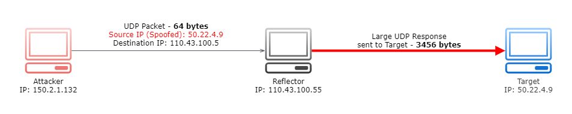

# **AWS Best Practices for DDoS Resiliency**

# Sections
- [**AWS Best Practices for DDoS Resiliency**](#aws-best-practices-for-ddos-resiliency)
- [Sections](#sections)
- [Overview](#overview)
  - [Prerequisites](#prerequisites)
- [Introduction: Denial of Service Attacks](#introduction-denial-of-service-attacks)
  - [Definition](#definition)
  - [Infrastructure Layer Attacks](#infrastructure-layer-attacks)
    - [UDP Reflection Attacks](#udp-reflection-attacks)
    - [SYN Flood Attacks](#syn-flood-attacks)
  - [Application Layer Attacks](#application-layer-attacks)
    - [HTTP Flood Attack](#http-flood-attack)
    - [Cache-Bursting Attack](#cache-bursting-attack)
    - [Other Attacks](#other-attacks)
- [Mitigation Techniques](#mitigation-techniques)
- [Attack Surface Reduction](#attack-surface-reduction)
- [Operational Techniques](#operational-techniques)
- [Conclusion](#conclusion)
- [References](#references)

# Overview
- [Source](https://d1.awsstatic.com/whitepapers/Security/DDoS_White_Paper.pdf)

This summary is based off of the December 2019 revision of the **AWS Best Practices for DDoS Resiliency** whitepaper. It provides the reader with guidance to improve the DDoS resiliency of their apps running on AWS. This is done through outlining the practices that fit into a DDoS mitigation strategy, and the corresponding AWS services and features that can help a customer replicate those practices to protect their apps.

## Prerequisites
- Basic knowledge of the [OSI Model](https://www.cloudflare.com/en-gb/learning/ddos/glossary/open-systems-interconnection-model-osi/)

# Introduction: Denial of Service Attacks

## Definition
A **Denial of Service (DoS)** attack is a deliberate attempt to make an application or website unavailable to its users, such as flooding and overwhelming it with network traffic. A **Distributed Denial of Service (DDoS)** attack uses multiple sources (infected computers, routers, IoT devices, etc.) to orchestrate a DoS attack against a target. The diagram below illustrates a simple DDoS attack.

DDoS attacks are most common at the layers 3, 4, 6, and 7 of the [OSI Model](https://www.cloudflare.com/en-gb/learning/ddos/glossary/open-systems-interconnection-model-osi/), and the chart below displays examples of attacks in each layer. These attack types will be discussed in detail in the following sections.

<html>
<table>
  <tr>
    <th align="center">Layer</th>
    <th align="center">Data Unit</th>
    <th align="center">Description</th>
    <th align="center">Attack Vector Examples</th>
  </tr>
  <tr>
    <th align="center">7 - Application</th>
    <td align="center">Data</td>
    <td align="center">Network access to application</td>
    <td align="center">HTTP floods, DNS query floods</td>
  </tr>
  <tr>
    <th align="center">6 - Presentation</th>
    <td align="center">Data</td>
    <td align="center">Data representation and encryption</td>
    <td align="center">TLS Abuse</td>
  </tr>
  <tr>
    <th align="center">4 - Transport</th>
    <td align="center">Segments</td>
    <td align="center">End-to-end connections and reliability</td>
    <td align="center">SYN floods</td>
  </tr>
  <tr>
    <th align="center">3 - Network</th>
    <td align="center">Packets</td>
    <td align="center">Path determination and logical addressing</td>
    <td align="center">UDP reflection attacks</td>
  </tr>
</table>
</html>

## Infrastructure Layer Attacks
This document will collectively refer to Layers 3 and 4 as the *infrastructure layer*, and it is the most commonly attacked layer. Large volumes of network traffic can overwhelm the network capacity, tie up firewall and server systems.

### UDP Reflection Attacks
A **UDP Reflection Attack** exploits the fact that UDP is a stateless protocol, meaning that the source server does not need to wait to get the target's permission to begin communication.

It involves the attacker creating a valid UDP request packet using the target's IP address as the source. When the attacker sends the UDP packet to an intermediate "reflector" server, it is tricked into sending the response packets to the target. The reflector server is used because it generates a response many times larger than the original request packet, depending on the amplification factor.

The amplification factor is dependent upon the protocol used. In the case of DNS for example, it can be 28 to 54 times the original amount of bytes. This attack may also more specifically referred to as a [DNS Amplification](https://www.cloudflare.com/en-gb/learning/ddos/dns-amplification-ddos-attack/) or [NTP Amplification](https://www.cloudflare.com/en-gb/learning/ddos/ntp-amplification-ddos-attack/) attack, depending on the protocol used.

### SYN Flood Attacks
A **SYN Flood Attack** exploits the SYN/ACK handshake process of a TCP connection. Under normal circumstances, the handshake proceeds as follows:
1. A SYN (synchronization) packet is sent from the client to the target to initiate communication
2. The target responds with a SYN-ACK packet in acknowledgement
3. The client responds with an ACK packet to acknowledge the target's response. At this point the TCP connection is open and able to transmit data.

In a SYN flood attack, the attacker sends a high volume of SYN packets to the target, often with spoofed IP addresses. The target responds to each request and opens a port ready to receive the ACK response. The response never comes back, and the target is left waiting with open ports for some time. Once all the available ports are used, the target is unable to function normally.

## Application Layer Attacks
Attacks agains Layers 6 and 7 are referred to as *application layer attacks*, and they work with a similar principle to [SYN Flood Attacks](#syn-flood-attacks). They attempt to overload specific functions of an application to make it unavailable or unresponsive to legitimate users.

### HTTP Flood Attack
In an **HTTP Flood Attack**, the attacker sends a high volume of HTTP requests to the target. The target becomes saturated with requests and is unable to respond to requests from legitimate users.

### Cache-Bursting Attack
The **Cache-Bursting Attack** is a specialized HTTP Flood that uses variations in the query string to circumvent [content delivery network (CDN)](https://www.cloudflare.com/en-gb/learning/cdn/what-is-a-cdn/) caching. It forces the CDN to contact the origin server for every page request, causing additional strain on the application.

### Other Attacks
TLS is computationally expensive, so if an app is delivered over TLS, an attacker can send unintelligible data to the app to reduce its performance. The attacker may also exhaust server resources by opening and closing many TLS sessions.

Brute force and credential stuffing attacks attempt to gain unauthorized access to areas of an application. Scraper bots attempt to steal content or record competitive information such as pricing. While these and other attacks are not strictly DDoS attacks, their automated nature makes them similar, and can be mitigated with some of the same practices outlined in this document.

# Mitigation Techniques

# Attack Surface Reduction

# Operational Techniques

# Conclusion

# References
- [Whitepaper](https://d1.awsstatic.com/whitepapers/Security/DDoS_White_Paper.pdf)
