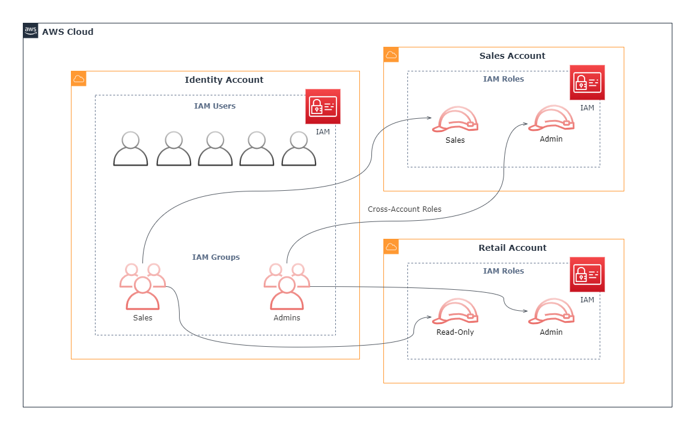
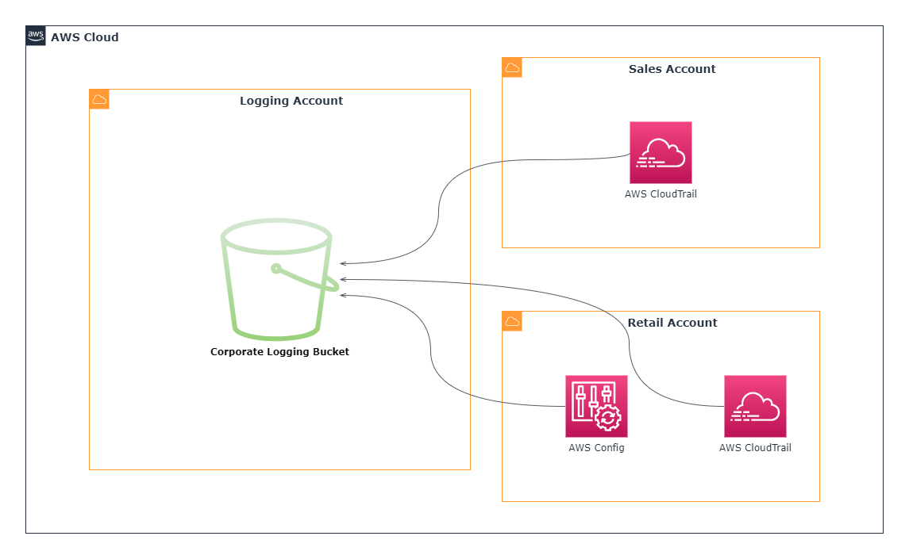
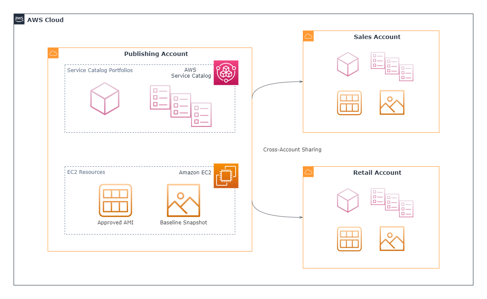
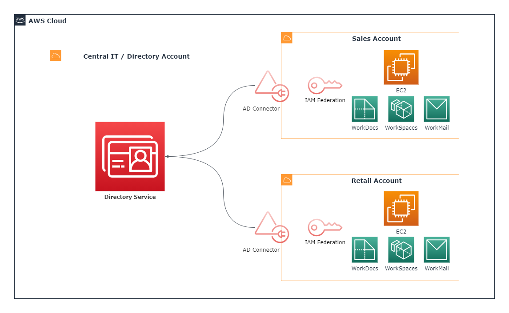
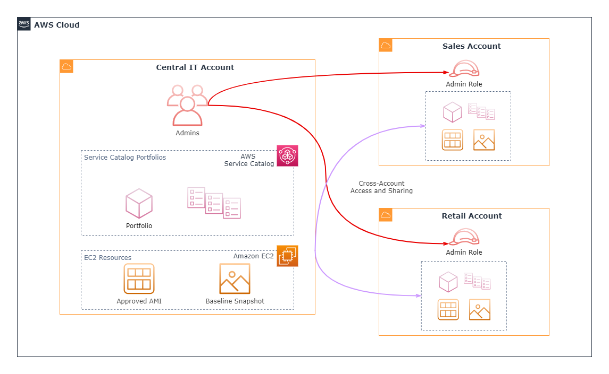

# **AWS Multi-Account Security Strategy**

# Sections
- [**AWS Multi-Account Security Strategy**](#aws-multi-account-security-strategy)
- [Sections](#sections)
- [Overview](#overview)
- [General Best Practices](#general-best-practices)
- [Implementation Considerations](#implementation-considerations)
  - [When to Create Multiple Accounts](#when-to-create-multiple-accounts)
  - [When to Create a Security Account Structure](#when-to-create-a-security-account-structure)
- [AWS Security Account Structures](#aws-security-account-structures)
  - [Identity Account Structure](#identity-account-structure)
  - [Logging Account Structure](#logging-account-structure)
  - [Publishing Account Structure](#publishing-account-structure)
- [Hybrid Security Account Structures](#hybrid-security-account-structures)
  - [Information Security Account](#information-security-account)
  - [Central IT Account](#central-it-account)
- [References](#references)

# Overview
- [Source](https://d1.awsstatic.com/aws-answers/AWS_Multi_Account_Security_Strategy.pdf)

This summary is based off of the June 2017 revision of the **AWS Multi-Account Security Strategy** whitepaper. This document answers the question:
*How do I manage multiple AWS accounts for security purposes?* at a high-level for various situations. It assumes that the reader has basic knowledge of AWS accounts, IAM, S3, CloudTrail, AWS Organizations, and identity federation.

# General Best Practices
- **Clearly define an AWS account-creation process**
  - Maintain an inventory of who is creating AWS accounts, and what each account is used for
- **Define a company-wide AWS usage policy**
  - Empowers customers to leverage AWS without internal confusion about what is or what isn't within policy guidelines
- **Create a security account structure for managing multiple accounts**
  - Makes it easier for companies to:
    - Assess the security of AWS-based deployments
    - Centralize security monitoring and management
    - Manage identity and access
- **Leverage AWS APIs and scripts**
  - Use the AWS APIs in custom scripts to automate the application of baseline configurations across AWS accounts
  - [AWS Control Tower](https://aws.amazon.com/controltower/) is tailored for this purpose, and is the easiest way to set up a secure multi-account AWS environment

# Implementation Considerations

## When to Create Multiple Accounts
Answering yes to any of the following questions is a good indicator of an organization requiring multiple AWS accounts:
- *Does the business require **administrative isolation between workloads?***
  - Different accounts can be used to isolate management of each workload
- *Does the business require **limited visibility and discoverability of workloads?***
  - A seperate account for workloads can be used to block their visibility to users in other accounts (unless explicitly given permission)
- *Does the business require isolation to **minimize blast radius?***
  - If an account is impacted by a critical event (ex. security breach, account suspension), separate accounts will only be slightly, if at all impacted
- *Does the business require strong **isolation of recovery and/or auditing data?***
  - A seperate account can be used to isolate and store auditing data from the workload accounts

## When to Create a Security Account Structure
Answering yes to any of the following questions is a good indicator of an organization organizing their accounts in some sort of security hierarchy:
- *1. Do you want to manage AWS user identities in one account and **federate access to other accounts?***
- *2. Do you want to **centrally store, analyze, and report on AWS generated log data** from services such as CloudTrail, Config, S3, CloudFront, ELBs, or VPC Flow Logs?*
- *3. Do you want to empower security and compliance organizations to **apply security baselines and monitor security compliance across multiple AWS accounts?***
- *4. Do you want to **centrally manage approved EC2 AMIs or Service Catalog products and portfolios?***

# AWS Security Account Structures
The following security account structures are based on common approaches for creating and securing AWS account groups.

## Identity Account Structure

- Useful for organizations that want to create users and groups in a central account, and enable access to resources in other accounts ([the 1st question mentioned above](#when-to-create-a-security-account-structure))
- This model uses cross-account roles to grant access control from one account to another
- Each associated account has IAM roles and permissions mapped to users or groups in order to control access

## Logging Account Structure

- Useful for organizations that want to centrally store, secure, and process AWS log and configuration data ([the 2nd question mentioned above](#when-to-create-a-security-account-structure))
- This model configures accounts to send logs to a parent logging account, and configures the parent account with specific service access policies to accept the data
- This approach simplifies monitoring and compliance checking across multiple accounts

## Publishing Account Structure

- Useful for organizations what want to centrally managed preapproved server images and CloudFormation templates across a company ([the 4th question mentioned above](#when-to-create-a-security-account-structure))
- This approaches leverages cross-account resource sharing to use a central repository account for resources such as approved AMIs and Service Catalog portfolios, and then shares them with other accounts in the organization

# Hybrid Security Account Structures
AWS recommends taking an iterative approach to determining the appropriate security account structure, because most customers rarely require every available option immediately. Usually, multiple hierarchies are more desirable than a single one since there may be different account concerns (such as billing, compliance monitoring, or shared IT services). The following examples illustrate a few ways to combine the aforementioned structures for Information Security or central IT purposes.

## Information Security Account

- This approach combines the [identity](#identity-account-structure) and [logging](#logging-account-structure) security structures for the purposes of Information Security
- The users in the InfoSec account can perform their necessary roles in the other accounts (such as enforcing compliance), and they can monitor activity across AWS accounts ([the 3rd question above](#when-to-create-a-security-account-structure))

## Central IT Account
Central IT accounts can have various responsibilities depending on the company. These are just two examples.

### User Directory

- This example uses the Central IT account to host a user directory with [AWS Directory Service for Microsoft Active Directory](https://aws.amazon.com/directoryservice/)
- For user access to EC2 instances and other resources such as Amazon WorkSpaces, the other accounts are federated with Directory Service ([the 1st question above](#when-to-create-a-security-account-structure))

### Centrally Manage IAM Identities & Shared Resources

- This approach combines the [identity](#identity-account-structure) and [publishing](#logging-account-structure) security structures to centrally manage users and approved AWS resources in a parent account
  - Users are associated with roles in the child accounts
  - AWS resources such as approved/verified AMIs and catalog portfolios can be published to child accounts

# References
- [Whitepaper](https://d1.awsstatic.com/aws-answers/AWS_Multi_Account_Security_Strategy.pdf)
