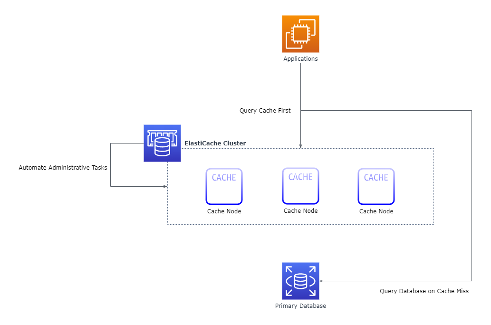
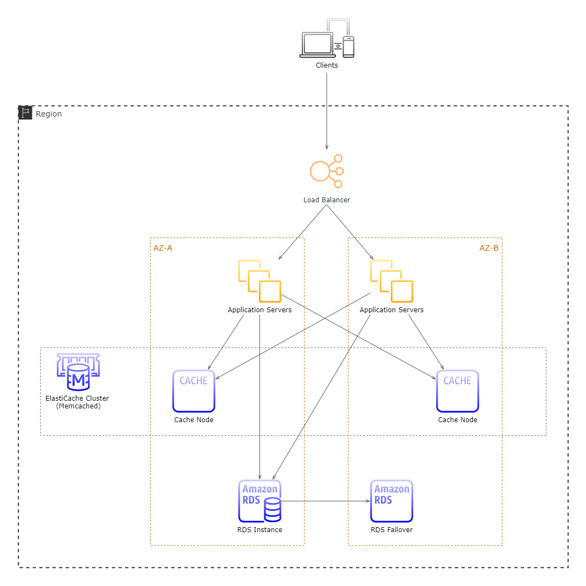
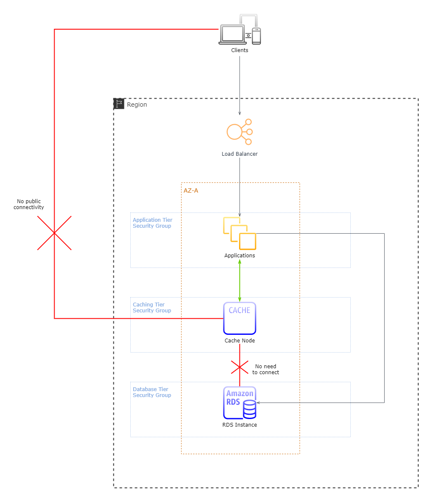
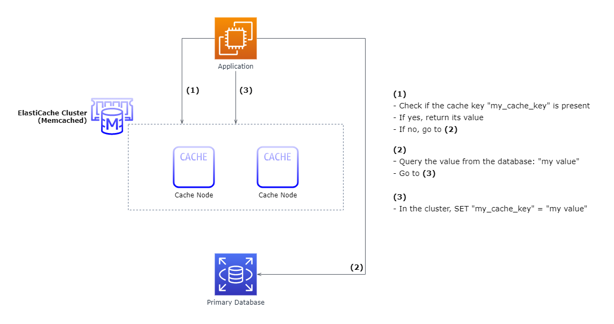
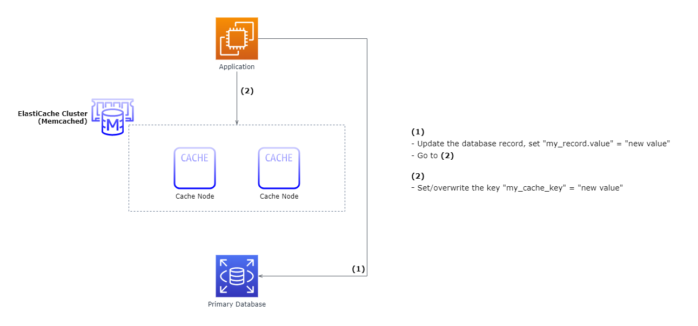

# **Performance at Scale with Amazon ElastiCache**

# Sections
- [**Performance at Scale with Amazon ElastiCache**](#performance-at-scale-with-amazon-elasticache)
- [Sections](#sections)
- [Overview](#overview)
  - [Architecture Overview](#architecture-overview)
  - [Alternatives to ElastiCache](#alternatives-to-elasticache)
    - [Amazon CloudFront](#amazon-cloudfront)
    - [RDS Read Replicas](#rds-read-replicas)
    - [On-host caching (Not Recommended)](#on-host-caching-not-recommended)
  - [Memcached vs. Redis](#memcached-vs-redis)
- [ElastiCache for Memcached](#elasticache-for-memcached)
  - [Architecture](#architecture)
    - [Best Practices](#best-practices)
  - [Selecting the Right Cache Node Size](#selecting-the-right-cache-node-size)
    - [Cache Size Approximation Example](#cache-size-approximation-example)
  - [Security Groups and VPC](#security-groups-and-vpc)
- [Caching Design Patterns](#caching-design-patterns)
  - [How to Apply Caching](#how-to-apply-caching)
  - [Consistent Hashing (Sharding)](#consistent-hashing-sharding)
  - [Client Libraries](#client-libraries)
  - [Be Lazy](#be-lazy)
    - [Advantages](#advantages)
    - [Best Practices](#best-practices-1)
  - [Write On Through](#write-on-through)
    - [Advantages](#advantages-1)
    - [Best Practices](#best-practices-2)
  - [Expiration Date](#expiration-date)
  - [The Thundering Herd](#the-thundering-herd)
    - [Causes](#causes)
    - [Solution](#solution)
- [ElastiCache for Redis](#elasticache-for-redis)
- [Advanced Datasets with Redis](#advanced-datasets-with-redis)
- [Monitoring and Tuning](#monitoring-and-tuning)
- [Cluster Scaling and Auto Discovery](#cluster-scaling-and-auto-discovery)
- [References](#references)

# Overview
- [Source](https://d0.awsstatic.com/whitepapers/performance-at-scale-with-amazon-elasticache.pdf)

This summary is based off of the July 2019 revision of the **Performance at Scale with Amazon ElastiCache** whitepaper. This whitepaper highlights the [Amazon ElastiCache](https://aws.amazon.com/elasticache/) service as a tool for maintaining the performance of web applications at scale. It compares its two in-memory caching engines, [Memcached](https://memcached.org/) and [Redis](https://redis.io/), demonstrates in-memory design patterns, and explains best practices for using ElastiCache with real-world application architectures.

## Architecture Overview
ElastiCache works by deploying one or more cache clusters in the AWS cloud. Once deployed and running, the service automates administrative tasks such as resource provisioning, failure detection and recovery, and software patching.

ElastiCache is independent of the database tier, so it's possible to use it as an in-memory layer between the application(s) and one database, multiple databases, or none at all. Below displays an example architecture with one cache cluster, 3 cache nodes, and one primary [Amazon RDS](https://aws.amazon.com/rds/) database to serve applications running on [Amazon EC2](https://aws.amazon.com/ec2/).

## Alternatives to ElastiCache

### Amazon CloudFront
- [Amazon CloudFront](https://aws.amazon.com/cloudfront/) is a content-delivery network used to cache static web content such as media files and webpages close to end users
- It's valuable for scaling a website, but isn't a replacement for ElastiCache
- It can be beneficial to use the two services together

### RDS Read Replicas
- RDS supports the ability for read replicas of the primary database
- This limits the data to a copy of the database format, and would not be a substitute for caching calculations, aggregates, or custom keys
- Read replicas are also not as fast as in-memory caches

### On-host caching (Not Recommended)
- The simplest approach is to store data on each EC2 application instance, but there are a wide host of problems with it:
  - The cache is tied to the instance's life span, reducing efficiency
    - If rebooted or replaced, the cache is emptied out
  - Cache invalidation is infeasible at scale
  - Synchronizing cache data across a fleet of servers is infeasible at scale
- In short, **don't use this approach**

## Memcached vs. Redis
Each ElastiCache cluster is selected between one of two popular open-source, in-memory key-value engines: [Memcached](https://memcached.org/) and [Redis](https://redis.io/). ElastiCache is protocol compliant with both, so existing applications that already use either caching engine will work seamlessly with the service.

<html>
    <table>
        <tr>
            <th align="center" width="400">ElastiCache for Memcached</th>
            <th align="center" width="400">ElastiCache for Redis</th>
        </tr>
        <tr>
            <td>
                <ul>
                    <li>Simple, easy-to-use caching model</li>
                    <li>Multithreaded nodes</li>
                    <li>Easily scales out by adding more nodes to the cluster</li>
                </ul>
            </td>
            <td>
                <ul>
                    <li>Supports advanced data types, such as lists, hashes, and sets</li>
                    <li>Built-in disk persistence</li>
                    <li>Can run in multiple Availability Zones with failover support</li>
                    <li>Publish and subscribe capabilities</li>
                    <li>Supports multiple compliance standards (ex. PCI DSS, HIPAA, FedRAMP)</li>
                </ul>
            </td>
        </tr>
    </table>
</html>

It may be tempting to look at Redis as a more evolved Memcached due to its advanced features, but Memcached has a longer track record and the ability to leverage multiple CPU cores. The two engines are also very different in practice, so the next few sections will address each of them separately.

# ElastiCache for Memcached

## Architecture
ElastiCache Memcached clusters sit in a separate tier alongside a database in an application architecture. ElastiCache does not directly communicate with the database, nor have any particular knowledge of the database. As requests come into the application, the application is responsible for communicating between the caching and database tiers. As more nodes are added to the cache cluster, the cache keys are distributed among them, resulting in linear scaling of the cache pool in relation to the number of its nodes.

When launching a cluster in a region, its availability zones must be specified. In the example above, we have an ElastiCache cluster spanning two availability zones.

### Best Practices
- Launch nodes across multiple availability zones to ensure high availability of the cache cluster
- Launch nodes in the same zones as application servers to achieve best performance

## Selecting the Right Cache Node Size
- To get an approximate amount of cache memory needed, multiply the size of the items (needing to be cached) by the number of items to be cached at once
- Memcached also adds 50-60 bytes of internal bookkeeping data to each element
- The cache key itself also consumes space, at 2 bytes per character
- Every cache node type and its specifications are [listed here](https://aws.amazon.com/elasticache/pricing/#Available_node_types)

### Cache Size Approximation Example
- The application is a social media website
- We want to cache user profile data, which is approximately 1KB
- We want to support at minimum 10 million profiles cached at any one time
- Our cache key per user will be 50 characters in length
- We have:
  - Raw Size per item = `1,000 bytes`
  - Cache key per item = `(50 * 2 bytes) = 100 bytes`
  - Bookkeeping per item = `50 bytes`
  - Total Size per item = `1,000 + 100 + 50 = 1,150 bytes`
- In total, we have:
  - Minumum cache memory required = `Item Size x Number of items` 
  `= 1,150 * 10,000,000` 
  `= 11,500,000,000 bytes` 
  `= 11.5 GB`

## Security Groups and VPC
- Like other AWS services, ElastiCache supports [security groups](https://docs.aws.amazon.com/AWSEC2/latest/UserGuide/ec2-security-groups.html) which define rules that limit access to compute instances based on IP addresses and ports
- It is a best practice to launch ElastiCache clusters into private subnets with no public connectivity for best security
- Only allow connectivity from the application tier, only the applications need  connectivity to ElastiCache
- The diagram below shows a simplified architecture diagram to achieve these practices:

# Caching Design Patterns

## How to Apply Caching
These questions can be used as a guideline to apply caching in an application:
- **Is it safe to use a cached value?**
  - The same piece of data can have different consistency requirements in different contexts
  - Ex. Price may be cached for the online checkout service, but on other pages it may be minutes out of date
- **Is caching effective for that data?**
  - Some applications have data access patterns not suitable for caching
  - Ex. A large, frequently changing dataset
- **Is the data structured well for caching?**
  - Sometimes, data is best cached in a format that combines multiple records together
  - Caching data in different formats allows it to be accessed by different attributes in the record

## Consistent Hashing (Sharding)
- A simple approach to spread cache keys across cache nodes would be to apply a hash function to the key, and use math modulo the number of cache nodes to determine which node to be cached to
- This approach has serious issues when adding more nodes to scale
  - The hash modulo of the new number of nodes will remap most cache keys to new nodes, effectively invalidating those keys
  - The number of keys remapped = `old node count / new node count`
    - Ex. A website receives heavy traffic and needs to increase 9 nodes to 10
      - `old node count / new node count = 9/10 = 90%`
      - 90% of the cache is wiped when the website needs it most, degrading performance for a while
- **Consistent Hashing** solves this problem by creating an internal hash ring with a preset number of random integers, and nodes are assigned to those random integers
  - As new nodes are added, they are slotted to a random integer on the hash ring
  - Cache keys are assigned by first finding it's closest integer on the ring, then being assigned to the node associated with that integer
- Many modern client libraries already support consistent hashing, so it likely won't need to be manually implemented

## Client Libraries
- As mentioned above, most popular client libraries for Memcached support consistent hashing
- For Java, .NET, or PHP, there are [ElastiCache clients with Auto Discovery](https://docs.aws.amazon.com/AmazonElastiCache/latest/mem-ug/Clients.html) to support auto discovery of new nodes as they are added to the cluster
  - Only works for Memcached, not Redis
  - Recommended if planning to use dynamically scaling clusters for applications with significant load fluctuation 

## Be Lazy
- **Lazy caching** is the most prevalent approach to caching, and the basic idea is to populate the cache only when an object is actually requested by the application
- The diagram below shows an example lazy caching flow for the cache key `my_cache_key`

### Advantages
- The cache only contains objects that the application actually requests, which helps keeps the cache size manageable
- As new nodes come online, the lazy caching method automaically adds objects to the nodes when the application first requests them
- Cache expiration is easily handled by simply deleting the cached object

### Best Practices
- For areas in the application where data is read often, a lazy caching strategy is a good choice
  - Ex. Personal profiles on social media apps don't change often, but are read by many users many times a day, depending on the profile
    - This is a perfect caching candidate

## Write On Through
- **Write-through caching** updates the cache in real-time as the database is updated
- The diagram below shows the same architecture as before, but now implementing the write-through strategy

### Advantages
- Avoids cache misses, which can help the app's performance
- Simplifies cache expiration since the cache is always up-to-date
- Shifts any application delay to the user updating data, mapping better to user expectations

### Best Practices
- Write-through caching should be used as a proactive measure for data that is certainly going to be accessed, or any type of aggregate
  - Ex. Top 100 game leaderboards, top 10 most popular news stories, product recommendations
- It's best to think of lazy caching as a foundation that can be used throughout the app, and write-through caching for targeted optimization for specific situations

## Expiration Date
- **Always apply a time to live (TTL)**
  - Apply a TTL to cache keys, except those updated with write-through caching
  - Catches application bugs when the cache key is forgotten to be updated or deleted when its underying record has been
    - The cache key will expire anyway and be refreshed
- **Set a short TTL for rapidly changing data**
  - Ex. comments, activity streams, leaderboards
  - If a database query is getting hammered, a TTL of a few seconds is a good hotfix to keep the application running
- **Russion doll caching pattern**
  - Nested records are managed with the ir own cache keys, and the top-level resource is a collection of those keys
    - Ex. a news webpage containing users, stories, and comments
      - Users, stories, and comments have their own cache keys
      - The webpage is the collection of those cache keys

## The Thundering Herd
- The **thundering herd effect** is what happens when a cache key is simultaneously requested by multiple application processes, missed, and then each process runs the same database query in parallel
  - Results in a heavier impact on the primary database, and the effect increases as the query becomes more expensive

### Causes
- **TTL**
  - Ex. a celebrity's profile on a social media app expires in the cache
    - Millions of users loading their profile page will suddenly hammer the database
- **Adding new nodes**
  - The new cache node's memory will be empty

### Solution
- The solution is to prewarm the cache by using these str:
  - **1.** Write an automated script to simulate requests that the application will expect
    - Cache misses will result in the cache keys filling up
  - **2.** When adding new cache nodes, the script should be run
    - Reconfigures the app to add a new node to the consistent hashing ring

# ElastiCache for Redis

# Advanced Datasets with Redis

# Monitoring and Tuning

# Cluster Scaling and Auto Discovery

# References
- [Whitepaper](https://d0.awsstatic.com/whitepapers/performance-at-scale-with-amazon-elasticache.pdf)