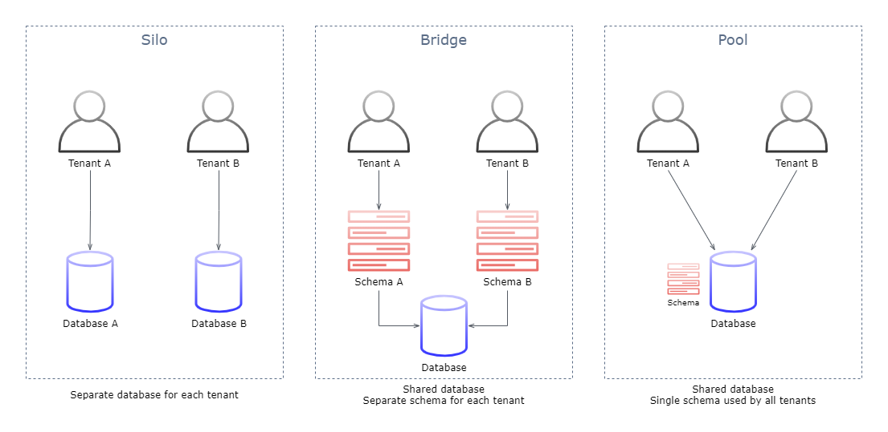

# **SaaS Storage Strategies**

# Sections
- [**SaaS Storage Strategies**](#saas-storage-strategies)
- [Sections](#sections)
- [Overview](#overview)
- [SaaS Partitioning Models](#saas-partitioning-models)
- [Finding the Right Fit](#finding-the-right-fit)
  - [Assessing Tradeoffs](#assessing-tradeoffs)
  - [Hybrid: The Business Compromise](#hybrid-the-business-compromise)
    - [Compromise Example](#compromise-example)
- [Data Migration](#data-migration)
  - [Migration and Multitenancy](#migration-and-multitenancy)
- [Security Considerations](#security-considerations)
- [Management and Monitoring](#management-and-monitoring)
- [Multitenancy on DynamoDB](#multitenancy-on-dynamodb)
- [Multitenancy on RDS](#multitenancy-on-rds)
- [Multitenancy on Redshift](#multitenancy-on-redshift)
- [References](#references)

# Overview
- [Source](https://d1.awsstatic.com/whitepapers/Multi_Tenant_SaaS_Storage_Strategies.pdf)

This summary is based off of the November 2016 revision of the **SaaS Storage Strategies** whitepaper. This whitepaper highlights different data partitioning solutions via AWS servivces for [multitenant](https://en.wikipedia.org/wiki/Multitenancy) applications. Just like there are multiple flavors of storage, there are multiple flavors of multitenant partitioning strategies. The goal is to find the best intersection of an application's storage and partitioning needs.

# SaaS Partitioning Models
There are 3 models commonly used when partitioning data in a SaaS environment:
- **Silo**
- **Bridge**
- **Pool** 

The diagram below displays each of the 3 models.

Some AWS services will map directly to these models, and others require a bit of creativity to achieve each type of tenant isolation.

# Finding the Right Fit

## Assessing Tradeoffs
If the 3 models were placed on a spectrum, Silo and Pool would be on opposite ends of the spectrum, with Bridge being a hybrid of the two. The qualities listed as strengths for a silo would be considered weakenesses for a pool, and vice versa. Some of the respective pros and cons of each end of the spectrum are listed below:

<html>
  
  <table>
    <tr>
      <th></th>
      <th>Silo Model</th>
      <th>Pool Model</th>
    </tr>
    <tr>
      <th>Pros</th>
      <td>
        <ul>
          <li>Compliance and regulatory alignment</li>
          <li>No cross-tenant impacts</li>
          <li>Tenant-level tuning</li>
        </ul>
      </td>
      <td>
        <ul>
          <li>Agility</li>
          <li>Cost optimization</li>
          <li>Centralized management</li>
        </ul>
      </td>
    </tr>
    <tr>
      <th>Cons</th>
      <td>
        <ul>
          <li>Compromised agility</li>
          <li>Cost</li>
          <li>Deployment complexity</li>
        </ul>
      </td>
      <td>
        <ul>
          <li>Cross-tenant impacts</li>
          <li>Compliance challenges</li>
          <li>All or nothing availability</li>
        </ul>
      </td>
    </tr>
  </table>
</html>

## Hybrid: The Business Compromise

### Compromise Example
- Suppose that a team identifies that a small section of their tenants require the silo model
  - This may lead them to assume that they have to implement all of the storage with that one model
  - Artificially limits the team's ability to embrace tenants that may be open to a pool model
  - May increase cost and complexity for tenants that don't require the attributes of the silo model
- A possible compromise can be building a solution that fully supports pooled storage, but carves out separate databases for tenants needing siloed storage

# Data Migration

## Migration and Multitenancy
- Each of the storage models requires its own unique approach for handling data migration
  - Silo and bridge models can migrate on a tenant-by-tenant basis
  - Pool models are challenging, yet appealing
    - If a problem is encountered during migration, it could impact all tenants
    - If successful, all tenants are migrated at once

# Security Considerations
- Whichever model is chosen, AWS is likely to use common security patterns for supporting it, such as:
  - Encryption at rest
  - IAM policies to limit access
- Achieving storage isolation will look very different between the various services

# Management and Monitoring
- **Aggregating Storage Trends**
  - In a siloed model, data must be collected from each isolated database and presented in an aggregate model
  - A pooled model by definition, will natively have an aggregated view of tenant activity
- **Policies and Alarms**
  - The more siloed the model, the more moving parts to manage and maintain on a tenant-by-tenant basis
  - The shared nature of pooled storage makes it simpler to have a more centralized, cross-tenant collection of policies and alarms

# Multitenancy on DynamoDB
DynamoDB has slightly less mapping between any of the storage models, and there are additional factors to consider. This section will illustrate how the models can be achieved on DynamoDB, along with potential challenges.

# Multitenancy on RDS

# Multitenancy on Redshift

# References
- [Whitepaper](https://d1.awsstatic.com/whitepapers/Multi_Tenant_SaaS_Storage_Strategies.pdf)