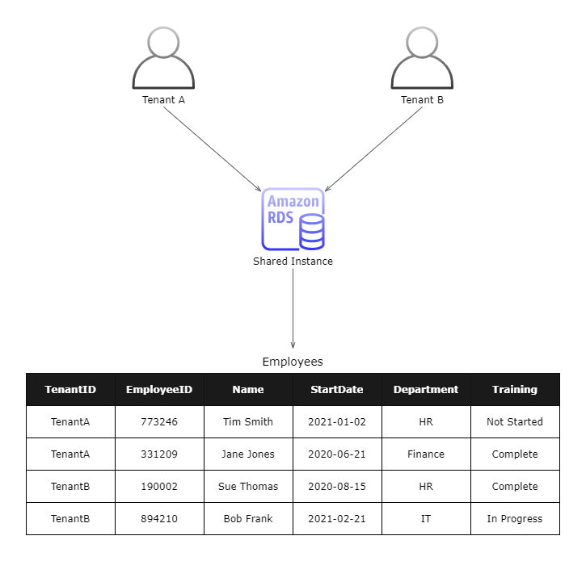

# **SaaS Storage Strategies**

# Sections
- [**SaaS Storage Strategies**](#saas-storage-strategies)
- [Sections](#sections)
- [Overview](#overview)
- [SaaS Partitioning Models](#saas-partitioning-models)
- [Finding the Right Fit](#finding-the-right-fit)
  - [Assessing Tradeoffs](#assessing-tradeoffs)
  - [Hybrid: The Business Compromise](#hybrid-the-business-compromise)
    - [Compromise Example](#compromise-example)
- [Data Migration](#data-migration)
  - [Migration and Multitenancy](#migration-and-multitenancy)
- [Security Considerations](#security-considerations)
- [Management and Monitoring](#management-and-monitoring)
- [Multitenancy on DynamoDB](#multitenancy-on-dynamodb)
  - [Silo Model](#silo-model)
    - [Advantages](#advantages)
    - [Disadvantages](#disadvantages)
  - [Bridge Model](#bridge-model)
  - [Pool Model](#pool-model)
    - [Considerations](#considerations)
    - [Solving the Problem](#solving-the-problem)
      - [Example: Table1](#example-table1)
    - [Managing Shard Distribution](#managing-shard-distribution)
- [Multitenancy on RDS](#multitenancy-on-rds)
  - [Silo Model](#silo-model-1)
  - [Bridge Model](#bridge-model-1)
    - [Disadvantages](#disadvantages-1)
  - [Pool Model](#pool-model-1)
- [Multitenancy on Redshift](#multitenancy-on-redshift)
- [References](#references)

# Overview
- [Source](https://d1.awsstatic.com/whitepapers/Multi_Tenant_SaaS_Storage_Strategies.pdf)

This summary is based off of the November 2016 revision of the **SaaS Storage Strategies** whitepaper. This whitepaper highlights different data partitioning solutions via AWS servivces for [multitenant](https://en.wikipedia.org/wiki/Multitenancy) applications. Just like there are multiple flavors of storage, there are multiple flavors of multitenant partitioning strategies. The goal is to find the best intersection of an application's storage and partitioning needs.

# SaaS Partitioning Models
There are 3 models commonly used when partitioning data in a SaaS environment:
- **Silo**
- **Bridge**
- **Pool** 

The diagram below displays each of the 3 models.

Some AWS services will map directly to these models, and others require a bit of creativity to achieve each type of tenant isolation.

# Finding the Right Fit

## Assessing Tradeoffs
If the 3 models were placed on a spectrum, Silo and Pool would be on opposite ends of the spectrum, with Bridge being a hybrid of the two. The qualities listed as strengths for a silo would be considered weakenesses for a pool, and vice versa. Some of the respective pros and cons of each end of the spectrum are listed below:

<html>
  <table>
    <tr>
      <th></th>
      <th>Silo Model</th>
      <th>Pool Model</th>
    </tr>
    <tr>
      <th>Pros</th>
      <td>
        <ul>
          <li>Compliance and regulatory alignment</li>
          <li>No cross-tenant impacts</li>
          <li>Tenant-level tuning</li>
        </ul>
      </td>
      <td>
        <ul>
          <li>Agility</li>
          <li>Cost optimization</li>
          <li>Centralized management</li>
        </ul>
      </td>
    </tr>
    <tr>
      <th>Cons</th>
      <td>
        <ul>
          <li>Compromised agility</li>
          <li>Cost</li>
          <li>Deployment complexity</li>
        </ul>
      </td>
      <td>
        <ul>
          <li>Cross-tenant impacts</li>
          <li>Compliance challenges</li>
          <li>All or nothing availability</li>
        </ul>
      </td>
    </tr>
  </table>
</html>

## Hybrid: The Business Compromise

### Compromise Example
- Suppose that a team identifies that a small section of their tenants require the silo model
  - This may lead them to assume that they have to implement all of the storage with that one model
  - Artificially limits the team's ability to embrace tenants that may be open to a pool model
  - May increase cost and complexity for tenants that don't require the attributes of the silo model
- A possible compromise can be building a solution that fully supports pooled storage, but carves out separate databases for tenants needing siloed storage

# Data Migration

## Migration and Multitenancy
- Each of the storage models requires its own unique approach for handling data migration
  - Silo and bridge models can migrate on a tenant-by-tenant basis
  - Pool models are challenging, yet appealing
    - If a problem is encountered during migration, it could impact all tenants
    - If successful, all tenants are migrated at once

# Security Considerations
- Whichever model is chosen, AWS is likely to use common security patterns for supporting it, such as:
  - Encryption at rest
  - IAM policies to limit access
- Achieving storage isolation will look very different between the various services

# Management and Monitoring
- **Aggregating Storage Trends**
  - In a siloed model, data must be collected from each isolated database and presented in an aggregate model
  - A pooled model by definition, will natively have an aggregated view of tenant activity
- **Policies and Alarms**
  - The more siloed the model, the more moving parts to manage and maintain on a tenant-by-tenant basis
  - The shared nature of pooled storage makes it simpler to have a more centralized, cross-tenant collection of policies and alarms

# Multitenancy on DynamoDB
DynamoDB has slightly less mapping between any of the storage models, and there are additional factors to consider. This section will illustrate how the models can be achieved on DynamoDB, along with potential challenges.

## Silo Model

- Every DynamoDB table (or group of tables) will have to be associated with a specific tenant
  - Table names must be unique, so they can be prepended with the tenant's name
- Access to tables is goverened by IAM policies and roles, and there is a unique set for each tenant, limiting access only to their own tables
  - Provisioning process will need to automate the creation of policies, and roles to access the tenant's set of tables

### Advantages
- CloudWatch metrics can be captured at the table-level, simplifying the aggregation of metrics on a per-tenant basis
- Table read and write capacity can be applied at the table-level, allowing granular control of database limits on a per-tenant basis

### Disadvantages
- Operational views of a tenant require the naming context to retrieve metrics and data from their tables
- Each interaction with a DynamoDB table requires inserting the tenant context to map the request to the appropriate tenant table

## Bridge Model
- Works similar to the silo model, but some isolation constraints may be relaxed

## Pool Model

### Considerations
- Requires consideration of how DynamoDB manages data before starting pool implementation:
  - Data in SaaS environments is not typically uniform
    - It's very common to have a handful of tenants that consume the largest portion of the data footprint
  - If tenants are simply mapped to a partition key, there will be partition "hot spots", which greatly undermines how DynamoDB partitions the table data
  - Some mechanism will be needed to better control the distribution of tenant data, and not rely on a single tenant identifier

### Solving the Problem
- To solve this issue, a secondary data sharding model should be created to associate each tenant with multiple partition keys
- This can be done by introducing a separate "tenant lookup table", such as below:

<html>
  <table>
    <tr>
      <th align="center">Partition Key</th>
      <th align="center" colspan="2">Attributes</th>
    </tr>
    <tr>
      <td>
        <b>TenantID</b> 
        TenantA</td>
      <td>
        <b>Table1</b> 
        { 
          ShardCount: 3, 
          ShardSize: [3, 5, 3] 
          ShardIds: ["60", "52", "88"] 
        }
      </td>
      <td>
        <b>Table2</b> 
        { 
          ShardCount: 2, 
          ShardSize: [5, 3, 6, 9] 
          ShardIds: ["111", "67", "23", "90"] 
        }
      </td>
    </tr>
    <tr>
      <td>
        <b>TenantID</b> 
        TenantB</td>
      <td>
        <b>Table1</b> 
        { 
          ShardCount: 4, 
          ShardSize: [6, 4, 7, 3] 
          ShardIds: ["12", "32", "120", "200"] 
        }
      </td>
      <td>
        <b>Table2</b> 
        { 
          ShardCount: 3, 
          ShardSize: [2, 4, 2] 
          ShardIds: ["42", "165", "80"] 
        }
      </td>
    </tr>
  </table>
</html>

- For each tenant, there is a sharding profile for each table containing these sub-attributes:
  - **ShardCount:** The number of shards associated with the table (for the tenant)
  - **ShardSize:** The current size of each shard
  - **ShardIds:** List of partition keys mapped to a tenant (for a table)
- This method can control how much data is distributed for each table
- Tenants with large data footprints will simply be given more shards
- Regular tables will now be formatted with the **ShardID** as the primary key, such as below:

#### Example: Table1
<html>
  <table>
    <tr>
      <th align="center">Partition Key</th>
      <th align="center">Attributes</th>
    </tr>
    <tr>
      <td><b>ShardID</b> 52</td>
      <td>...</td>
    </tr>
    <tr>
      <td><b>ShardID</b> 12</td>
      <td>...</td>
    </tr>
    <tr>
      <td><b>ShardID</b> 120</td>
      <td>...</td>
    </tr>
    <tr>
      <td>...</td>
      <td>...</td>
    </tr>
  </table>
</html>

### Managing Shard Distribution
- Questions to consider:
  - How to detect when a tenant needs more shards?
  - Which metrics and criteria should be used to automate this process?
- There is no single approach that universally answers these questions for each situation
  - The key takeaway is to be aware of how DynamoDB partitions data before moving in data blindly
  - Missing this consideration will likely undermine the performance and cost profile of the SaaS solution

# Multitenancy on RDS
RDS has a more natural mapping to each of the 3 models, and the realization of multitenancy is relatively straightforward.

## Silo Model

- A basic silo implementation would be to allocate a separate database per tenant
- Each database's read replicas and failover instances would also be tied to the tenant

## Bridge Model

- Create separate tables for each tenant within a shared database instance
- The introduces the need for provisioning and to map tables to tenants at runtime
- Another implementation would be to use a unique database for each tenant (within the same database instance), and each database has its own set of tables

### Disadvantages
- Some RDS containers limit the number of databases/schemas that can be created within an instance
  - Ex. SQL Server only allows 30 databases

## Pool Model

- Relies on traditional relational indexing schemes to partition tenant data
  - Tables are indexed with a unique tenant identifier to manage each tenant's data
- All tenants must use the same schema version
  - RDS is not like DynamoDB, which allows tenants to use different schemas within the same table

# Multitenancy on Redshift

# References
- [Whitepaper](https://d1.awsstatic.com/whitepapers/Multi_Tenant_SaaS_Storage_Strategies.pdf)