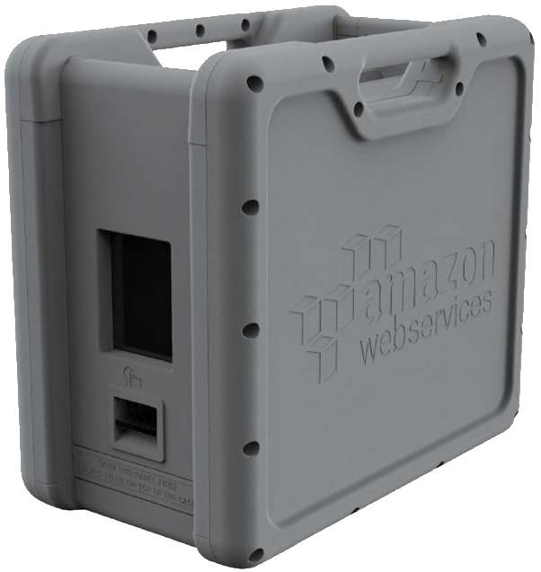

# **AWS Storage Services Overview**

# Sections
- [**AWS Storage Services Overview**](#aws-storage-services-overview)
- [Sections](#sections)
- [Overview](#overview)
- [Amazon S3](#amazon-s3)
  - [Usage Patterns](#usage-patterns)
  - [Anti-Patterns](#anti-patterns)
  - [Performance](#performance)
  - [Durability and Availability](#durability-and-availability)
  - [Security](#security)
  - [Cost Model](#cost-model)
- [Amazon Glacier](#amazon-glacier)
  - [Usage Patterns](#usage-patterns-1)
  - [Anti-Patterns](#anti-patterns-1)
  - [Performance](#performance-1)
  - [Durability and Availability](#durability-and-availability-1)
  - [Security](#security-1)
  - [Cost Model](#cost-model-1)
- [Amazon EFS](#amazon-efs)
  - [Usage Patterns](#usage-patterns-2)
  - [Anti-Patterns](#anti-patterns-2)
  - [Performance](#performance-2)
  - [Durability and Availability](#durability-and-availability-2)
  - [Security](#security-2)
  - [Cost Model](#cost-model-2)
- [Amazon EBS](#amazon-ebs)
  - [Usage Patterns](#usage-patterns-3)
  - [Anti-Patterns](#anti-patterns-3)
  - [Performance](#performance-3)
  - [Durability and Availability](#durability-and-availability-3)
  - [Security](#security-3)
  - [Cost Model](#cost-model-3)
- [Amazon EC2 Instance Storage](#amazon-ec2-instance-storage)
  - [Usage Patterns](#usage-patterns-4)
  - [Anti-Patterns](#anti-patterns-4)
  - [Performance](#performance-4)
  - [Durability and Availability](#durability-and-availability-4)
  - [Security](#security-4)
  - [Cost Model](#cost-model-4)
- [AWS Storage Gateway](#aws-storage-gateway)
  - [Usage Patterns](#usage-patterns-5)
  - [Performance](#performance-5)
  - [Durability and Availability](#durability-and-availability-5)
  - [Security](#security-5)
  - [Cost Model](#cost-model-5)
- [AWS Snowball](#aws-snowball)
  - [Usage Patterns](#usage-patterns-6)
  - [Anti-Patterns](#anti-patterns-5)
  - [Performance](#performance-6)
  - [Durability and Availability](#durability-and-availability-6)
  - [Security](#security-6)
  - [Cost Model](#cost-model-6)
- [Amazon CloudFront](#amazon-cloudfront)
  - [Usage Patterns](#usage-patterns-7)
  - [Anti-Patterns](#anti-patterns-6)
  - [Performance](#performance-7)
  - [Durability and Availability](#durability-and-availability-7)
  - [Security](#security-7)
  - [Cost Model](#cost-model-7)
- [References](#references)

# Overview
- [Source](https://d1.awsstatic.com/whitepapers/Storage/AWS%20Storage%20Services%20Whitepaper-v9.pdf)

This summary is based off of the December 2016 revision of the **AWS Storage Services Overview** whitepaper. It covers various AWS storage solutions and their specifics, including usage patterns, performance, security, and other factors.

# Amazon S3
[Amazon S3](https://aws.amazon.com/s3/) is a scalable and highly durable key/object storage service. It can be used to store and retrieve any amount of data at any time through a simple web interface.

## Usage Patterns
There are four common uses for S3:
- **1. Distribute static web content and media**
  - Each object has a unique HTTP URL, which can be used to access the content
  - Ex. Images, Videos
- **2. Host static websites**
  - Ex. HTML files, static web content, client-side JavaScript
- **3. Store data for computation and large-scale analytics**
  - S3's horizontal scalability allows simultaneous access from multiple compute nodes with high performance
  - Ex. Financial transaction analysis, clickstream analytics, media transcoding
- **4. Backup and archiving of critical data**
  - S3 is durable, scalable, and be secured with encryption

## Anti-Patterns
The following are storage needs for which other AWS services are a better choice than S3:
- **File system**
  - S3 uses a flat namespace and isn't meant to serve as a standalone, [POSIX-compliant](https://en.wikipedia.org/wiki/POSIX) file system
  - Use [EFS](http://aws.amazon.com/efs/) instead
- **Structured data with query**
  - S3 doesn't offer query capabilities to retrieve specific objects
  - Use database services such as [RDS](https://aws.amazon.com/rds/) or [DynamoDB](https://aws.amazon.com/dynamodb/) instead
- **Dynamic website hosting**
  - Dynamic websites depend on database interaction or server-side scripting
  - Create dynamic websites on [EC2](https://aws.amazon.com/ec2/) or [EFS](http://aws.amazon.com/efs/) instead

## Performance
- S3 is designed so that server-side latencies are insignificant relative to Internet latencies
- It scales storage and requests to support an extremely large amount of web-scale applications
- To improve upload performance of large objects (above 100 MB), S3 offers multi-part uploads for improved throughput and quick recovery from network issues
- [S3 Transfer Acceleration (S3TA)](https://aws.amazon.com/s3/transfer-acceleration/) can be enabled to greatly improve upload speeds (up to 500% faster) over long distances

## Durability and Availability
- S3 buckets (in Standard or Standard-IA class) automatically replicate data across multiple devices and facilities in the bucket's geographical region
  - 99.999999999% ("11 nines") durability over 1 year
  - 99.99% availability over 1 year
- Cross-region replication can be enabled on a bucket to automatically copy objects to a different AWS region when items are uploaded to it

## Security
- **Access**
  - Fine-grained access by AWS accounts and users can be granted or denied at the object and/or bucket level using [IAM policies](https://docs.aws.amazon.com/IAM/latest/UserGuide/access_policies.html) and [access policies](https://docs.aws.amazon.com/AmazonS3/latest/userguide/access-policy-alternatives-guidelines.html)
- **Encryption**
  - S3 supports encryption at rest, either using AWS managed keys, or custom keys
  - S3 data can be protected in transit using SSL or client-side encryption
- **Monitoring**
  - Requests to a bucket can be tracked by enabling [access logging](http://docs.aws.amazon.com/AmazonS3/latest/dev/ServerLogs.html)
  - Each record contains detailed request specifics such as the requester, request time, request action, response status, etc.
  - Helpful for security audits, learning the customer base, and understanding the S3 bill

## Cost Model
- **3 pricing components:**
  - Storage (per GB/month)
  - Data transfer in or out (per GB/month)
  - Requests (per 1,000 requests/month)

# Amazon Glacier
[Amazon Glacier](https://aws.amazon.com/glacier/) provides low-cost, highly durable, highly secure archive storage in the cloud. Data is stored as archives, the Glacier equivalent to S3 objects, and archives can represent a single file, or several files. Archives are then stored in vaults, the Glacier equivalent to S3 buckets. Data can be seamlessly moved between Glacier and S3 using [lifecycle policies](https://docs.aws.amazon.com/AmazonS3/latest/userguide/lifecycle-transition-general-considerations.html).

## Usage Patterns
Common uses of Glacier include:
- **Archiving data**
  - Ex. Offsite enterprise information, media assets, research and scientific data
- **Digital preservation**
- **Magnetic tape replacement**

## Anti-Patterns
The following are storage needs for which other AWS services are a better choice than Glacier:
- **Rapidly changing data**
  - Many other AWS services provide lower read/write latencies for rapidly changing data
  - Use [RDS](https://aws.amazon.com/rds/), [DynamoDB](https://aws.amazon.com/dynamodb/), [EBS](https://aws.amazon.com/ebs/), [EC2](https://aws.amazon.com/ec2/) or [EFS](http://aws.amazon.com/efs/) instead
- **Immediate data access**
  - Data stored in Glacier is not immediately available
  - Retrieval jobs typically take 3-5 hours to complete
  - Use [S3](https://aws.amazon.com/s3/) instead

## Performance
- Glacier is purposed for storing data that is infrequently accessed and long-lived
  - Retrieval jobs typically complete in 3-5 hours
- Similar to S3, multi-part uploads can be used to improve the upload experience

## Durability and Availability
- Similar to S3, including 11 nines durability for an archive

## Security
- **Access**
  - Specified with [IAM](https://docs.aws.amazon.com/IAM/latest/UserGuide/access_policies.html) policies
- **Encryption**
  - Uses AES-256 to encrypt data at rest
- **Vault Lock**
  - Glacier allows for locking vaults for long-term record retention using [vault lock policies](https://docs.aws.amazon.com/amazonglacier/latest/dev/vault-lock.html)
  - Compliance controls such as WORM ("write once read many") can be used in the lock policy to prevent the vault from further modification
  - Time-based data retention may also be specified in lock policies
  - Once locked, the lock policy cannot be changed, enforcing compliance objectives

## Cost Model
- **3 pricing components:**
  - Storage (per GB/month)
  - Data transfer out (per GB/month)
  - Requests (per 1,000 UPLOAD and RETRIEVAL requests/month)

# Amazon EFS
[Amazon Elastic File System (EFS)](http://aws.amazon.com/efs/) provides scalable, highly available, and highly durable network file storage for EC2 instances. For EC2 instances to access EFS, there must be an EFS system in the same region. EC2 instances can then access the system through its mount targets in the region's Availability Zones.

## Usage Patterns
EFS should be used for workloads involving parallelized or multi-threaded applications, such as:
- **Big data and analytics**
  - Provides the scale and performance required for big data applications, with high throughput and low-latency file operations
- **Media processing workflows**
  - Video editing, broadcast processess, sound design, and other media workflows depend on shared storage to manipulate files
- **Content management and web serving**
  - Durability and high throughput allows for storing and serving information for applications such as websites, online publications, and archives
- **Home directories**
  - Many users need to access and share common datasets concurrently
  - Permissions for users and groups can be set at the file and directory level

## Anti-Patterns
The following are storage needs for which other AWS services are a better choice than EFS:
- **Archival data**
  - Encrypted archival storage with a long recovery time objective (RTO) can be more cost-effectively stored with [Glacier](https://aws.amazon.com/glacier/)
- **Relational database storage**
  - In most cases, relational databases require storage that is mounted, accessed, and locked by a single node
  - Use [RDS](https://aws.amazon.com/rds/), [EBS](https://aws.amazon.com/ebs/), or [EC2](https://aws.amazon.com/ec2/) instead
- **Temporary storage**
  - Scratch disks, buffering, queueing, and caching needs are more cost-effectively served with [EC2 instance stores](http://docs.aws.amazon.com/AWSEC2/latest/UserGuide/InstanceStorage.html)

## Performance
- EFS is distributed among an unconstrained number of servers, and an grow to PB-scale, allowing massive parallel access
  - Applications can attain substantial levels of aggregate throughput and IOPS if they are parallelized across multiple instances
- **Two Performance Modes for EFS systems:**
  - General
    - Appropriate for most file systems (less than 7,000 file operations/second)
  - Max I/O:
    - More than 7,000 file operations/second
    - Optimized for applications where tens, hundreds, or thousands of instances are accessing the EFS system
- Can burst at high-throughput levels for a short time using a [burst credit system](https://docs.aws.amazon.com/efs/latest/ug/performance.html#bursting)

## Durability and Availability
- Designed to be as highly durable and available as S3

## Security
- **Access (EFS API calls)**
  - [IAM](https://aws.amazon.com/iam/) enables access control for administering EFS file systems
- **Access (file permissions)**
  - EFS file system objects work in a [Unix-style mode](https://en.wikipedia.org/wiki/File-system_permissions), which defines permissions needed to perform actions on objects
- **Security groups**
  - [Security groups](https://docs.aws.amazon.com/AWSEC2/latest/UserGuide/ec2-security-groups.html) establish network connectivity between EC2 instances and EFS file systems
  - They act as firewalls and enforce rules that define traffic flow between the instances and EFS

## Cost Model
- Pay only for the amount of storage put into the file system
- EFS dynamically grows and shrinks, so no payment for provisioning storage in advance is required

# Amazon EBS
[Amazon EBS](http://aws.amazon.com/ebs/) provides durable block storage volumes for [Amazon EC2](https://aws.amazon.com/ec2/) instances. EBS volumes are network-attached and can persist independently from the running life of a single EC2 instance. Multiple volumes can be attached to a single instance, however, any single volume can only be attached to one instance at a time.

EBS also provides the ability to create [point-in-time snapshots](https://docs.aws.amazon.com/AWSEC2/latest/UserGuide/EBSSnapshots.html) of volumes, backed by S3. New EBS volumes can be instantiated from these snapshots, and snapshots can be copied within and across regions.

## Usage Patterns
EBS is suited for workloads that require relatively **frequently changing data**:
- Primary storage for a database or file system
- Applications or operating systems needing direct access to raw block-level storage

## Anti-Patterns
The following are storage needs for which other AWS services are a better choice than EBS:
- **Temporary storage**
  - [EC2 Instance Storage](http://docs.aws.amazon.com/AWSEC2/latest/UserGuide/InstanceStorage.html) provide better performance for needs such as scratch disks, buffers, queues, and caches
- **Multi-instance storage**
  - EBS volumes can only be attached to one instance at a time
  - Use [EFS](http://aws.amazon.com/efs/) instead
- **Highly durable storage**
  - For very high durable storage, use [S3](https://aws.amazon.com/s3/) or [EFS](http://aws.amazon.com/efs/) instead
  - They are designed for high availability and durability, spanning multiple Availability Zones by default
- **Static data or web content**
  - [S3](https://aws.amazon.com/s3/) is a more cost-effective and scalable solution for data that doesn't change often
  - Web content can be delivered directly out of S3 or from mulitiple instances using [EFS](http://aws.amazon.com/efs/)

## Performance
- EBS provides a range of volume types that are divided into **two major categories**:
  - **SSD-backed**
    - Price/performance optimization for random small block workloads
    - Ex. I/O intensive databases, low-latency interactive apps
  - **HDD-backed**
    - Price/performance optimization for large sequential workloads
    - Ex. data warehouses, log processing, cold data storage
  - Read more about the specific volume types [here](https://docs.aws.amazon.com/AWSEC2/latest/UserGuide/ebs-volume-types.html)
- EBS is network-attached, so auxiliary network factors can affect the performance of the volume such as:
  - Other network I/O performed by the attached EC2 instance
  - Total load on the shared network
- Performance issues can be mitigated by using [EBS-optimized instances](https://docs.aws.amazon.com/AWSEC2/latest/UserGuide/ebs-optimized.html), which provides dedicated throughput between EC2 and EBS

## Durability and Availability
- EBS volume data is replicated across multiple servers in a single Availability Zone to protect against failure of a single component
- **Snapshots** increase durability of availability of data stored in the volume:
  - Durability is increased because the snapshot persists independent of its source volume
    - Volume can fail, but the snapshot can still be used to re-create it
  - Availability is increased because snapshots are available across all Availability Zones within a region
- Volumes are designed with an annual failure rate (AFR) of 0.1% to 0.2%
  - Ex. For 1,000 EBS volumes over a year, expect unrecoverable failures for 1 or 2 of them
  - This is 20x more reliable than typical disk drives, which have an AFR around 4%

## Security
- **Access**
  - [IAM](https://aws.amazon.com/iam/) enables access controls for EBS volumes, specifying who can access which volumes
- **Encryption**
  - EBS encryption enables data-at-rest and data-in-transit security
  - Once a volume is encrypted, its snapshots will also become encrypted

## Cost Model
- **3 pricing components:**
  - Provisioned storage
    - For General Purpose `(gp2, gp3)`, Throughput Optimized `(st1)`, and Cold `(sc1)` volume types:
      - per GB/month
    - For Provisioned IOPS `(io1, io2)` volumes types:
      - per GB/month +
      - per provisioned IOPS/month
  - Snapshot storage (per GB/month)
  - I/O requests 

# Amazon EC2 Instance Storage
[Amazon EC2 Instance Storage](http://docs.aws.amazon.com/AWSEC2/latest/UserGuide/InstanceStorage.html) provides temporary block storage volumes for [Amazon EC2](https://aws.amazon.com/ec2/) instances. Unlike EBS volumes which are network-attached, instance stores are physically attached to the instance. They also cannot be detached and re-attached to other instances. Instance stores persist until one of the following events occur:
- The instance stops
- The instance hibernates
- The instance terminates
- The underlying disk drive fails

The instance store will still persist if the instance reboots.

## Usage Patterns
EC2 Instance Storage is ideal for temporary storage for the following needs:
- **Continually changing information**
  - Ex. buffers, caches, queues, scratch data
- **Data replicated across a fleet of servers**
- **High I/O workloads**
  - SSD-backed instance stores are suited for high-performance database workloads
  - Examples: 
    - NoSQL databases such as [Cassandra](https://cassandra.apache.org/) or [MongoDB](https://www.mongodb.com/)
    - Clustered databases
    - [OLTP](https://docs.oracle.com/database/121/VLDBG/GUID-0BC75680-5BD4-43A9-826F-CD8837D30EB2.htm#VLDBG1367) systems such as order entry and financial transaction systems
- **High storage workloads**
  - These applications can benefit from high sequential I/O performance across very large datasets
  - Examples:
    - [Data warehouses](https://aws.amazon.com/data-warehouse/)
    - [Hadoop/MapReduce](https://hadoop.apache.org/) storage nodes
    - Parallel file systems

## Anti-Patterns
The following are storage needs for which other AWS services are a better choice than EC2 Instance Storage:
- **Persistent storage**
  - For data or files to persist longer than the lifetime of a single EC2 instance, use [EBS](http://aws.amazon.com/ebs/), [EFS](http://aws.amazon.com/efs/) or [S3](http://aws.amazon.com/s3/) instead
- **Relational database storage**
  - In most cases, relational databases require storage that persists beyond the lifetime of a single EC2 instance
  - Use [EBS](http://aws.amazon.com/ebs/) instead
- **Shared storage**
  - Instance store volumes are dedicated to a single EC2 instance
  - Use [EBS](http://aws.amazon.com/ebs/) to detach and attach volumes from EC2 instances
  - Use [EFS](http://aws.amazon.com/efs/) or [S3](http://aws.amazon.com/s3/) for shared storage among multiple instances simultaneously

## Performance
- Since the EC2 instance and the instance store are attached physically, the interaction between them is very fast
- Multiple volumes can be grouped together using a [RAID 0](https://en.wikipedia.org/wiki/Standard_RAID_levels#RAID_0) configuration to increase aggregate IOPS or improve sequential disk throughput
  - Can achieve higher throughput since the disk bandwidth is not limited by the network
- SSD-backed instance store volumes can provide tens of thousands, to hundreds of thousands of low-latency, random 4 KB random IOPS

## Durability and Availability
- Due to their ephemeral nature, instance stores are neither durable nor highly available
- If data needs to persist, it can be replicated to durable storage such as EBS or S3, but that incurs extra managerial overhead for maintaining a replication procedure

## Security
- In a similar fashion to EBS volumes, [IAM](https://aws.amazon.com/iam/) can control who can access and manage instance store volumes
- Data within the volume can be encrypted using custom tools, or third-party tools on the [AWS Marketplace](https://aws.amazon.com/marketplace)

## Cost Model
- The cost of a local instance store volume is included with the cost of its associated EC2 instance

# AWS Storage Gateway
[AWS Storage Gateway](http://aws.amazon.com/storagegateway/) provides an on-premises appliance that connects storage between an organization's on-premises IT environment and the AWS cloud. The storage gateway appliance is downloaded as a virtual machine and installed in an on-premises host or EC2. It supports industry-standard storage protocols that work with existing applications. It can be used in several modes:

<html>
  <table>
  <tr>
    <th align="center" width="160px">Gateway Mode</th>
    <th align="center" width="100px">Interface</th>
    <th>Main Function</th>
  </tr>
  <tr>
    <td align="center"><a href="https://aws.amazon.com/storagegateway/file/" target="_blank">File Gateway</a></td>
    <td align="center">NFS, SMB</td>
    <td align="center">Store and retrieve objects in S3 via NFS or SMB mount</td>
  </tr>
  <tr>
    <td align="center"><a href="https://aws.amazon.com/storagegateway/volume/" target="_blank">Volume Gateway (Stored)</a></td>
    <td align="center">iSCSI</td>
    <td align="center">Asynchronously backup point-in-time snapshots to S3</td>
  </tr>
  <tr>
    <td align="center"><a href="https://aws.amazon.com/storagegateway/volume/" target="_blank">Volume Gateway (Cached)</a></td>
    <td align="center">iSCSI</td>
    <td align="center">Primarily store data in S3, but retain a local copy of frequently accessed data subsets for low-latency access</td>
  </tr>
  <tr>
    <td align="center"><a href="https://aws.amazon.com/storagegateway/vtl/" target="_blank">Tape Gateway</a></td>
    <td align="center">iSCSI</td>
    <td align="center">Archive backup data to Glacier or Deep Archive</td>
  </tr>
  </table>
</html>

## Usage Patterns
- **Store primary application backups to S3**
- **Disaster recovery solution**
- **Mirror data to cloud-based resources**

## Performance
- The Storage Gateway VM sits between S3 and underlying on-premises storage, so performance depends upon a number of factors:
  - Network bandwidth between the iSCSI initiator and gateway VM
  - Storage allocated to the gateway VM
  - Bandwidth between the gateway VM and S3
  - Speed and configuration of the underlying disk running the gateway VM

## Durability and Availability
- Backed by S3 and Glacier, so Storage Gateway achieves the same high levels of durability and availability

## Security
- **Access**
  - [IAM](https://aws.amazon.com/iam/) controls which users can execute which [Storage Gateway API calls](http://docs.aws.amazon.com/storagegateway/latest/userguide/AWSStorageGatewayAPI.html)
- **Encryption**
  - Encrypts all data in transit by using SSL
  - Volumes and snapshots stored using volume gateway are encrypted at rest using AES-256
  - Virtual tape data is encrypted at rest using AES-256

## Cost Model
- **Pricing components (All):**
  - Per gateway/month
  - Data transfer out (per GB/month)
- **File Gateway:**
  - File storage is billed as S3 requests
- **Volume Gateway:**
  - Snapshot storage (per GB/month)
  - Volume storage (per GB/month)
- **Tape Gateway:**
  - Virtual tape library storage (per GB/month)
  - Virtual tape retrieval (per GB/month)

# AWS Snowball
[AWS Snowball](https://aws.amazon.com/snowball/) is a service that allows for transporting large amounts of data to and from the AWS cloud using secure Snowball appliances. The appliances have 80 TB storage, and is entirely self-contained, with a power cord, network connections, a display and a control panel. It's water-resistant, dustproof, and rugged enough to withstand an 8.5-G jolt. A snowball device is displayed below.

  </img>

## Usage Patterns
- **Transfer TB-scale data**
  - Cost-effective alternative to making expensive network upgrades
  - If loading the data over the Internet would take a week or more, use Snowball instead
- **Cloud migration**
- **Disaster recovery**
- **Data center decommission**

## Anti-Patterns
- If the data can be transferred over the Internet in less than a week, Snowball will not be the ideal solution

## Performance
- Snowball appliances include a 10 Gbps network connection to minimize data transfer times
  - Can transfer 80 TB from the data source to the appliance in 2.5 days (plus shipping time)
- To increase transfer speed from the source to the appliance, there are many general approaches, such as:
  - Use a powerful computer workstation
  - Combine smaller objects
  - Reduce local network use
  - Parallelization by using multiple [Snowball Edge Clients](https://aws.amazon.com/snowball/resources/#Snowball_Edge_Client)

## Durability and Availability
- Dependent upon the target AWS data store
  - Ex. if transferring to S3 Standard Storage, the data has 11 nines durability and 99.99% availability

## Security
- **Access**
  - Integrates with [IAM](https://docs.aws.amazon.com/snowball/latest/developer-guide/snowball-edge-iam.html) to control which users can access the Snowball Management Console and which actions they can perform
- **Encryption**
  - Integrates with [KMS](https://aws.amazon.com/kms/) protect the encryption keys used to protect data on each Snowball appliance
- **Physical**
  - Secured by using an industry-standard [TPM](https://en.wikipedia.org/wiki/Trusted_Platform_Module) that uses a dedicated processor designed to detect any unauthorized modifications to the hardware, firmware, or software

## Cost Model
- **3 pricing components:**
  - Service fee (per job)
  - Extra day charges (first 10 days of onsite usage are free)
  - Data transfer out

# Amazon CloudFront
[Amazon CloudFront](http://aws.amazon.com/cloudfront/pricing/) provides a global [content delivery network (CDN)](https://www.cloudflare.com/en-gb/learning/cdn/what-is-a-cdn/), speeding up the distribution of a website's dynamic, static, and streaming content by making it available via AWS' [global edge network](https://aws.amazon.com/cloudfront/features/#Global_Edge_Network). CloudFront is optimized to work with other web services, such as S3, EC2, [Elastic Load Balancing](https://aws.amazon.com/elasticloadbalancing/), and [Route53](https://aws.amazon.com/route53/).

## Usage Patterns
- **Distribute frequently accessed static content**
  - Ex. popular website images, videos, software downloads
- **Deliver dynamic web applications over HTTP**

## Anti-Patterns
- **Serve infrequently accessed data**
  - More cost-effective to serve directly from the origin server, whether it be S3, EC2, etc.
- **Frequently changing data**
  - Objects are cached at an edge location for a specified time, and to remove an object from the cache (to allow an updated version), one can [invalidate the cache](http://docs.aws.amazon.com/AmazonCloudFront/latest/DeveloperGuide/Invalidation.html), but it costs a price to do so

## Performance
- CloudFront is designed for low-latency and high-bandwidth delivery of content
- Requests are routed to nearest edge location, dramatically reducing the number of networks that users' requests must traverse, and improving performance

## Durability and Availability
- CDNs are edge caches, so CloudFront is not durable
  - The origin server provides the durable file storage needed
- Requests are carried over network paths monitored and optimized by Amazon for both availability and performance

## Security
- **Access**
  - Integrates with IAM to control which CloudFront actions that users can perform
- **Monitoring**
  - CloudFront can be configured to create [access logs](https://docs.aws.amazon.com/AmazonCloudFront/latest/DeveloperGuide/AccessLogs.html) that contain details about every request CloudFront receives 
  - CloudFront also integrates with [CloudWatch metrics](https://docs.aws.amazon.com/AmazonCloudFront/latest/DeveloperGuide/monitoring-using-cloudwatch.html) for metrics collection

## Cost Model
- **2 pricing components:**
  - Regional data transfer out (per GB/month)
  - Requests (per 10,000/month)

# References
- [Whitepaper](https://d1.awsstatic.com/whitepapers/Storage/AWS%20Storage%20Services%20Whitepaper-v9.pdf)
