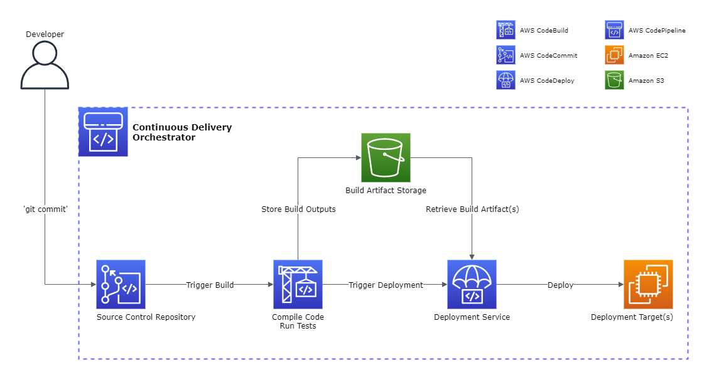
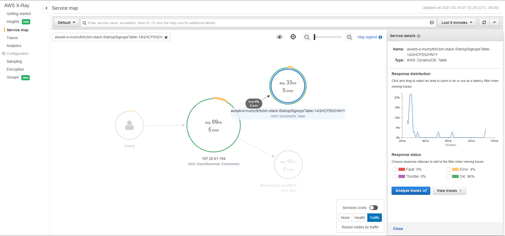

# **AWS Well-Architected Framework**

# Sections
- [**AWS Well-Architected Framework**](#aws-well-architected-framework)
- [Sections](#sections)
- [Overview](#overview)
- [Definitions](#definitions)
  - [Terminology](#terminology)
  - [The Five Pillars](#the-five-pillars)
- [General Design Principles](#general-design-principles)
- [The Five Pillars: Operational Excellence](#the-five-pillars-operational-excellence)
  - [Definition](#definition)
  - [Design Principles](#design-principles)
  - [Best Practices](#best-practices)
    - [Organization](#organization)
    - [Prepare](#prepare)
    - [Operate](#operate)
    - [Evolve](#evolve)
- [The Five Pillars: Security](#the-five-pillars-security)
  - [Definition](#definition-1)
  - [Design Principles](#design-principles-1)
  - [Best Practices](#best-practices-1)
    - [Security](#security)
    - [Identity and Access Management](#identity-and-access-management)
    - [Detection](#detection)
    - [Infrastructure Protection](#infrastructure-protection)
    - [Data Protection](#data-protection)
    - [Incident Response](#incident-response)
- [The Five Pillars: Reliability](#the-five-pillars-reliability)
  - [Definition](#definition-2)
  - [Design Principles](#design-principles-2)
  - [Best Practices](#best-practices-2)
    - [Foundations](#foundations)
    - [Workload Architecture](#workload-architecture)
    - [Change Management](#change-management)
    - [Failure Management](#failure-management)
- [The Five Pillars: Performance Efficiency](#the-five-pillars-performance-efficiency)
- [The Five Pillars: Cost Optimization](#the-five-pillars-cost-optimization)
- [References](#references)

# Overview
- [Source](https://docs.aws.amazon.com/wellarchitected/latest/framework/welcome.html)

This summary is based off of the July 2020 revision of the **AWS Well-Architected Framework** whitepaper.

The AWS Well-Architected Framework (W-AF) helps customers learn the best architectural practices for designing and operating systems on the cloud. For a customer, it provides a way to measure their current cloud architecture decisions against best practices to identify areas for improvement, which will likely lead to increased business success.

The W-AF poses fundamental questions to the customer to help them evaluate if their system has the expectant qualities of modern cloud-based systems, and the remediation steps to achieve those qualities.

# Definitions

## Terminology
- **Component**
  - The code, configuration, and AWS resources that together deliver against a requirement. It is often the smallest unit of technical ownership.
  - Examples: a MySQL database, a load balancer, a web server
- **Workload** 
  - A set of components that together deliver business value. This is usually the level of detail that business and technology leaders communicate about.
  - Example: An application consisting of a load balancer, web servers and a MySQL database
- **Technology portfolio** 
  - The collection of workloads that are required for the business to operate.
- **Milestones** 
  - Key changes in the architecture as it evolves throughout the product lifecycle: design, implementation, testing, go live, and production.
- **Architecture** 
  - The manner in which multiple components work together to form a workload. How components communicate with each other is usually the focus of architecture diagrams.
  - Example: Simple architecture diagram of the workload example above

## The Five Pillars
The WA-F is based on five pillars, **operational excellence**, **security**, **reliability**, **performance efficiency**, and **cost optimization**. They're each described in the table below, and will be explained further in their own sections.

<html>
<table>
  <tr>
    <th width="200">Pillar</th>
    <th width="600">Description</th>
  </tr>
  <tr>
    <th>Operational Excellence</th>
    <td>The ability to support development and run workloads effectively, gain insight into their operations, and to continuously improve supporting processes and procedures to deliver business value.</td>
  </tr>
  <tr>
    <th>Security</th>
    <td>The ability to protect data, systems, and assets to take advantage of cloud technologies to improve the organization's security.</td>
  </tr>
  <tr>
    <th>Reliability</th>
    <td>The ability of a workload to perform its intended function correctly and consistently when it's expected to. This includes the ability to operate and test the workload through its total lifecycle.</td>
  </tr>
  <tr>
    <th>Performance Efficiency</th>
    <td>The ability to use computing resources efficiently to meet system requirements, and to maintain that efficiency as demand changes and technologies evolve.</td>
  </tr>
  <tr>
    <th>Cost Optimization</th>
    <td>The ability to run systems to deliver business value at the lowest price point.</td>
  </tr>
</table>
</html>

When architecting workloads, sometime tradeoffs have to be made between pillars based on the business context. Generally however, operational excellence and security are not traded off.

# General Design Principles
The W-AF identifies some general principles to facilitate good design in the cloud:
- **Stop guessing capacity needs**
- **Test systems at production scale**
  - The cloud capability to test on demand means a user can set up a production-scale test environment, complete the testing, then decomission the environment once finished
  - Costs are only accrued while the environment is running, allowing for simulating the live environment for a fraction of the cost on-premises
- **Automate to make architectural experimentation easier**
- **Allow for evolutionary architectures**
  - The cloud capability to test on demand lowers the risk of impact from design changes, allowing more room for innovation
- **Drive architectures using data**
- **Improve through game days**
  - Regularly schedule simulation events in production to understand where improvements can be made, and to gain experience dealing with events

# The Five Pillars: Operational Excellence

## Definition
The ability to support development and run workloads effectively, gain insight into their operations, and to continuously improve supporting processes and procedures to deliver business value.

There are four best practice areas for operational excellence in the cloud:
- [Organization](#organization)
- [Prepare](#prepare)
- [Operate](#operate)
- [Evolve](#evolve)

## Design Principles
These design principles will be prevalent for operational excellence best practices:
- **Perform operations as code**
- **Make frequent, small, reversible changes**
- **Refine operations procedures frequently**
- **Anticipate failure**
- **Learn from all operational failures**

## Best Practices

### Organization
Teams need to have a shared understanding of the entire workload, their role in it, and shared business goals to set well-defined priorities that will enable business success. 

**OPS 1: How do you determine what your priorities are?**
- Evaluate internal and external customer needs involving key stakeholders, including business, development, and operations teams. This will ensure that you have a thorough understanding of the operations support that is required to achieve business outcomes.
- Evaluate the threat landscape and keep a registry of risks. Include their impacts to determine where to focus efforts.
- Manage benefits and risks to make informed decisions about where to focus efforts. Some risks can be mitigated or even acceptable for a time, while others would need immediate remediation if they were to occur.

**OPS 2: How do you structure your organization to support your business outcomes?**
- Processes, procedures, and resources have identified owners, and a defined business value or reasoning for existence.
- Understanding the responsibilities of your role and how you contribute to business outcomes informs the prioritization of your tasks and why your role is important.
- Responsibilities between teams are predefined, describing how they work with and support each other. Understanding each teams' work on business outcomes informs the prioritization of their tasks, and enables them to respond appropriately.

**OPS 3: How does your organizational culture support your business outcomes?**
- Senior leadership clearly sets expectations for the organization and evaluates success.
- Communications between team members and teams are timely, clear, and actionable.
- Team members are enabled and encouraged to maintain and grow their skill sets. Growth of skills in new technologies is frequently a source of team member satisfaction and supports innovation.
- Resource teams appropriately, with team member capacity and tools for them to support their workload needs.

### Prepare
To prepare for operational excellence, team members need to understand their workloads and their expected behaviours. Then the workloads can be designed to provide insight into their status, and procedures can be built to support them.

**OPS 4: How do you design your workload so that you can understand its state?**
- Instrument the application code to emit information about its internal state, status, and achievement of business outcomes.
  - This is known as *application telemetry*.
- Configure *workload telemetry*, such as HTTP status codes, auto-scaling events, API call volume, etc.
- Implement *user activity telemetry* to emit information about user activities, such as click streams, started or completed transactions, etc.
- Implement *transaction telemetry*, to track transactions across the workload

**OPS 5: How do you reduce defects, ease remediation, and improve flow into production?**
- Test and validate changes to help limit and detect errors. Automate testing where possible to reduce manual error.
- Make frequent, small, reversible code changes to reduce the scope and impact of change and potential errors
- Use automated management systems for: configuration, build and deployment, and patching
  - Reduces the amount of manual errors and the effort required for each.

**OPS 6: How do you mitigate deployment risks?**
- Prepare for unsuccessful changes by having a rollback plan to revert to a known good state.
- Deploy using parallel environments. Once the new deployment is confirmed as successful, the prior environment can be removed.
- Fully automate integration and deployment to reduce manual error and effort.
  - The image below displays a [Continuous Integration & Continuous Delivery (CICD)](DevOps/practicing-cicd.md) pipeline that automates deployment changes in a consistent way without any human intervention.

**OPS 7: How do you know that you are ready to support a workload?**
- Ensure that you have the appropriate number of trained personnel to provide support for operational needs.
- Ensure consistent review of operational readiness, including at minimum, the operational readiness of the team and workload, and the security requirements.
- Use documented procedures (called *runbooks*) to achieve specific outcomes for well-understood events. Implement runbooks as code and trigger them in response to events where appropriate to ensure speed and consistency, while reducing  manual error.
- Document the investigation process of issues not well known, in *playbooks*. Playbooks are predefined steps to perform to identify factors contributing to a failure scenario.

### Operate
Successful operation of a workload is measured by the achievement of business and customer outcomes. Define expected outcomes, determine how success will be measured, and identify the metrics that will be used in those calculations to determine workload and operations success.

**OPS 8: How do you understand the health of your workload?**
- Identify *key performance indicators (KPIs)* based on desired business outcomes and customer outcomes, and evaluate the KPIs to determine workload success.
- Define, collect, and analyze workload metrics:
  - Metrics to measure KPI achievement (for example, abandoned shopping carts, orders placed, cost, price).
  - Metrics to measure workload health (for example, response time, error rate, requests made and completed).
- Alert when workload outcomes are at risk, or anomalies are detected.
- Validate the achievement of outcomes and the effectiveness of KPIs and metrics.

**OPS 9: How do you understand the health of your operations?**
- Identify KPIs based on desired business (features delivered etc.) and customer (support cases etc.) outcomes, and evaluate the KPIs to determine operations success.
- Define, collect, and analyze operations metrics:
  - Metrics to measure KPI achievement (for example, successful deployments, failed deployments)
  - Metrics to measure health of operations activities (for example, mean time to detect an incident (MTTD), mean time to recovery (MTTR) from an incident)
- Establish operations metrics baselines, and learn expected patterns of activity
  - Alert when anomalies are detected, or operations outcomes are at risk
- Validate the achievement of outcomes and the effectiveness of KPIs and metrics.

**OPS 10: How do you manage workload and operations events?**
- Prepare and validate procedures for responding to events to minimize their disruption to your workload.
- Prioritize operational events based on business impact.
- Define escalation paths in your runbooks and playbooks, and identify owners for each action to ensure prompt responses to events.
- Where possible, automate responses to events.
- Communicate status through dashboards tailored to their target audiences.

### Evolve
You must learn, share, and continuously improve to sustain operational excellence.

**OPS 11: How do you evolve operations?**
- Dedicate time and resources for continuous incremental improvement to evolve the effectiveness and efficiency of your operations.
- Have a process for continuous improvement by regularly evaluating and prioritizing opportunities to focus efforts where they can provide the greatest benefits.
- Review customer-impacting events, and identify the contributing factors and preventative actions. This information can be used to develop mitigations to limit or prevent future occurrence.
- Regularly perform retrospective analysis of operations metrics with cross-team participants to identify opportunities for improvement, potential courses of action, and to share lessons learned.
- Document and share lessons learned from operations activities so that they can be used internally and across teams.

# The Five Pillars: Security

## Definition
The ability to protect data, systems, and assets to take advantage of cloud technologies to improve the organization's security.

There are six best practice areas for security in the cloud:
- [Security](#security-1)
- [Identity and Access Management](#identity-and-access-management)
- [Detection](#detection)
- [Infrastructure Protection](#infrastructure-protection)
- [Data Protection](#data-protection)
- [Incident Response](#incident-response)

## Design Principles
These design principles will be prevalent for security best practices:
- **Implement a strong identity foundation**
- **Enable traceability**
- **Apply security at all layers**
- **Automate security best practices**
- **Protect data at rest and in transit**
- **Keep people away from data**
- **Prepare for security events**

## Best Practices

### Security
To operate a workload securely, overarching best practices must be applied to every area of security. 

**SEC 1: How do you securely operate your workload?**
- Secure access to your AWS account(s), for example enabling MFA, restricting use of the root user, and configure account contacts.
- Separate workloads using separate accounts based on function, or a common set of controls.
- Keep up to date with AWS and industry security threats and recommendations.
- Establish secure baselines and templates for security mechanisms that are tested and validated as part of your build, pipelines, and processes.
  - Example: scanning container images for security vulnerabilities, irregularities, and drift from established baselines.
- Identify and prioritize risks using a threat model, and continually revisit and maintain this list in an evolving security landscape.

### Identity and Access Management
Identity and access management (IAM) are key parts of an information security program, ensuring that only authorized and authenticated users and components are able to access resources and only in the manner that they are inteded to be accessed.

**SEC 2: How do you manage identities for people and machines?**
- There are two types of identities to manage:
  - **Human identities:** Administrators, developers, operators, end users, etc.
    - These interact with workloads via web browser, client application, or command-line tools.
  - **Machine identities:** Service applications, operational tools, workloads themselves, etc.
    - These interact with workloads via API requests to AWS services.
- Use strong sign-in mechanisms, such as MFA, password length, password complexity, etc.
- Rely on a centralized identity provider, which is easier to manage.
- Require identities to dynamically acquire temporary credentials.
- Audit and rotate credentials periodically where temporary credentials cannot be used.

**SEC 3: How do you manage permissions for people and machines?**
- Have a clear definition of who or what should have access to each component, and choose the appropriate identity type and method of authentication and authorization.
- Grant least privilege access. As teams and workloads determine what access they need, remove permissions they no longer use to establish least privilege access.
- Establish a process that allows emergency access to the workload in the event of an automated process or pipeline issue.
- Govern the consumption of shared resources across accounts, and review shared resource access.

### Detection
Detective controls can be used to identify a potential security threat or incident. They are essential, and can be used to support a quality process, a compliance obligation, and for threat identification and response efforts.

**SEC 4: How do you detect and investigate security events?**
- Configure service and application logging, then capture and analyze events from the logs and metrics to gain visibility. Store these findings in a central location, and use dashboards to give insight into real-time system health.
- Implement actionable security events. Ensure that alerts include relevant information for the team to take action.
- Where possible, automate responses to events.

### Infrastructure Protection
Infrastructure protections encompasses control methodologies necessary to meet best practices and organizational or regulatory obligations. Multiple layers of defense (for example, VPC, NACLs, security groups, firewalls) are advisable in any type of environment.

**SEC 5: How do you protect your network resources?**
- Group components that share reachability requirements into layers.
  - Example: A database in a VPC with no need for internet access should be placed in subnets with no route to or from the Internet.
- Control and monitor traffic at all layers (for example, NACLs, security groups, subnets)
- Automate network protection mechanisms based on threat intelligence and anomaly detection.

**SEC 6: How do you protect your compute resources?**
- Frequently scan and patch for vulnerabilities in your code, dependencies, and your infrastructure to protect against new threats.
- Reduce attack surface by hardening operating systems, minimizing components, libraries, and external services in use.
- Implement managed surfaces to reduce your security maintenance tasks as part of the shared responsibility model.
- Remove the ability for direct, interactive access, and automate protection where possible. This reduces the risk of human error and manual configuration or management.

### Data Protection
Data protection supports objectives such as preventing financial loss or complying with regulatory obligations. Data classification provides a way to organize data based on its sensitivity level, and encryption protects data by rendering it unintelligible to unauthorized access.

**SEC 7: How do you classify your data?**
- Identify the data within your workload. This includes its type, associated business processes, data owner, applicable legal and compliance requirements, where it's stored, etc.
- Automate identification and classification to reduce the risk of human error from manual interactions.
- Protect data according to its classification level (for example, sensitive data will have additonal controls compared to public data).

**SEC 8: How do you protect your data at rest?**
- Encryption keys must be stored securely and periodically rotated, with strict access control. Consider using different keys, and manage access control to the keys using IAM and resource-based policies, to align with data classification levels.
- Enforce encryption at rest. Use automated tools to continuously validate and enforce data protection.
  - Example: Verify that there are only encrypted storage resources.
- Keep all users aways from directly accessing sensitive data and systems under normal operational circumstances.

**SEC 9: How do you protect your data in transit?**
- Authenticate network communications by using protocols that support authentication, such as TLS or IPsec.
- Enforce encryption in transit.
- Automate detection of unintended data access.

### Incident Response
Even with mature preventative and detective controls, customers should still put processes in place to respond to and mitigate the potential impact of security incidents.

**SEC 10: How do you anticipate, respond to, and recover from incidents?**
- Ensure that you have a way to quickly grant access for your security team, and automate the isolation of instances as well as capturing the data and state for forensics.
- Create plans to help you respond to, communicate during, and recover from an incident. Include how you would communicate and escalate both internally and externally.
- Ensure that security personnel have the right tool pre-deployed into AWS to reduce time for investigation through to recovery.
- Practice incident response game days regularly, and incorporate lessons learned into your incident management plans to continuously improve.

# The Five Pillars: Reliability

## Definition
The ability of a workload to perform its intended function correctly and consistently when it's expected to. This includes the ability to operate and test the workload through its total lifecycle.

There are four best practice areas for reliability in the cloud:
- [Foundations](#foundations)
- [Workload Architecture](#workload-architecture)
- [Change Management](#change-management)
- [Failure Management](#failure-management)

## Design Principles
These design principles will be prevalent for reliability best practices:
- **Automatically recover from failure**
- **Test recovery procedures**
- **Scale horizontally to increase aggregate workload availability**
- **Stop guessing capacity**
- **Manage change in automation**

## Best Practices

### Foundations
Before architecting any system, foundational requirements that influence reliability should be in place. For example, an organization must have sufficient bandwidth to their data center.

**REL 1: How do you manage service quotas and constraints?**
- Be aware of your default quotas and quota increase requests for your workload.
- Be aware of unchangeable service quotas and physical resources, and architect to prevent those from impacting reliability.
- Evaluate your potential usage, and increase your quotas appropriately allowing for planned growth in usage.
- Implement tools to alert you when thresholds are being approached. You can automate quota increase requests by using the [AWS Service Quota APIs](https://docs.aws.amazon.com/servicequotas/2019-06-24/apireference/Welcome.html).

**REL 2: How do you plan your network topology?**
- Use highly available network connectivity for your workload public endpoints.
  - Ways to implement this: highly available DNS, CDNs, API Gateways, load balancers, etc.
- Provision redundant connectivity between private networks in the cloud and on-premises environments.
- Ensure subnet IP allocation accounts for expansion and availability.
- Prefer *hub-and-spoke* topologies over *many-to-many-mesh* if more than two address spaces are connected.
  - [AWS Transit Gateway](https://aws.amazon.com/transit-gateway/?whats-new-cards.sort-by=item.additionalFields.postDateTime&whats-new-cards.sort-order=desc) is a hub-and-spoke solution.
- The IP address ranges of different address spaces must not overlap when peered or connected via VPN.

### Workload Architecture
Your architecture choices for both software and infrastructure will impact your workload behaviour across all five WA-F pillars.

**REL 3: How do you design your workload service architecture?**
- Build highly scalable and reliable workloads using a service-oriented architecture or [microservices architecture](https://aws.amazon.com/microservices/).
- When choosing how to segment your workload, balance the benefits against the complexities. The priorities for a new product racing to first launch is different than the priorities for a workload that needs to scale from the start.
- Build services focused on specific business domains and functionality.

**REL 4: How do you design interactions in a distributed system to prevent failures?**
- Implement loosely coupled dependencies to help isolate behaviour of a component from other components, increasing resiliency and agility.
- Make all responses *idempotent.* This means that each request is completed exactly once, such that making multiple identical requests has the same effect as making a single request. 
  - This meakes it easier for a client to implement retries without fear that a request will be erroneously processed multiple times.

**REL 5: How do you design interactions in a distributed system to mitigate or withstand failures?**
- When a component's dependencies are unhealthy, the component itself can still function, although in a degraded manner.
  - Example: if a dependency call fails, failover to a predetermined static response.
- Throttle requests to mitigate unexpected increases in demand.
- Set client timeouts.
- Control and limit retry calls, using exponential backoff to retry after progressively longer intervals, and limit the maximum number of retries.
- Make services stateless where possible.

### Change Management
Changes to the workload or its environment must be anticipated and accomodated to achieve reliable operation of the workload. Changes include external sources (such as spikes in demand), and internal sources (such as feature deployments or patches).

**REL 6: How do you monitor workload resources?**
- Configure your workload to monitor logs and metrics and to automatically send notifications when thresholds are crossed or significant events occur.
- Consolidate logs in a central location.
- Automate responses to take action when events are detected, such as to replace failed components.
- Monitor end-to-end tracing of requests through your system.
  - Example: [AWS X-Ray](https://aws.amazon.com/xray/) can be used to more easily analyze and debug distributed systems. An X-Ray graph is shown below:

**REL 7: How do you design your workload to adapt to changes in demand?**
- Obtain resources upon detection of impairment to a workload.
- Obtain resources upon detection that more resources are needed for a workload to meet demand.
- Use automation when obtaining and scaling resources.
- Load test your workload to see if scaling activity meets workload requirements.

### Failure Management
Reliability requires that your workload be aware of failures as they occur and take action to avoid impact on availability.

**REL 9: How do you back up data?**
- Back up data, applications, and configuration to meet your [*recovery time objectives (RTO) and recovery point objectives (RPO)*](https://docs.aws.amazon.com/wellarchitected/latest/reliability-pillar/disaster-recovery-dr-objectives.html).
- Identify all data that needs to be backed up.
- Secure and encrypt backups.
- Perform data backup automatically based on a periodic schedule, or by changes in the dataset.
- Perform periodic recovery of the data to verify backup integrity and processes.

**REL 10: How do you use fault isolation to protect your workload?**
- Deploy the workload to multiple locations, as diverse as required.
- Automate recovery for components constrained to a single location.
- Use *bulkhead architectures* to limit the scope of impact. This design pattern ensures that failure is contained to a subset of requests/users so that most requests can continue without error.

**REL 11: How do you design your workload to withstand component failures?**
- Monitor all workload components to detect failures.
- Failover to healthy resources in unimpaired locations.
- Automate healing on all layers.
- Send notifications when events impact availability.

**REL 12: How do you test reliability?**
- Use playbooks to investigate failures, similar to in the [operational excellence pillar](#prepare).
- Perform post-incident analysis, similar to in the [operational excellence pillar](#evolve).
- Test functional, scaling, and performance requirements.
- Run tests that inject failures regularly into pre-production and production environments. Hypothesize how the workload will react, then compare it to what actually happens and iterate if they do not match. Ensure that production testing does not impact users.
  - Some failure scenarios that can be used for testing are described in [The Netflix Simian Army](https://netflixtechblog.com/the-netflix-simian-army-16e57fbab116).

**REL 13: How do you plan for disaster recovery (DR)?**
- Define [RTOs and RPOs]((https://docs.aws.amazon.com/wellarchitected/latest/reliability-pillar/disaster-recovery-dr-objectives.html)) for your workloads.
- Create a DR strategy defined to meet objectives. Choose a strategy such as:
  - Backup and restore
  - Active/Passive
  - Active/Active
- Ensure that the infrastructure, data, and configuration are as needed at the DR site.
- Test DR implementation to validate that the RTOs and RPOs are met.

# The Five Pillars: Performance Efficiency

# The Five Pillars: Cost Optimization

# References
- [AWS Well-Architected Framework (Documentation)](https://docs.aws.amazon.com/wellarchitected/latest/framework/welcome.html)