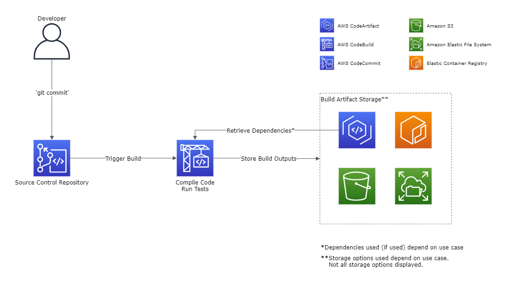
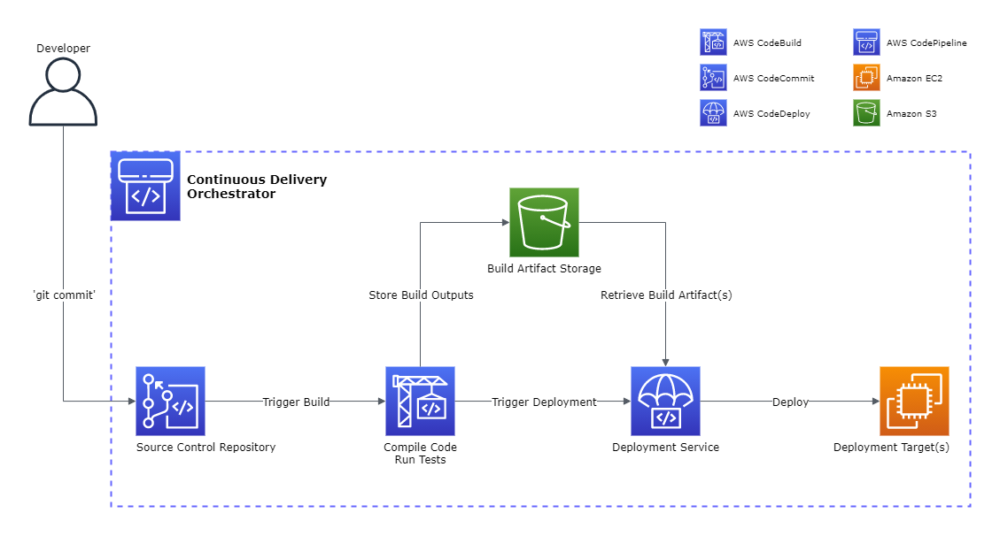
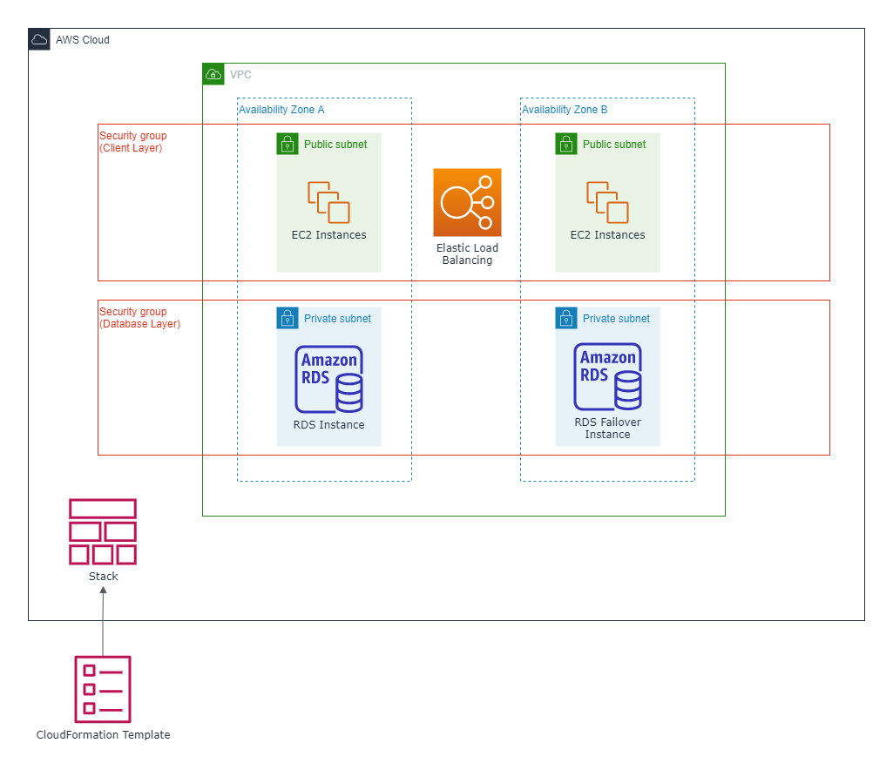

# **Introduction to DevOps on AWS**

# Overview
- [Source](https://docs.aws.amazon.com/whitepapers/latest/introduction-devops-aws/welcome.html)

This summary is based off of the October 2020 revision of the Introduction to DevOps on AWS whitepaper.

**DevOps** is the combination of cultural and practical practices, as well as tools that increase the speed and stability of software development in an organization. The essential practices associated with DevOps are the following:
- [Continuous Integration](continuous-integration)
- [Continuous Delivery](#continuous-delivery)
- [Infrastructure as Code](#infrastructure-as-code)
- [Monitoring and Logging](#monitoring-and-logging)
- [Communication and Collaboration](#communication-and-collaboration)
- [Security](#security)

This whitepaper highlights how AWS can help an organization achieve the aforementioned practices.

# Continuous Integration

### Definition
**Continuous Integration (CI)** is a software development practice where code developers regularly merge their code into a central code repository, which then automatically triggers  builds and executes tests against the changed code.

### CI Architecture Example


### Benefits 
- Find and address bugs quicker
- Reduce the time needed to validate new software updates
- Improve software quality

### Services
- [**CodeCommit**](https://aws.amazon.com/codecommit/) - secure & scalable source control service that hosts private git repositories
- [**CodeBuild**](https://aws.amazon.com/codebuild) - fully managed CI service that can compile code, run tests, and produce software packages ready for deployment
  - Can use GitHub, BitBucket, CodeCommit, or S3 as the source code provider
- [**CodeArtifact**](https://aws.amazon.com/codeartifact) - fully managed artifact repository service that can be used to store, publish, and share software packages
  - Works with common package managers and tools such as Maven, Gradle, yarn, pip, etc.


# Continuous Delivery

### Definition
**Continuous Delivery (CD)** is a software development practice that expands upon CI, by deploying the code changes to a testing and/or production environment after a successful build stage.

### Benefits
- Ensures all deployment-ready build artifacts have passed through a standardized validation process
- A test environment allows for detailed verification of software (beyond unit testing) before deploying it to customers
  - Examples: UI testing, load testing, integration testing

### Services
- [**CodeDeploy**](https://aws.amazon.com/codedeploy) - automated deployment service capable of deploying software to:
  - [Amazon EC2 Instances](https://aws.amazon.com/ec2)
  - [AWS Fargate Containers](https://aws.amazon.com/fargate)
  - [AWS Lambda Functions](https://aws.amazon.com/lambda/)
  - On-Premises servers
- [**CodePipeline**](https://aws.amazon.com/codepipeline) - CD service that enables modelling and visualizing the automated steps to release software. The steps below can be ordered, enumerated, and integrated with each other in granular detail:
  - **Source Control:** CodeCommit, S3, and popular tools (GitHub, BitBucket, etc...)
  - **Build:** CodeBuild, Jenkins and other third-party tools
  - **Test:** CodeBuild, BlazeMeter, and other third-party tools
  - **Deploy:** CodeDeploy, [CloudFormation](https://aws.amazon.com/cloudformation/), [Elastic Beanstalk](https://aws.amazon.com/elasticbeanstalk/), and many other AWS services
  - **Invoke:** Lambda and [Step Functions](https://aws.amazon.com/step-functions/) can be invoked during and/or between stages

### CD Architecture Example
- This diagram displays a CD implementation that branches from [the CI diagram example](#ci-architecture-example)
- There's no one way of designing CD steps, but this example lays a solid foundation:
  - Source Control: CodeCommit
  - Build: CodeBuild
  - Test: CodeBuild
  - Deploy: CodeDeploy to EC2 instances



# Infrastructure as Code

### Definition
**Infrastructure as Code (IaC)** involves applying the same principles of application code development to infrastructure provisioning. This means that when cloud infrastructure is to be created, it is written using a defined format, and stored in a source control system for logging its history of changes.

### Benefits
- Provides a clear and repeatable method of creating, deploying, and maintaining infrastructure
- Can provide a layer of governance for cloud infrastructure, as it follows a set format

### Services
- [CloudFormation](https://aws.amazon.com/cloudformation/) - enables the creation and updates of AWS resources in an orderly and predictable method, using JSON or YAML template files. A single template file can create and update an entire AWS environment, or multiple templates can be used for multiple layers within an environment. CloudFormation also has built-in rollback to the previous template version if an error occurs.
- [AWS Cloud Development Kit (AWS CDK)](https://aws.amazon.com/cdk/) - open-source software development framework to model and provision cloud resources using familiar programming languages
  - Currently supports TypeScript, Python, Java, and .NET

### Example Partial CloudFormation Template
- The following CloudFormation template is written in YAML
- The full template creates a VPC with multiple subnets and availability zones, and launches EC2 instances within it, **all in about 5 minutes**
  - The link to the full template is [here](https://github.com/AJ2O/aws-short-projects/blob/main/1-vpc-from-scratch/vpc-cloudformation.yaml)
- From this excerpt, we can find details on the created resources:
  - A VPC with a defined CIDR range
  - An internet gateway to allow outbound internet access
  - A public subnet with a CIDR range, in the VPC
  - An EC2 instance launched in a public subnet
```
Resources:
  # Create VPC
  VPC:
    Type: AWS::EC2::VPC
    Properties:
      CidrBlock: 10.0.0.0/16
      InstanceTenancy: default
  
  # Create Internet Gateway
  IGW:
    Type: AWS::EC2::InternetGateway
  IGWAttachment:
    Type: AWS::EC2::VPCGatewayAttachment
    Properties:
      InternetGatewayId: !Ref IGW
      VpcId: !Ref VPC
  ...

  # Create Subnets in each availability zone for the new VPC
  PublicSubnetA:
    Type: AWS::EC2::Subnet
    Condition: UsePublicSubnetsCondition
    Properties:
      VpcId: !Ref VPC
      AvailabilityZone: !Select
        - 0
        - Fn::GetAZs: !Ref AWS::Region
      CidrBlock: 10.0.0.0/24 
      MapPublicIpOnLaunch: True
  ...

  # Launch EC2 Instance into a Public Subnet
  EC2InstancePublic:
    Type: AWS::EC2::Instance
    DependsOn:
      - RouteTableAssociationPublicA
      - RouteTableAssociationPublicB
    Properties:
      AvailabilityZone: !GetAtt PublicSubnetA.AvailabilityZone
      SubnetId: !Ref PublicSubnetA
      InstanceType: t2.micro
      KeyName: MySSHKeyPair
      SecurityGroupIds:
        - !Ref PublicSecurityGroup
      ImageId: ami-0080e4c5bc078760e
  ...
```

### Example CloudFormation Stack
- In CloudFormation, a running group of AWS resources created from a template is called a **stack**
- Every stack created using the example template will contain the following group of AWS resources:
  - A [VPC](https://aws.amazon.com/vpc/) to isolate the network
  - Public and private subnets spread across multiple availability zones
  - EC2 instances, and their subnet placement
  - A load balancer to distribute traffic among the EC2 instances
  - An [RDS](https://aws.amazon.com/rds/) instance with a failover instance in another availability zone
  - Security groups to control access to instances
  


- **Note:** this diagram is simplified and doesn't contain every type of resource created

# Automation

### Definition
**Automation** in the DevOps world focuses on the automatic configuration, deployment, and support of infrastructure, and of the applications that run on it. The removal of manual processes is key to succesful automation. Manual processes are error prone, time-consuming, and may lead to nonstandard environments.

### Benefits
- Repeatable configurations
- Rapid changes
- Improved productivity
- Automated testing
- Leveraged elasticity

### Services
- [OpsWorks](https://aws.amazon.com/opsworks) - application management service utilizing configuration management software (Chef or Puppet), and application lifecycle management. Lifecycle management defines when resources are set up, configured, deployed, undeployed, or shut down. Applications can also be defined as highly configurable, independently-managed stacks. An application may have stacks including a web tier, database tier, load balancing, etc.

# Monitoring and Logging

### Definition
**Monitoring and Logging** refers to processes involving the collecting and examining of metrics from the application and/or its underlying infrastructure. This is an essential process for feedback on the application, which is fundamental for the practice of [communication and collaboration](#communication-and-collaboration). AWS provides feedback with three core services, [CloudWatch](https://aws.amazon.com/cloudwatch/), [EventBridge](https://aws.amazon.com/eventbridge/), and [CloudTrail](https://aws.amazon.com/cloudtrail/).

### Amazon CloudWatch
- CloudWatch automatically gathers metrics from AWS services, which can be organized into dashboards, alarms, or events that can trigger operations in the AWS account
  - Using the [PutMetric API Call](https://docs.aws.amazon.com/AmazonCloudWatch/latest/APIReference/API_PutMetricData.html), custom metrics from within applications can be pushed and viewed from CloudWatch as well
- CloudWatch Logs is a service that can aggregate logs across AWS services so that they can be centrally monitored
  - CloudWatch Logs Insights enables interactive querying and visualization of log data, supporting various log formats

### Amazon EventBridge
- Provides a near real-time stream of system events that describe changes to AWS resources
- You customize rules to match system events, and create targets functions or streams
- Once matched, the targets operate as you defined, such as taking corrective action, sending notification messages, invoking Lamdba functions, etc.

### AWS CloudTrail
- An auditing service that logs API calls to AWS services, with detailed information for each invocation, such as:
  - The API call, and whether it was denied or accepted
  - The user or role that invoked it
  - The caller's IP address
  - The time it was invoked
  - The options the call was invoked with
  - etc...

# Communication and Collaboration

### Definition

### Benefits

### Services


# Security

### Definition

### Benefits

### Services

# Conclusion

# References
